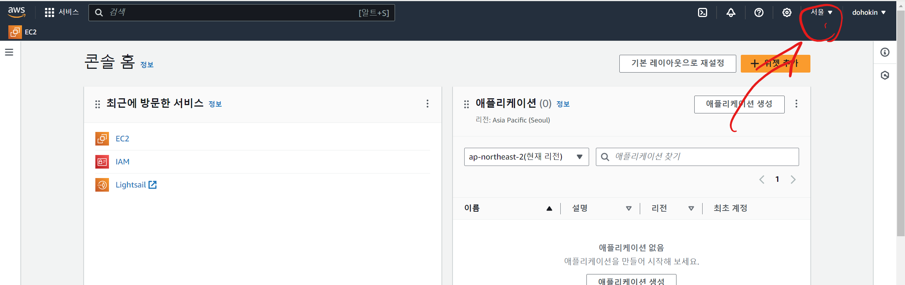
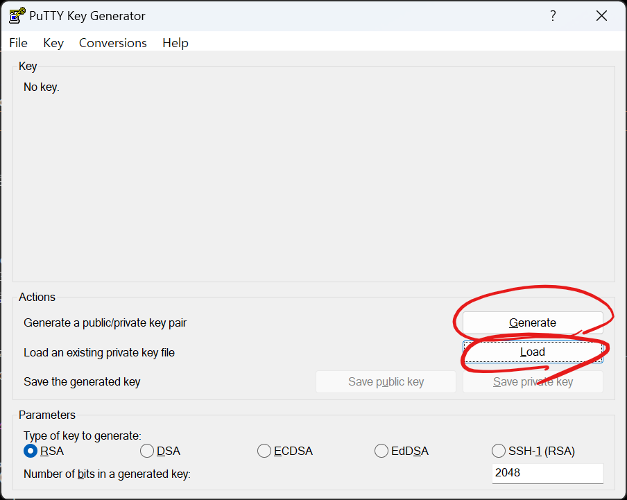
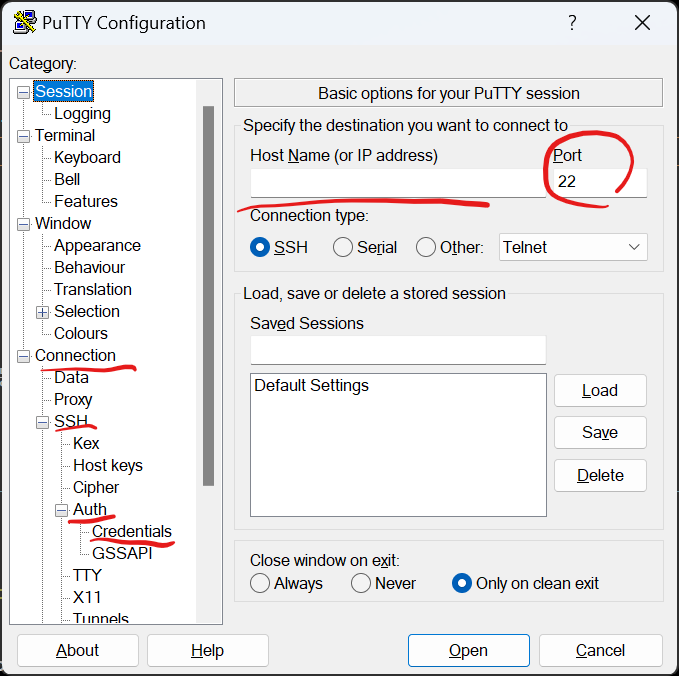
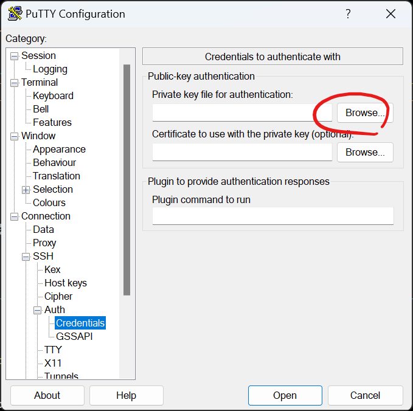

# aws

- 리전확인하기  


# ec2  
  - 인스턴스 생성하기  

# 윈도우에서 ec2 접속하기  
<a href="https://docs.aws.amazon.com/ko_kr/AWSEC2/latest/UserGuide/putty.html">putty 설명</a>  
  - putty 다운로드 
  - putty 커널 실행프로그램  
  - puttygen pem키 to ppk (putty용 키로 변환)  
    
  - 로드에서 확장자 모드로 선택한다음, putty용 키로 변환할 .pem 선택  
  - 제너레이트 클릭
    
  - host Name에 ec2 인스턴스 퍼블릭 ip 입력 포트 22  
    
  - 왼쪽창에 coonection > ssh > auth > credentials > browse클릭 후 변환한 키 선택  
  - 오픈 클릭 후 login as 나타나면, ubuntu 입력  

# 리눅스 커널 명령어  
  - ls  
    - 현재 경로 나타남.  
    ```bash  
    ls  
    ```  

  - cd [폴더명]
    - 폴더 이동  
    ```bash  
    cd home
    # 하위폴더인 home 으로 이동  
    cd ..  
    # 상위폴더로 이동  
    cd ~ 
    # home 디렉토리로 이동  
    ```
  - pwd  
    - 현재 위치한 폴더 보여줌  
    ```bash  
    pwd  
    # /home/ubuntu 이런식으로 현재경로 표시  
    ```

