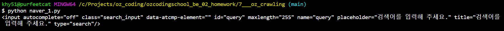
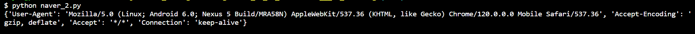
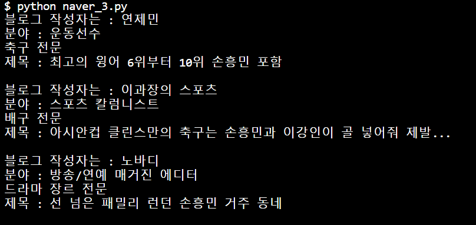
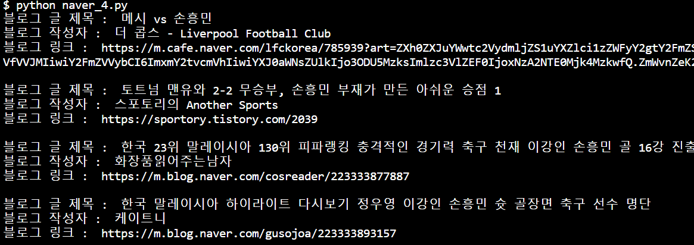
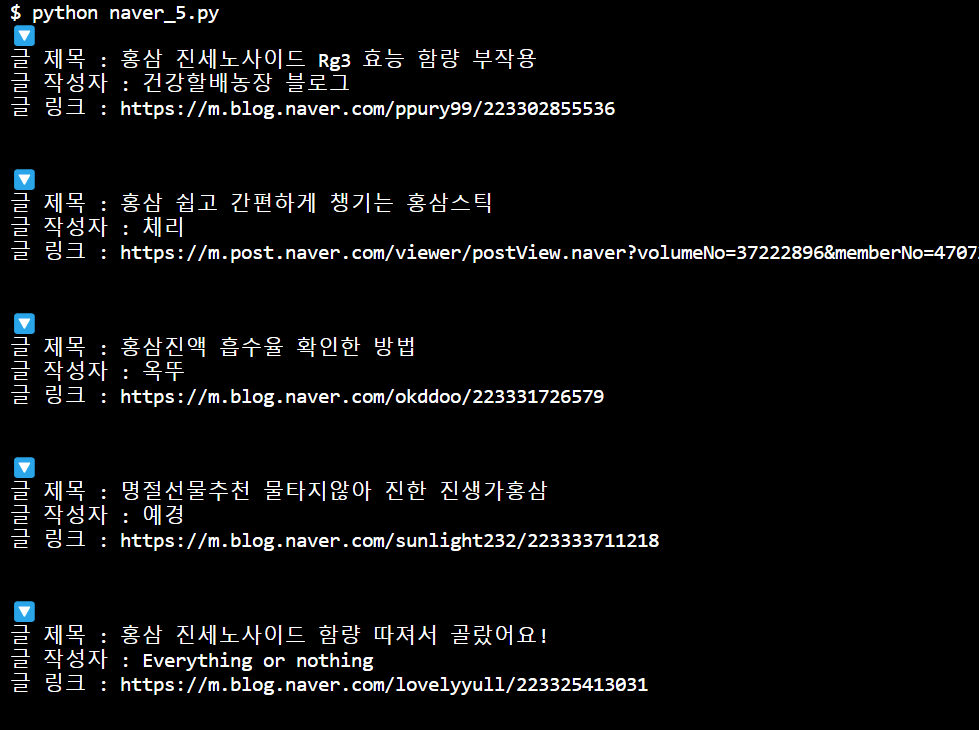
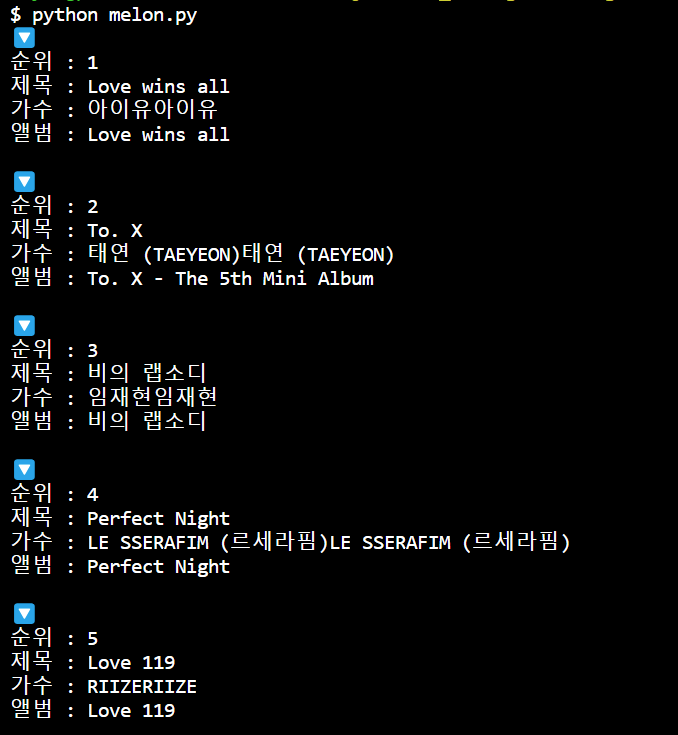

# 배운내용

import requests  
from bs4 import BeautifulSoup  
requests 와 bs4 를 활용해서, 크롤링 하기.

# naver_1.py

  
  
# naver_2.py  
  
  

# naver_3.py

  

# naver_4.py

  

# naver_5.py

  

# naver_6.py

find = select_one
find_all = select

# melon.py

  

# selenuum

- win의 경우 아래 명령어로 크롬 드라이버 매니저 설치  
  pip install webdriver-manager
- 아래 명령어로 셀레니움 설치  
  pip install selenium

  # melon_rank

  멜론 차트 데이터 크롤링해서, 버블 차트 만들기  
  
