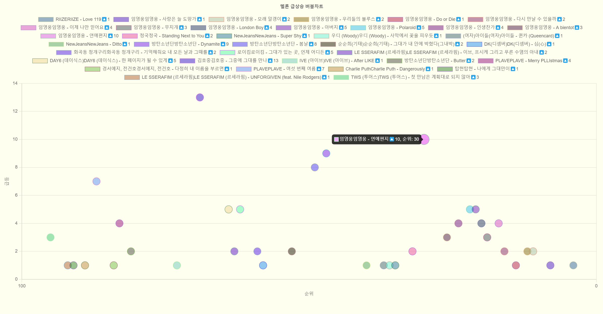

# 멜론차트에서 급등 크롤링 데이터, 버블차트 만들기

<a href = "https://bamjun.github.io/ozcodingschool_be_02_homework/7___oz_crawling/melon_rank/index.html" style="color:red; font-size:30px;">예제 바로보기</a>



#### 1. 멜론차트에서 크롤링 한 데이터 data.js 로 저장.


#### 2. index.html 실행하기

---

# melonCawling.py

이 코드는 멜론 차트(Melon Chart) 웹페이지에서 급상승하는 곡들의 정보를 크롤링하여, 이 데이터를 이용해 버블 차트를 생성하기 위한 JavaScript 파일(`data.js`)을 만드는 스크립트입니다.

### 1. 필요한 라이브러리 임포트

```python
import requests, random, json
from bs4 import BeautifulSoup
```

- `requests`: 웹 페이지의 HTML 콘텐츠를 가져오기 위한 라이브러리입니다.
- `random`: 랜덤 색상을 생성하기 위해 사용됩니다.
- `json`: 데이터를 JSON 형식으로 변환하기 위해 사용됩니다.
- `BeautifulSoup`: HTML 문서를 파싱하고 데이터를 추출하기 위한 라이브러리입니다.

### 2. 사용자 에이전트 설정 및 멜론 차트 접속

```python
header_user = {
    "User-Agent": "..."
}

url = "https://www.melon.com/chart/index.htm"

req = requests.get(url, headers=header_user)
html = req.text
soup = BeautifulSoup(html, "html.parser")
```

- `header_user`: 웹 서버가 스크립트가 아닌 브라우저에서 요청이 발생했다고 인식하도록 하는 사용자 에이전트 문자열입니다.
- `url`: 멜론 차트의 URL입니다.
- `requests.get`: 멜론 차트 페이지의 HTML을 가져옵니다.
- `BeautifulSoup`: 가져온 HTML을 파싱하기 위해 사용됩니다.

### 3. 데이터 추출

```python
lst_all = soup.find_all(class_=["lst50", "lst100"])

data = {"datasets": []}
for rank, x in enumerate(lst_all, 1):
    # ...
```

- `lst_all`: 차트에 있는 곡들의 리스트를 추출합니다.
- `data`: 차트 데이터를 저장할 딕셔너리입니다.

### 4. 각 곡에 대한 데이터 처리

```python
for rank, x in enumerate(lst_all, 1):
    a = x.select_one(".up")
    if a:
        title = x.select_one(".ellipsis.rank01").text.strip()
        # ...
        data["datasets"].append({...})
```

- `enumerate`: 각 곡의 순위를 구하기 위해 사용됩니다.
- `.select_one`: 특정 클래스를 가진 HTML 요소를 선택합니다.
- `if a`: 곡이 급상승 중인지 확인합니다.
- 곡의 제목, 가수, 앨범 정보를 추출합니다.
- `data["datasets"].append`: 추출한 정보를 데이터셋에 추가합니다. 여기서 랜덤 색상을 생성하여 차트에 사용됩니다.

### 5. 파일로 저장

```python
with open("data.js", "w", encoding="utf-8") as file:
    file.write("const data = " + json.dumps(data, indent=2, ensure_ascii=False) + ";")
```

- 추출한 데이터를 `data.js` 파일에 JSON 형식으로 저장합니다. `ensure_ascii=False`는 유니코드 문자가 올바르게 저장되도록 합니다.

### 결론

이 스크립트는 멜론 차트에서 급상승하는 곡들의 정보를 크롤링하여 JavaScript 파일로 저장합니다. 이 파일은 index.html 웹 페이지에서 차트 데이터로 사용 합니다.

---

# index.html

chartjs를 사용, 크롤링해서 가져온 데이터를 버블차트로 생성.
