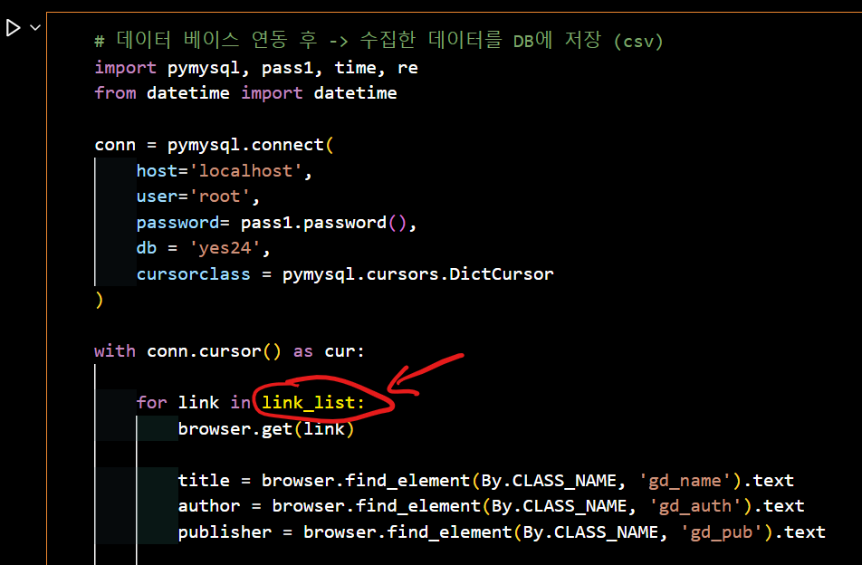
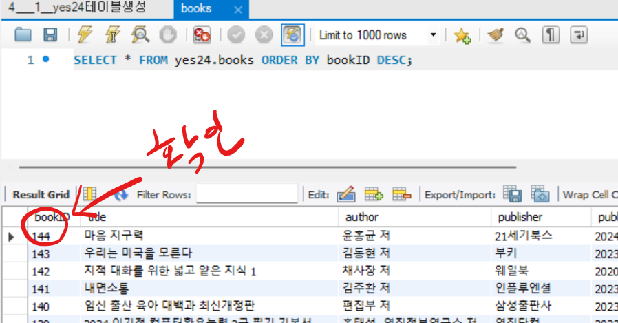
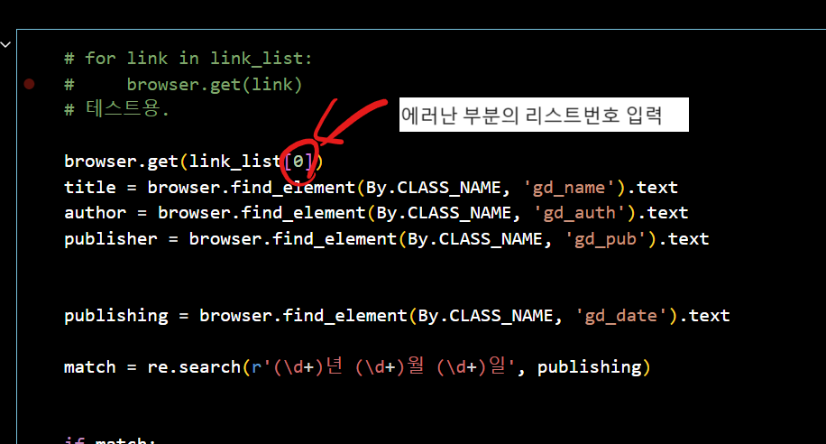
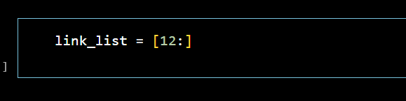

# 데이터 베이스 [자료 링크](https://visioneer.notion.site/DB-58522f145bfd4b86b44277005c3612e0)

## day1

- sql 기본 문법
- mysql workbench 설치 및 사용 방법

## day2

- mysql workbench 를 활용해서 테이블 생성
- 샘플데이터 생성
- 데이터 분석
- ERD 프로그램 알아보기

## day3

- pymysql 연습
- 셀레니움 설치 및 연습

## day4

- yes24 크롤링

  - 셀레니움 크롤링시 주피터노트북(ipynb) 사용해야하는 이유.
    - 오류발생시 대처하기가 쉽다.
    - 오류가 발생한 시점에서 중간에 수정해야했을때 수정도 용이.
    - 어디서 오류가 발생했는지 찾기 쉬움.
  - 오류가 발생햇을때 대처법.
    
    - 셀레니움을 활용해서, 주소를 List에 저장해서, 주소 리스트를 for 문에 돌리는 상황에서 에러가 발생했을시,
      - 1. db에서 마지막 저장된 데이터 확인  
           
      - 2. 켜져있는 크롬브라우저 마지막 페이지 확인  
           
      - 주피터 노트북에서 별도로 코드 돌려서 에러부분찾기.  
        
      - 에러 수정후, 에러난 부분부터 리스터 다시저장(에러난 부분이 12라고 가정 12부터 끝까지 다시 시작)  
        

- mini project sakila sql
  - sakila는 mysql에서 제공하는 데이터베이스를 지칭함.[사이트](https://dev.mysql.com/doc/index-other.html)
