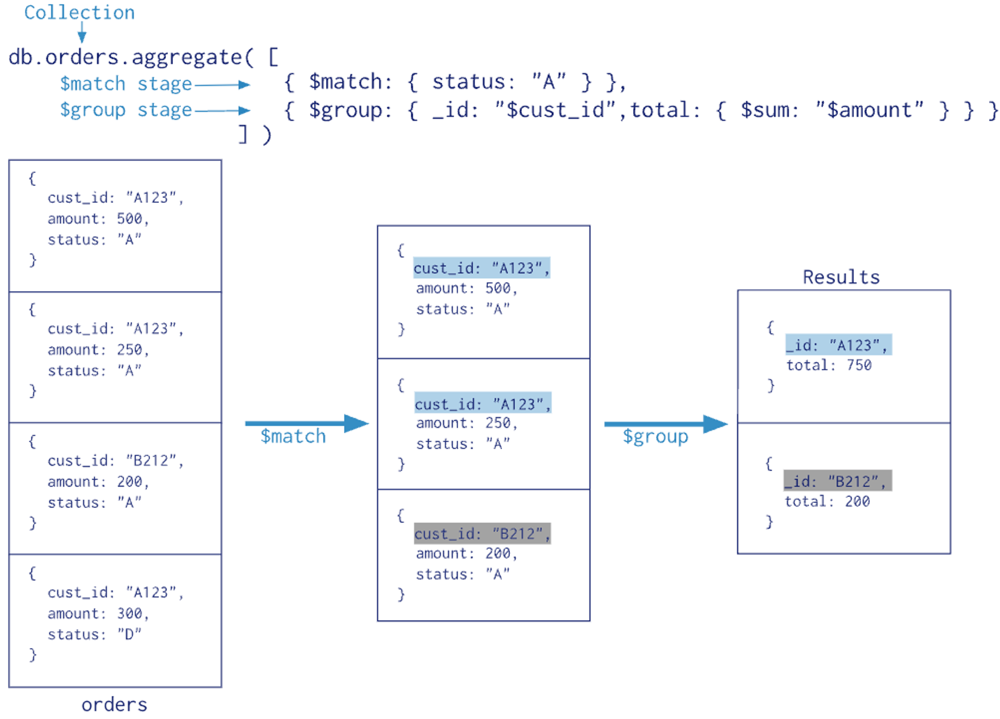

# 데이터 베이스 [자료 링크](https://visioneer.notion.site/DB-58522f145bfd4b86b44277005c3612e0)

## day1

- sql 기본 문법
- mysql workbench 설치 및 사용 방법

## day2

- mysql workbench 를 활용해서 테이블 생성
- 샘플데이터 생성
- 데이터 분석
- ERD 프로그램 알아보기

## day3

- pymysql 연습
- 셀레니움 설치 및 연습

## day4

- yes24 크롤링

  - 셀레니움 크롤링시 주피터노트북(ipynb) 사용해야하는 이유.
    - 오류발생시 대처하기가 쉽다.
    - 오류가 발생한 시점에서 중간에 수정해야했을때 수정도 용이.
    - 어디서 오류가 발생했는지 찾기 쉬움.
  - 오류가 발생햇을때 대처법.
    
    - 셀레니움을 활용해서, 주소를 List에 저장해서, 주소 리스트를 for 문에 돌리는 상황에서 에러가 발생했을시,
      - 1. db에서 마지막 저장된 데이터 확인  
           
      - 2. 켜져있는 크롬브라우저 마지막 페이지 확인  
           
      - 주피터 노트북에서 별도로 코드 돌려서 에러부분찾기.  
        
      - 에러 수정후, 에러난 부분부터 리스터 다시저장(에러난 부분이 12라고 가정 12부터 끝까지 다시 시작)  
        

- mini project sakila sql
  - sakila는 mysql에서 제공하는 데이터베이스를 지칭함.[사이트](https://dev.mysql.com/doc/index-other.html)

## day5

- mongo DB

## MongoDB 비교문법 & 논리연산

### 비교문법

| 연산자 | 설명                                | 예시                                                  |
| ------ | ----------------------------------- | ----------------------------------------------------- |
| $eq    | 값이 지정된 값과 같은 경우          | db.myCollection.find({ age: { $eq: 30 } })            |
| $gt    | 값이 지정된 값보다 큰 경우          | db.myCollection.find({ age: { $gt: 30 } })            |
| $gte   | 값이 지정된 값보다 크거나 같은 경우 | db.myCollection.find({ age: { $gte: 30 } })           |
| $lt    | 값이 지정된 값보다 작은 경우        | db.myCollection.find({ age: { $lt: 30 } })            |
| $lte   | 값이 지정된 값보다 작거나 같은 경우 | db.myCollection.find({ age: { $lte: 30 } })           |
| $ne    | 값이 지정된 값과 다른 경우          | db.myCollection.find({ age: { $ne: 30 } })            |
| $in    | 값이 지정된 배열에 있는 경우        | db.myCollection.find({ age: { $in: [30, 35, 40] } })  |
| $nin   | 값이 지정된 배열에 없는 경우        | db.myCollection.find({ age: { $nin: [30, 35, 40] } }) |

### 논리연산

| 연산자 | 설명                                  | 예시                                                                         |
| ------ | ------------------------------------- | ---------------------------------------------------------------------------- |
| $and   | 모든 조건이 참인 문서를 찾음          | db.myCollection.find({ $and: [{ age: { $gt: 20 } }, { age: { $lt: 30 } }] }) |
| $or    | 하나 이상의 조건이 참인 문서를 찾음   | db.myCollection.find({ $or: [{ age: 20 }, { name: "Alice" }] })              |
| $not   | 조건의 반대에 해당하는 문서를 찾음    | db.myCollection.find({ age: { $not: { $gt: 30 } } })                         |
| $nor   | 주어진 모든 조건이 거짓인 문서를 찾음 | db.myCollection.find({ $nor: [{ age: 20 }, { name: "Alice" }] })             |

이 연산자들은 특정 조건에 부합하는 문서를 찾거나, 특정 조건을 제외한 문서를 찾는 데 사용됩니다. **`$and`**와 **`$or`**는 가장 자주 사용되며, 복잡한 쿼리 조건을 구성하는 데 필수적인 요소입니다.

## MongoDB Aggregation 문법

MongoDB의 Aggregation Framework는 복잡한 데이터 처리 및 분석 작업을 위해 설계된 기능

데이터를 변환하고, 결합하고, 계산할 수 있습니다.

[Aggregation Pipeline — MongoDB Manual](https://www.mongodb.com/docs/v3.4/core/aggregation-pipeline/)

여러 document 들을 grouping 하여 연산을 수행한 후 하나의 result 를 반환하는 연산



1. **Aggregation Pipeline**: Aggregation Framework의 핵심 개념입니다. 여러 단계(stage)를 통해 데이터를 처리합니다. 각 단계는 입력으로 문서들을 받아, 변환을 수행하고, 출력으로 다음 단계로 문서들을 전달합니다.
2. **Stages**: 각 단계는 특정 연산을 수행합니다. 예를 들어, 필터링(**`$match`**), 정렬(**`$sort`**), 그룹화(**`$group`**), 프로젝션(**`$project`**) 등이 있습니다.
3. **Pipeline Operators**: 각 단계에서 사용되는 연산자입니다. 예를 들어, **`$sum`**, **`$avg`**, **`$min`**, **`$max`**, **`$group`**, **`$sort`** 등이 있습니다.

간단한 예시로, **`users`** 컬렉션에서 사용자들의 평균 나이를 계산하는 Aggregation Pipeline을 살펴봅시다:

```jsx
db.users.aggregate([{ $group: { _id: null, averageAge: { $avg: "$age" } } }]);
```

이 예시에서는 다음과 같은 작업을 수행합니다:

- **`$group`**: 이 단계에서는 문서들을 그룹화합니다. 여기서는 **`_id: null`**을 사용하여 모든 문서를 단일 그룹으로 묶습니다.
- **`$avg: "$age"`**: 각 사용자의 **`age`** 필드의 평균을 계산합니다.

- **$match**: 데이터를 필터링합니다. 예를 들어, **`age`**가 30 이상인 문서만 선택합니다.
  - 예시: **`db.collection.aggregate([ { $match: { age: { $gte: 30 } } } ])`**
- **$group**: 데이터를 그룹화하고 집계합니다. 예를 들어, 각 **`department`** 별로 평균 **`salary`**를 계산합니다.
  - 예시: **`db.collection.aggregate([ { $group: { _id: "$department", averageSalary: { $avg: "$salary" } } } ])`**
- **$project**: 특정 필드를 선택하거나 새로운 필드를 생성합니다. 예를 들어, **`name`**과 **`age`** 필드만 표시합니다.
  - 예시: **`db.collection.aggregate([ { $project: { name: 1, age: 1 } } ])`**
- **$sort**: 결과를 정렬합니다. 예를 들어, **`age`** 필드로 오름차순 정렬합니다.
  - 예시: **`db.collection.aggregate([ { $sort: { age: 1 } } ])`**
- **$limit**: 결과의 개수를 제한합니다. 예를 들어, 상위 5개 문서만 반환합니다.
  - 예시: **`db.collection.aggregate([ { $limit: 5 } ])`**
- **$skip**: 특정 개수의 문서를 건너뜁니다. 예를 들어, 처음 10개 문서를 건너뛰고 그 다음 문서들을 반환합니다.
  - 예시: **`db.collection.aggregate([ { $skip: 10 } ])`**
- **$unwind**: 배열 필드를 개별 문서로 분리합니다. 예를 들어, **`interests`** 배열의 각 항목을 별도의 문서로 분리합니다.
  - 예시: **`db.collection.aggregate([ { $unwind: "$interests" } ])`**
- **$lookup**: 다른 컬렉션과의 조인을 수행합니다. 예를 들어, **`orders`** 컬렉션과 **`customers`** 컬렉션을 **`customerId`**로 조인합니다.
  - 예시:
  ```sql
  db.orders.aggregate([
      {
          $lookup: {
              from: "customers",           // 조인할 다른 컬렉션의 이름
              localField: "customerId",    // 현재 컬렉션(orders)의 필드
              foreignField: "_id",         // 조인 대상 컬렉션(customers)의 필드
              as: "customerDetails"        // 조인된 문서들이 저장될 새 필드의 이름
          }
  ```
