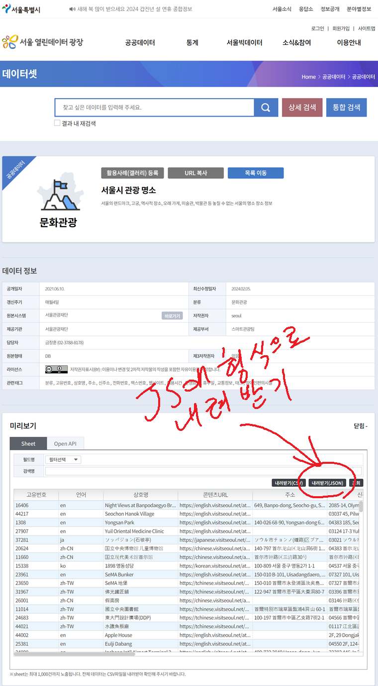
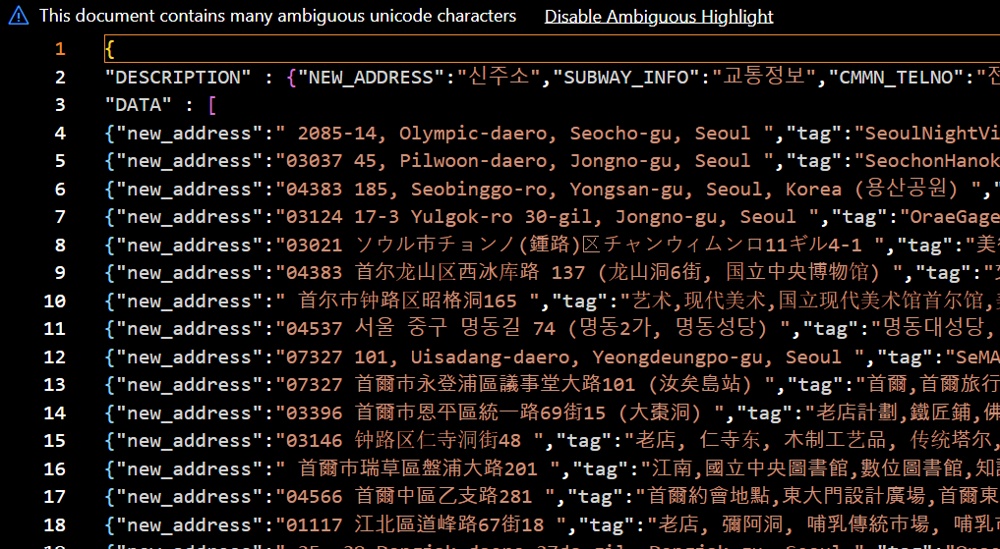
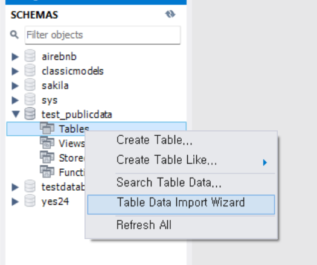
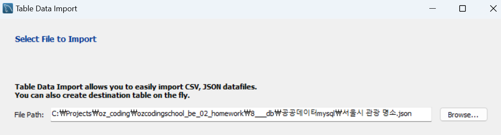
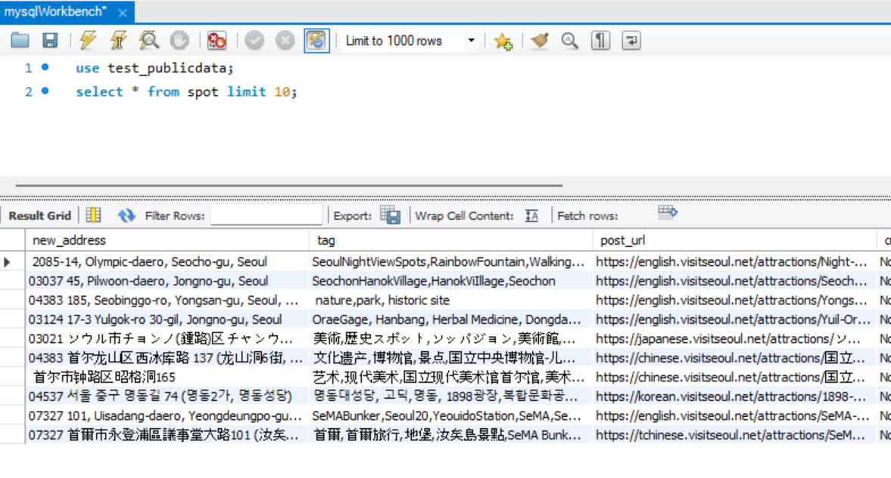
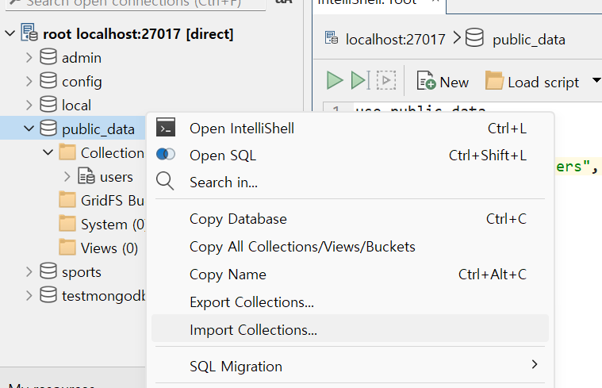
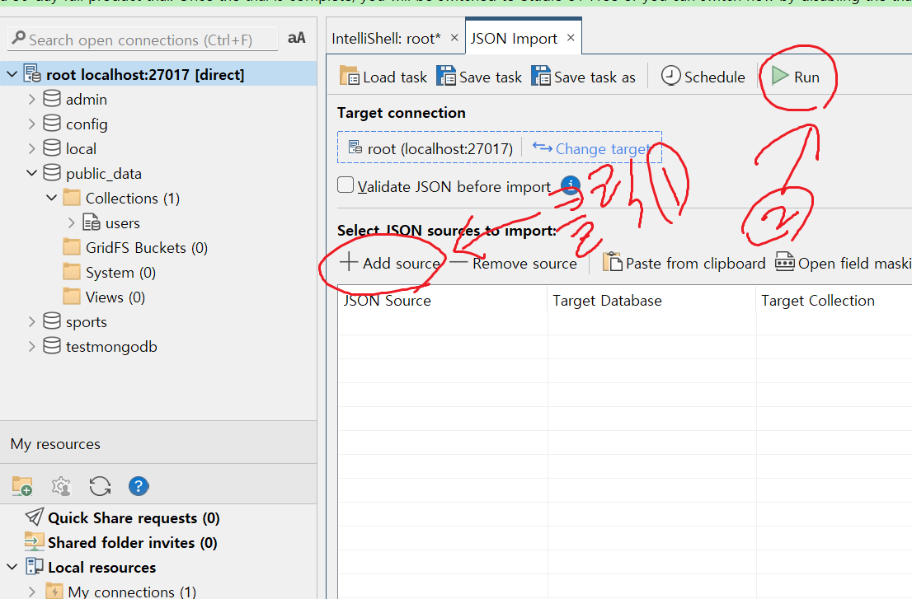
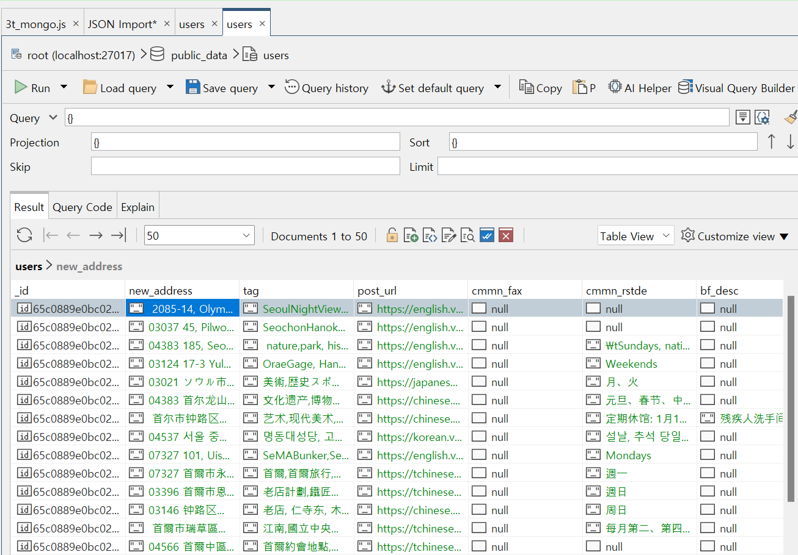

# 공공데이터 데이터베이스 과제 [과제링크](https://legend-palm-1f1.notion.site/de112eca2a6d493d8a7be39519624432)

# 과제 1 서울시 관광명소 저장하기 [데이터 링크](https://data.seoul.go.kr/dataList/OA-21050/S/1/datasetView.do)

## 과제 1-1 공공데이터 mysql workbench를 이용해서 mysql 에 데이터저장

  

공공데이터 사이트에서 JSON으로 저장.

  

json 으로 저장된 파일.  
  
  

  

mysqlWrokbench에서 데이터 넣을 스키마 테이블에 오른쪽 버튼 누르고, Table Data Import Wizard 누르기.  
  
  

  

경로에 한글 없이 영어만, json 데이터는 [{key1:value,key2:value...},{key1:value,key2:value...}...] 형식으로 저장하기.  
  
  

  

데이터가 정상적으로 들어갔다.

## 과제 1-2 공공데이터 Studio 3T를 이용해서 mongoDB 에 데이터저장

  

Studio 3T에서 저장원하는 곳에 Import Collections 클릭

  

Add source눌러서 data파일 선택하고, Run 누르기.  
  

  

데이터 저장 완료
  

