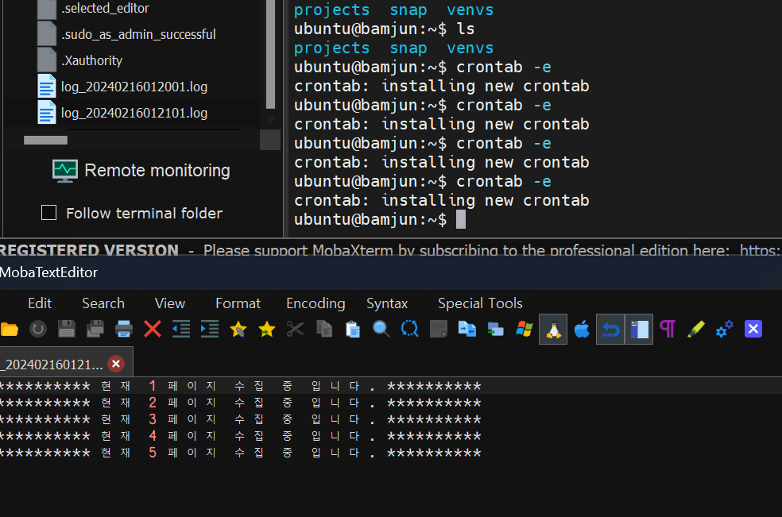
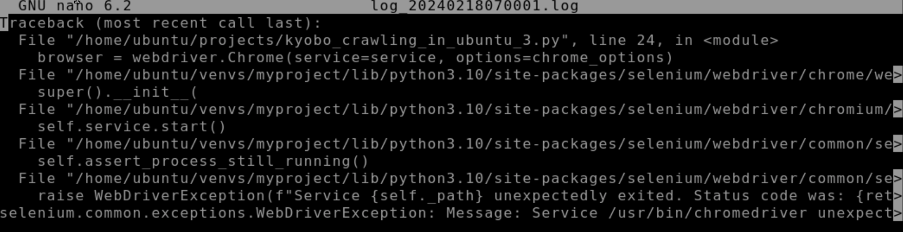

# 교보문고. yes24 크롤링 데이터 활용해서 차트 만들기
> 교보문고, yes24에서 각각 일간베스트 도서 크롤링 후 크롤링 데이터를 활용해서 비교 차트 웹페이지 만들기  

<br>  

# 2024.02.07. ~ 2024.02.16.

[사이트 보기](http://topbookscharts.com/)


### 가이드 페이지 [링크](https://legend-palm-1f1.notion.site/0e70a019c8154103907fb13c8b6ee121)  

---  
# $$\Huge\color{purple}\fbox{\Huge \color{pink}{TODO LIST}}$$  
- DB 스키마 구조 설계  
  - 고유 책 ID인 ISBN으로 테이블 묶음.
    ```diff
    - 2024 02 07 완료  
    ```    
      
  - 스키마 다시 만들어야 할듯...
    - > 교보문고 크롤링완료하고 워크벤치 확인과정에서, 문제점 발견..  
    교보문고 크롤링완료하고 yes24크롤링 후 데이터를 저장해야하는데, 한곳의 테이블에 교보문고와 yes24 데이터를  
    저장하는게 비효율이고, 오류가 발생할 가능성이 많을꺼 같아서, price와 ranking 테이블을 교보와 yes24테이블로 각각 만들어야할듯..  
      ```diff
      + 수정 2024 02 08  
      - 완료 2024 02 08  
      ```  
        
        
  <br>
- 교보문고 크롤링 하기  
  - ~~yes24는 주간평균데이터만 제공하므로 비교를 위해 교보무고 주간~~```일간``` 데이터 가져오기  
    - 
    ```diff
    - 2024 02 07 완료  
    ```    
      
  - > 매일 크롤링 하는과정에서 동일한 책은 books 테이블에 데이터 삽입 하지 않도록 수정  
  db에서 select count(*) as a from books where isbn = isbn 으로 중복확인  
    ```diff
    + 추가 2024 02 08 
    - 완료 2024 02 08  
    ```    
      
  <br>    
- yes24 크롤링 하기  
  - 데이터 크롤링.  
    ```diff
    - 완료 2024 02 08  
    ```    
    
  <br>
- mysql 데이터 베이스에 저장  
  ```diff
  - 완료 2024 02 08  
  ```    
  <br>

- 교보문고, yes24 데이터 평균값 average 테이블에 저장  
  ```diff  
  - 완료 2024 02 10  
  ```  
    

  <br>

- flask 웹페이지 연동  
  - mysql 연동  
    ```diff  
    - 완료 2024 02 08  
    ```  
      
    <br>  

  - 부트스트렙을 활용해서 크롤링데이터 출력하기  
    ```diff  
    - 완료 2024 02 12  
    ```
      
    <br>  

    - 페이지네이션 적용하기  
    ```diff  
    - 완료 2024 02 12  
    ```
      
    <br>  

  - chart js 를 활용해서 차트 만들기  
    ```diff  
    - 완료 2024 02 14  
    ```
      
    <br>  
  <br>
- aws window server에서 가동하게 구현하기  
  - aws lightsail windows server 개설하기  
    - 
    ```diff
    - 2024 02 07 완료  
    ```    
      
  - RDP를 활용해서 윈도우즈 메인컴에 서버컴 리모트 연동하기  
    - 
    ```diff
    - 2024 02 07 완료  
    ```    
      
      
  - aws ubuntu 개설  
    - 윈도우 환경에서 mysql 셀레니움 개발해서, aws 윈도우 서버로 하려고 했으나, 웹 개설할때 어려울꺼같아서, 우분투로 변경  
    - 셀레니움 코드 통합하기  
    ```diff  
    - 완료 2024 02 11  
    ```  
      

    - mysql 설치 & 크롤링 코드 연동하기    

    - flask 설치 & 코드 연동하기   

  - mysql 연동  
  - 파이썬 크롤링 스크립트 매일 1회 실행하게 하기.  
  - flask 실행하기  
  - ~~윈도우용~~ nginx 설치  
  - 웹 개설 하기  


  # ㅠㅠ

  - 우분투에서 플라스크 실행중..

  - 크롤링 파일 크롤링이 끝까지 안되고, 자꾸 중간에 멈추는 문제발생. 
    - 총 100개 크롤링 중 10개 끝날때마다, 셀레니움 재시작하게 코드 만들어서 해결..  
    ```diff  
    - 완료 2024 02 11  
    ```  

  - nginx 켜져있는 상태에서 크롤링한 데이터 mysql에 정상적으로 저장되는지 테스트 하기 위해. nginx 적용.  
    ```diff 
    - 완료 2024 02 11
    ```
      
  
  - 웹게시중, 크롤링 가능함.  
    ```diff 
    - 완료 2024 02 11
    ```
      

  - 우분투로 크롤링가능 한지 확인하기 위해서, mysql 정리가 안됬는데, 작동하는지만 확읺고, nginx 까지 넘어감...  정리해야할듯..  
  - aws 서버 지우고 다시 정리하기..  

# aws lightsail 다시 만들기  
  - 초기설정 [instruction](https://dohokin.com/?p=1982)
  - 우분투 mysql 설치, 데이터베이스 생성 [instruction](https://dohokin.com/?p=1986)  
    ```diff  
    - 완료 2024 02 15  
    ````  
    

    

  - 크롤링 파일 실행해서, 데이터베이스 채우기  [우분투 셀레니움 설치가이드](https://dohokin.com/?p=2018)  
    ```diff  
    - 완료 2024 02 15  
    ```  

    

  - 스케줄러 이용해서, 새벽시간대에 크롤링 자동실행하기.  [instruction](https://dohokin.com/?p=2028)
    ```diff  
    - 완료 2024 02 16  
    ```  
    
    

  - nginx 까지 적용완료..  
    ```diff  
    - 완료 2024 02 16  
    ```  

  
    

---
---

# $$\Huge\color{green}\fbox{\Huge \color{yellow}{Improvement}}$$  

- 날짜별로 선택 가능하게 만들기.  
  - 기존에는 crontab을 이용해서, 매일 아침 9시에 크롤링한 데이터를, 차트에 필요한 js파일로 변하는 과정을 거쳤다.  
    날자별로 선택했을시, 다른날자 선택했을때, 차트가 최신 데이터만 표시되게 때문에, 페이지불러올때마다 데이터 변환하게 해야함..  
    flask view에서 변환하게 변경함..   

    ```diff  
    + 시작 2024 02 17  
    - 완료 2024 02 18
    ``` 

    

<br>  

--- 

<br>  
  
- crontab 으로 매일 새벽에 크롤링 돌리는 코드 에러 수정하기.  
  - 수동으로 돌렸을때는 잘작동했고, nginx 적용 전까지도 crontab으로 잘 작동했는데, 왜 지금 안될까..  
  - 03___kyoboCrawlingDataToMysql 로 코드 통합 내일(19일) 잘 되는지 봐야할듯...  
    ```diff  
    + 시작 2024 02 18  
    ```  
    


<br>  

--- 

<br>  
  

- 버블차트 색을 랜덤으로 지정해서, 통일성이 없어 보인다. 분류별로 저장하고, 분류별 색을 지정하자.  
  - sql 스키마부터 변경해야할듯. 분류저장할 곳을 정하자.  
  - 책 분류별로 크롤링 해서, db에 저장하기.  
  - views, html 파일 변경 차트에 적용시키기.  
    ```diff  
    + 시작 2024 02 18  
    ```  

<br>  

--- 

<br>  
  
- 크롤링 파이썬코드 윈도우&리눅스 통합하기.  
  - 개발을 편하게하기 위해서 현재 윈도우 크롤링 파이썬 코드 파일과 리눅스 크롤링 파이썬 코드 통합하기  
  - 셀레니움 경로가 틀려서 윈도우전용과 리눅스 전용 별도로 만들었는데, 윈도우에서 테스트하고 코드수정하고, 수정한 결과를 리눅스에 또 카피 하는 과정이 번거롭다..  
  - import platform 을통해서 현재 실행중인 코드의 운영체제 체크하고 윈도우 용과 파이썬 용 별도로 작동하게 하기.  
  - 03___kyoboCrawlingDataToMysql 파일로 통합
    ```diff  
    + 시작 2024 02 18  
    - 완료 2024 02 18
    ```  
