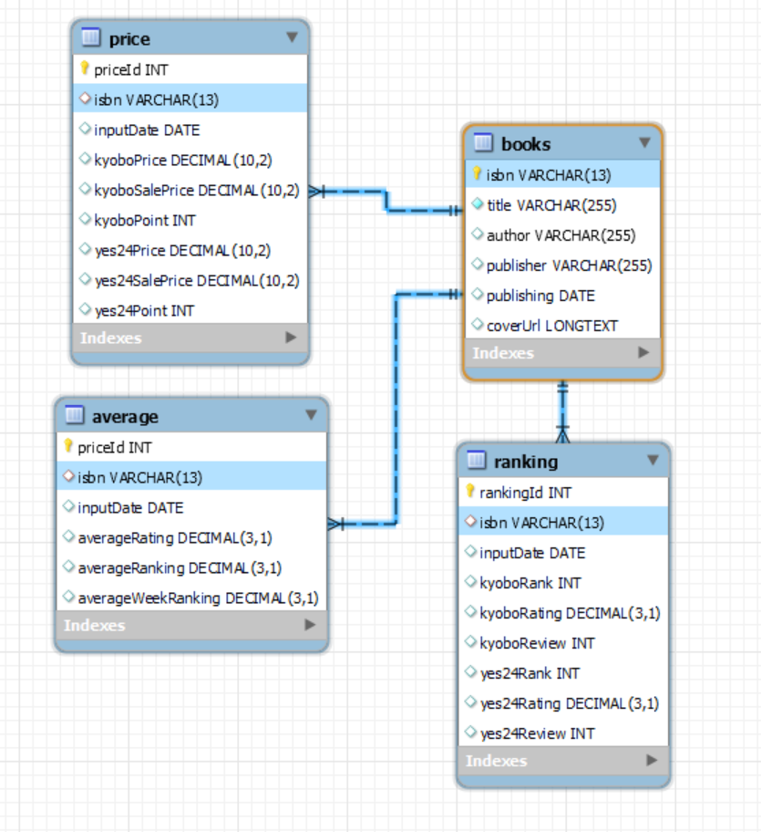

# 교보문고. yes24 크롤링 데이터 활용해서 차트 만들기
> 교보문고, yes24에서 각각 일간베스트 도서 크롤링 후 크롤링 데이터를 활용해서 비교 차트 웹페이지 만들기  

<br>  

# 2024.02.07. ~


### 가이드 페이지 [링크](https://legend-palm-1f1.notion.site/0e70a019c8154103907fb13c8b6ee121)  

---  

# TODO LIST  
- DB 스키마 구조 설계  
  - 고유 책 ID인 ISBN으로 테이블 묶음.  
  - 2024 02 07 완료  
      
  <br>
- 교보문고 크롤링 하기  
  - ~~yes24는 주간평균데이터만 제공하므로 비교를 위해 교보무고 주간~~```일간``` 데이터 가져오기  
  <br>    
- yes24 크롤링 하기  
  - 데이터 크롤링.  
  <br>
- mysql 데이터 베이스에 저장  
  <br>
- flask 웹페이지 연동  
  - mysql 연동  
  - 부트스트렙을 활용해서 크롤링데이터 출력하기  
  - chart js 를 활용해서 차트 만들기  
  <br>
- aws window server에서 가동하게 구현하기  
  - aws lightsail windows server 개설하기  
  - RDP를 활용해서 윈도우즈 메인컴에 서버컴 리모트 연동하기  
  - mysql 연동  
  - 파이썬 크롤링 스크립트 매일 1회 실행하게 하기.  
  - flask 실행하기  
  - 윈도우용 nginx 설치  
  - 웹 개설 하기  