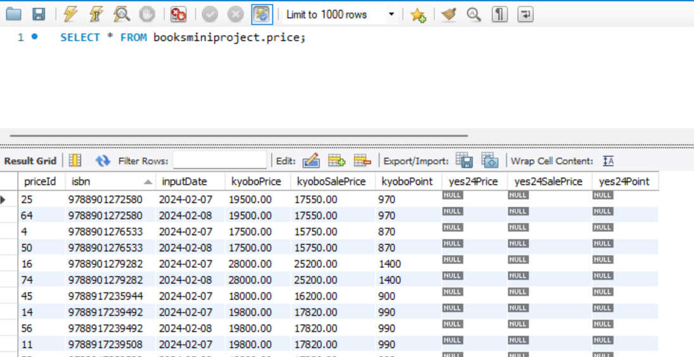
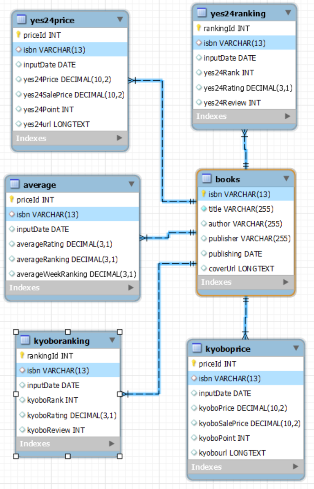
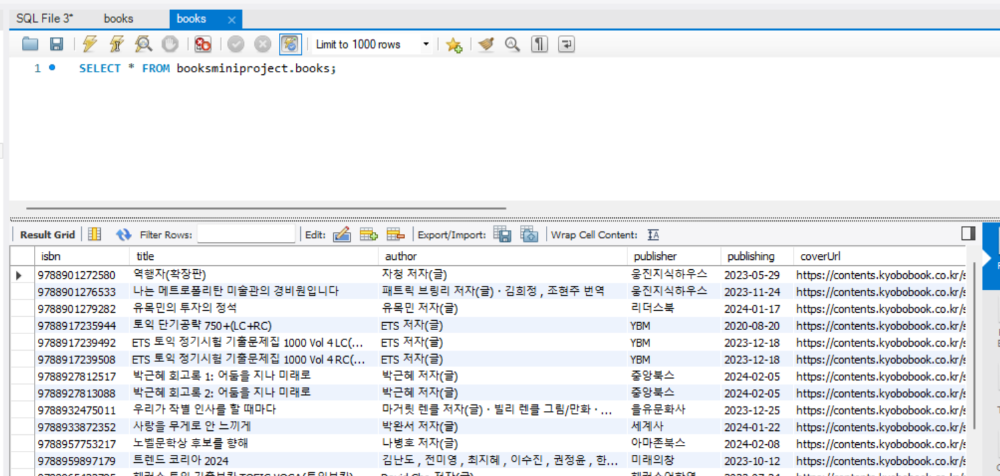
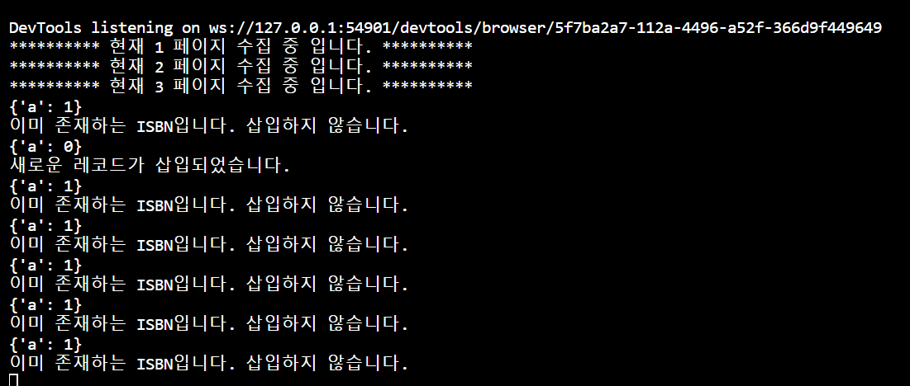
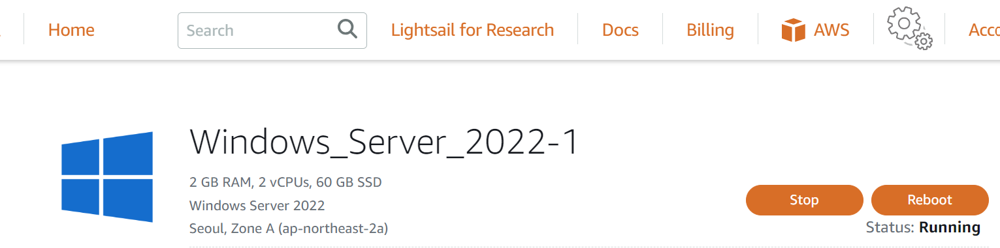
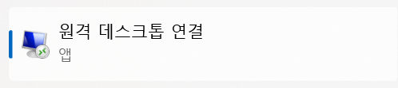
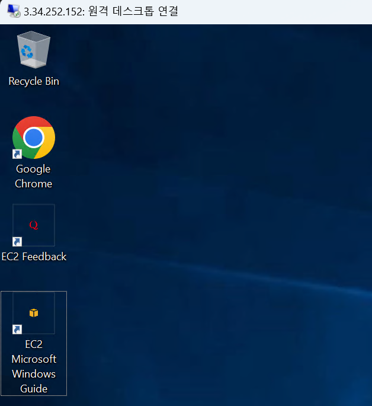

# 교보문고. yes24 크롤링 데이터 활용해서 차트 만들기
> 교보문고, yes24에서 각각 일간베스트 도서 크롤링 후 크롤링 데이터를 활용해서 비교 차트 웹페이지 만들기  

<br>  

# 2024.02.07. ~


### 가이드 페이지 [링크](https://legend-palm-1f1.notion.site/0e70a019c8154103907fb13c8b6ee121)  

---  
<p>$\huge{\rm{\color{#5ad7b7}큰글씨\ 로만체\ 초록색}}$</p>
# TODO LIST  
- DB 스키마 구조 설계  
  - 고유 책 ID인 ISBN으로 테이블 묶음.
    - <span style='background-color:yellow; color:black;'>2024 02 07 완료</span>  
      
  - 스키마 다시 만들어야 할듯...
    - > 교보문고 크롤링완료하고 워크벤치 확인과정에서, 문제점 발견..  
    교보문고 크롤링완료하고 yes24크롤링 후 데이터를 저장해야하는데, 한곳의 테이블에 교보문고와 yes24 데이터를  
    저장하는게 비효율이고, 오류가 발생할 가능성이 많을꺼 같아서, price와 ranking 테이블을 교보와 yes24테이블로 각각 만들어야할듯..  
      - 수정 2024 02 08  <span style='background-color:yellow; color:black;'>완료 2024 02 08</span>
        
        
  <br>
- 교보문고 크롤링 하기  
  - ~~yes24는 주간평균데이터만 제공하므로 비교를 위해 교보무고 주간~~```일간``` 데이터 가져오기  
    - <span style='background-color:yellow; color:black;'>2024 02 07 완료</span>  
      
  - > 매일 크롤링 하는과정에서 동일한 책은 books 테이블에 데이터 삽입 하지 않도록 수정  
  db에서 select count(*) as a from books where isbn = isbn 으로 중복확인  
    - 추가 2024 02 08 <span style='background-color:yellow; color:black;'>완료 2024 02 08</span>  
      
  <br>    
- yes24 크롤링 하기  
  - 데이터 크롤링.  
  - <span style='background-color:yellow; color:black;'>완료 2024 02 08</span>  
    
  <br>
- mysql 데이터 베이스에 저장  
  - <span style='background-color:yellow; color:black;'>완료 2024 02 08</span>  
  <br>
- flask 웹페이지 연동  
  - mysql 연동  
  - 부트스트렙을 활용해서 크롤링데이터 출력하기  
  - chart js 를 활용해서 차트 만들기  
  <br>
- aws window server에서 가동하게 구현하기  
  - aws lightsail windows server 개설하기  
    - <span style='background-color:yellow; color:black;'>2024 02 07 완료</span>  
      
  - RDP를 활용해서 윈도우즈 메인컴에 서버컴 리모트 연동하기  
    - <span style='background-color:yellow; color:black;'>2024 02 07 완료</span>  
      
      
  - mysql 연동  
  - 파이썬 크롤링 스크립트 매일 1회 실행하게 하기.  
  - flask 실행하기  
  - 윈도우용 nginx 설치  
  - 웹 개설 하기  