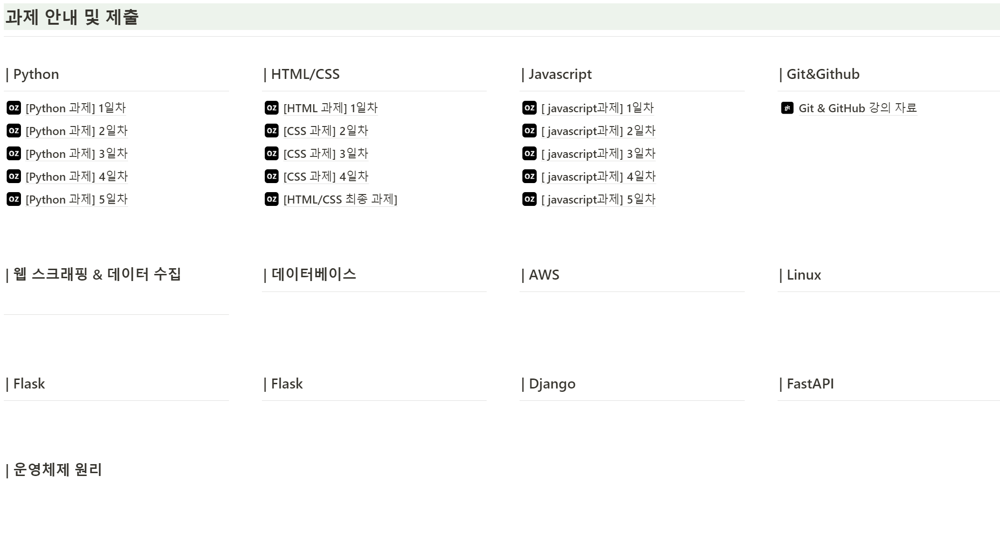

숙제하기

## 깃복사하기
git clone [GitHub 프로젝트 URL]  
git clone https://github.com/bamjun/ozcodingschool_be_02_homework.git  
  

##
기존 GitHub 저장소에서 clone한 후 업데이트 또는 변경된 내용을 업로드하기 위한 순서는 다음과 같습니다:

1. **로컬 저장소에서 작업**:
   - 클론된 로컬 저장소로 이동하여 변경하고 싶은 파일을 수정하거나 새 파일을 추가합니다.

2. **변경 사항 스테이징**:
   - 모든 변경 사항을 스테이징 영역에 추가합니다:
     ```
     git add .
     ```
     또는 특정 파일만 추가하려면:
     ```
     git add [파일명]
     ```

3. **커밋 생성**:
   - 변경 사항에 대한 커밋을 생성합니다:
     ```
     git commit -m "변경 내용에 대한 설명"
     ```

4. **원격 저장소에 푸시**:
   - 변경 사항을 원격 저장소에 푸시합니다:
     ```
     git push origin [브랜치명]
     ```
     `master` 또는 `main` 브랜치를 사용하는 경우:
     ```
     git push origin master
     ```
     또는
     ```
     git push origin main
     ```

이 순서를 따르면 로컬에서 작업한 내용을 원격 GitHub 저장소에 업로드할 수 있습니다.