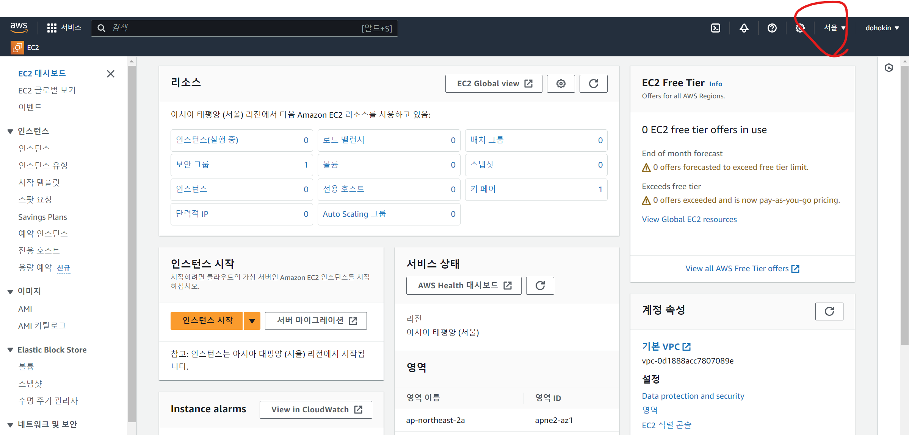
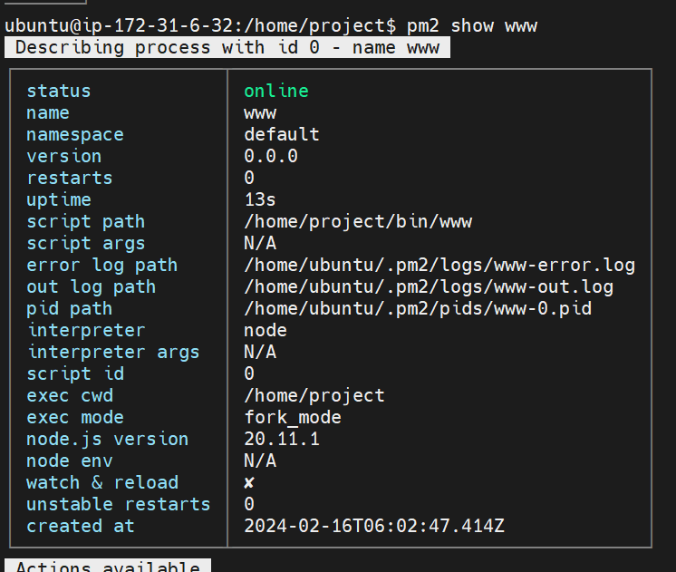

# aws

- 리전확인하기  


# ec2  
  - 인스턴스 생성하기  

# 윈도우에서 ec2 접속하기  
<a href="https://docs.aws.amazon.com/ko_kr/AWSEC2/latest/UserGuide/putty.html">putty 설명</a>  
  - putty 다운로드 
  - putty 커널 실행프로그램  
  - puttygen pem키 to ppk (putty용 키로 변환)  
    
  - 로드에서 확장자 모드로 선택한다음, putty용 키로 변환할 .pem 선택  
  - 제너레이트 클릭
    
  - host Name에 ec2 인스턴스 퍼블릭 ip 입력 포트 22  
    
  - 왼쪽창에 coonection > ssh > auth > credentials > browse클릭 후 변환한 키 선택  
  - 오픈 클릭 후 login as 나타나면, ubuntu 입력  

# 리눅스 커널 명령어  
  - ls  
    - 현재 경로 나타남.  
    ```bash  
    ls  
    ```  

  - cd [폴더명]
    - 폴더 이동  
    ```bash  
    cd home
    # 하위폴더인 home 으로 이동  
    cd ..  
    # 상위폴더로 이동  
    cd ~ 
    # home 디렉토리로 이동  
    ```
  - pwd  
    - 현재 위치한 폴더 보여줌  
    ```bash  
    pwd  
    # /home/ubuntu 이런식으로 현재경로 표시  
    ```

# elastic IP 탄력적 IP  
  - 사용중인 ec2 가 문제가 생길때 빠르게 대처할수 있음.  
  - EC2 메뉴에서 오른쪽 메뉴에서 한글일경우, 네트워크 및 보안 > 탄력적 IP > 주환색 탄력적 IP 주소 할당 > 할당  
  - 생성된 탄력적 ip 주소 클릭 후 생성한 인스턴스 설정해주기.  
  - 설정안된 탄력적 IP 주소는 과금 됨..  
  - 탄력적 IP 주소 와 기존 인스턴스 IP로 둘 다 사용해서 커널 접속 가능.  
  - 탄력적IP 주소 사용안해서, 탄력적IP주소 연결해제 했을시, 탄력적IP주소 릴리스 눌러서 완전히 삭제해야 과금안됨.  
  - 릴리스 안하고 1시간 경과시, 과금  
    

# 보안그룹  
  - ec2 안에 보안그룹 있음.  
  - 규칙은 허용적으로만 생성가능(어떤거는 불가능하게 설정 못함)  

# ec2인스턴스 삭제는 없고, 종료하면 이후에 자동으로 삭제됨..  

# EBS  
  - EBS(elastic block store)  
  - ec2에 여러게 ebs 연결해서 사용가능, 반대로 ebs하나에 여러게의 ec2 연결 불가.  
  - AMI (Amazone Machine Image)
    - os가 설치된 형태의 이미지 파일  
  - 새로 생성 후 인스턴스 연결가능.  

# ELB
  - ELB(elastic load balancing)  
    - 부하 분산시킴으로써 안정적으로 서비스를 제공.  
  - Load Balancer  
    - 과부하를 나눠준다.  
  - 유형
    - ALB
      - HTTP 헤더 기준으로 트래픽 분배    
    - NLB
      - IP 주소 기준으로 트래픽 분배  
    - CLB
      - 과거유형  

# EC2 WORDPRESS 생성 과정  
  - 인스턴스 생성 > 인스턴스 이름 지정 > wordpress bitnami 검색 > ec2 프리티어 버전 설정 > 키페어 설정 > 인스턴스 생성  
    
    
    
    
    
    
    

  - ELB 로드벨런서.  
    
    
    
    
    
    
    
    
    
    
    
    
    
    
    
    

# Auto Scaling  
  - 자동으로 크기를 조절한다. 
  - 트래픽에 따라서 자동으로 서버를 조절한다.  
  - 자동으로 ec2 인스턴스 개수를 조절.  
  - elb와 auto scaling 같이 사용  
  - auto scaling 기본구조  
    

<br>

  - Auto Scaling Group (ASG)  
    - auto scaling 되는 ec2 인스턴스들의 집합  
    - Cloud Watch와 연동가능. 


# 오토스케일링  실습  

  - 이미지 생성해놔야함.  

    
  
  
  
  
  
  

    - 활성화시 ec2 리부팅안됨, 오류발생 위험있음.    

  

  - 이미지 생성완료..  

  
  
  

  - 가지고있는 ec2 선택  

  


  - auto scaling 가용영역 선택  
      - 여러개 선택하면, 분산해서 관리함  
  

  - 부하테스트  
    - 커널에서 stress 이용해서 부하 태스트  
    ```cmd  
    sudo apt-get install stress  
    stress --cpu 4  
    ````  

    

  - 커널에서 wordpress 유저 아이디 확인하기.  
    ```cmd  
    cat bitnami_credentials
    ```

# RDS  
  - Relational Databasae Service 관계형 데이터베이스 서비스  
  - ELB 혹은 AS 이용해서, ec2 확장해서 이용시, 동일한 저장공간이 아니여서, 동일한 데이터가 보이지 않음.. 이를 방지하기위해서, RDS를 이용해서 동일한 공간에 데이터 저장.  
  - 완전관리형 관계형 db서비스  
  - 다양한 db엔진 제공  
  - db 이중화  
  - read replica  
    - 읽기전용  


  
<a href='https://www.techrepublic.com/blog/the-enterprise-cloud/what-does-a-dba-do-all-day/'>관련링크</a>

  - ec2 기본 내장 저장공간을 사용하는것보단, rds 사용할때 더 효율적  


  - M : 읽고쓰기의 역할 master db가 함.  
  - S : stand by db 대기중인 인스턴스  
    - 장애가 생겼을때 M(master)의 역활을 대신함.  
    - 멀티 에이지의 역활을 함.  
  - R : Read replica 읽기전용 인스턴스  
    - 비동기 복제가 이루어짐.  
    - 데이터가 약간 다를수 있음.(실시간 복제)  


  - 장애발생시  

  

  - S를 M으로 변경가능, 두개의 M이 발생가능.  

  


# mysqlworkbench 와 rds 연동  

  


- connections name : 데이터 베이스 임의 이름.  
- hostname : rds의 엔드포인트 입력  
- username : rds 생성 후 나타난 id  
- password : rds 생성 후 제공된 일회용 password  

<a href='https://github.com/soaple/first-met-aws-practice/blob/master/chapter_07/backup.sql'>wordpress bitnami mysql 스키마</a>


-  vim /opt/bitnami/wordpress/wp-config.php

  

-  vim 에디터 접속해서, 워드프레스 db 설정  


-  sql 정보 수정한 ec2 이미지 생성  


-  이미지 준비 확인하기  


-  인바운드 규칙 anywhere 로 변경하기.  

  

-  새로운 시작템플릿 생성하거나, 템플릿 수정해서, 이미지 바꾸기  


-  db 수정한 이미지로 변경  


-  시작 템플릿 수정으로 했으면, 기본버전 설정해야함  

  

-  데이터 베이스에 잘들어와 있는거 확인..  

# S3 simple storage service  
  - 객체 스토리지 특징
    - 방대한 확장성 및 메타 데이터  
    - 데이터를 파일로 관리  

  

  

  - aws 클라우드 유형  
    - s3  
      - 객체 스토리지  
    - EFS  
      - 파일 스토리지  
    - EBS  
      - 블록 스토리지  

  


  - s3 스토리지 클래스 다양함..  

  


- s3 리전이 글로벌임. 따로 설정 할필요없음.  

# cyberduck (s3용 툴)  

  - cyberduck 이용하기 위해서, IAM 키 생성.  

  


  

  - 키는 이시점에만 다운로드 가능. csv 파일 다운로드해서 저장하기.  


  - [다운로드페이지](https://cyberduck.io/download/)

# CloudFront
  - 클라우드 프론트는 CDN 서비스임.  

  


# cdn s3 연동 실습하기  


  - 같은 이름의 파일이 수정 했을경우, 무효화해야지 업데이트 됨..  

# route 53  


# IAM


- 타 이용자에게 자신의 aws를 임의의 아이디를 제공해서 서비스를 이용하게 함.  

# CloudWatch

  - 클라우드 모니터링 서비스  

  

# DynamoDB


# lambda

 - 서버리스 컴퓨팅 서비스  

 

  - 이미지 리사이징 가능.  

# SDK, CLI  

  - sdk 소프트웨어 개발 키트  
  - cli 커맨드라인 인터페이스  
  - shared credentials 공유 자격 증명  
    - 컴퓨터에 aws자격증명을 설정해서, sdk cli 사용해서 aws 서비스를 사용가능하게 함.  


[관련링크](https://docs.aws.amazon.com/ko_kr/sdkref/latest/guide/file-format.html)  


# 실습

  - ls -al
    - 리눅스에서 폴더 권한까지 보는 명령어.
  - sudo chown ubuntu:ubuntu project/
    - project 폴더에 ubuntu로 권한 변경  

    

  - npm init -y
    - -y 명령어는 다 yesfh tjfwjd  

    

  - package-lock.json
    - 버전 잠금  

    

  - vim 에디터 명령어 설정.  
    - vim ~/ .vimrc

    

    - set autoindent : 들여쓰기 설정
    - set ts=4 : 들여쓰기 몇칸인지  
    - set nu : 앞에 줄수 표시

    

  - nodejs 서버 설정 [설정 링크](https://expressjs.com/en/starter/hello-world.html)  

  - nodejs 설정 후 ec2에서 3000번 포트 개방 설정  

    

  - 접속 에러뜰때 프로세서 강제 종료 후 재시작.  
    - ps -al : 프로세서 확인 명령어  
    - kill -9 [PID] : 프로세서 종료  

    

  - rm 명령어 조심.  

      

  - express generator : 패키지  
    - sudo npx express-generator --view=ejs project
  
  - 권한 설정  
    - sudo chown -R ubuntu:ubuntu project/  
    - -R : 하위 폴더까지 저네 권한 설정.  

  - npm start : 별도로 설정가능  
  - vim package.json

  

  - ec2 기본 저장공간에 이미지 저장하기  
    - api 틀 만들기.  
    - npm install fs multer  

    

    

    

    

  - 업로드 하고, 업로드 항목 표시  

      

  - pm2 자동 node 실행  

  

  - 완료

  

- 실제 서비스를 해봐야 좋은건가 느낌이 올듯...  


