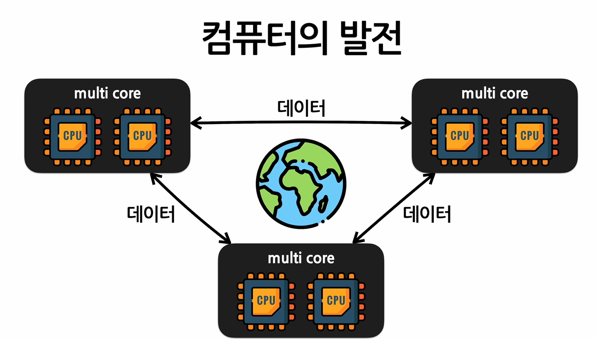

### 클라우드 컴퓨팅 개념

클라우드 컴퓨팅은 인터넷을 통해 서버, 스토리지, 데이터베이스, 네트워킹, 소프트웨어, 분석 등 컴퓨팅 서비스를 제공하는 기술입니다. 사용자는 물리적인 하드웨어를 직접 구매, 관리할 필요 없이 이러한 서비스를 원격으로 사용할 수 있습니다. 클라우드 서비스는 유연한 확장성, 비용 효율성, 고성능, 속도, 효율성 및 혁신성을 제공합니다. 사용한 만큼 비용을 지불하는 '페이 애즈 유 고(Pay-As-You-Go)' 모델 덕분에, 기업이나 개인 사용자는 IT 인프라에 대한 대규모 초기 투자 없이도 필요한 컴퓨팅 자원에 접근할 수 있습니다.

### 리전, 가용 영역, 엣지 로케이션

- **리전(Region)**: 클라우드 서비스가 위치한 지리적 위치를 의미합니다. AWS 같은 클라우드 서비스 제공업체는 전 세계 여러 지역에 데이터 센터를 운영하여 고객이 지연 시간을 최소화하고 법적, 정책적 요구사항을 준수하면서 서비스를 이용할 수 있게 합니다.

- **가용 영역(Availability Zone, AZ)**: 리전 내에 위치한 데이터 센터 그룹입니다. 각 가용 영역은 독립적인 전력, 냉각, 보안 시설을 갖추고 있어 하나의 가용 영역에 문제가 발생해도 다른 가용 영역의 서비스는 영향을 받지 않습니다. 이는 높은 가용성과 재해 복구 기능을 제공합니다.

- **엣지 로케이션(Edge Location)**: AWS의 콘텐츠 전송 네트워크(CDN)인 Amazon CloudFront와 같은 서비스를 사용할 때 데이터와 콘텐츠를 사용자에게 더 빠르게 전달하기 위한 위치입니다. 사용자에게 더 가까운 위치에서 콘텐츠를 캐싱하므로, 응답 시간이 단축되고 전송 속도가 향상됩니다.

### 클라우드의 종류

클라우드 컴퓨팅을 이해하는 데에는 "피자를 먹는 네 가지 방법" 비유가 자주 사용됩니다. 이 비유는 클라우드 서비스 모델(Infrastructure as a Service, Platform as a Service, Software as a Service)과 전통적인 온프레미스 환경을 설명하는 데 도움이 됩니다.

- **온프레미스(집에서 직접 피자 만들기)**: 모든 재료를 구매하고 직접 피자를 만들어 먹는 것처럼, 기업이 자체 데이터 센터에서 모든 서버, 소프트웨어, 네트워크를 구매하고 관리합니다.

- **IaaS(Infrastructure as a Service, 피자 가게에서 데워 먹는 피자)**: 기본적인 인프라(서버, 스토리지, 네트워크)를 클라우드 제공업체로부터 임대해 사용합니다. 사용자는 운영 체제나 애플리케

이션은 자유롭게 설치하고 관리할 수 있습니다.

- **PaaS(Platform as a Service, 반죽이 준비된 피자 키트)**: 애플리케이션 개발에 필요한 플랫폼(운영 체제, 개발 환경, 데이터베이스)을 클라우드에서 제공받습니다. 사용자는 코드 작성과 애플리케이션 배포에만 집중할 수 있습니다.

- **SaaS(Software as a Service, 배달 피자)**: 소프트웨어를 온라인으로 제공받아 사용합니다. 소프트웨어는 클라우드에 호스팅되며, 사용자는 웹 브라우저를 통해 언제 어디서나 접근할 수 있습니다. 소프트웨어의 유지보수와 업데이트는 제공업체가 담당합니다.

각 모델은 사용자의 특정 요구사항, 기술 능력, 예산에 따라 선택할 수 있으며, 클라우드 컴퓨팅의 유연성과 확장성을 잘 보여줍니다.