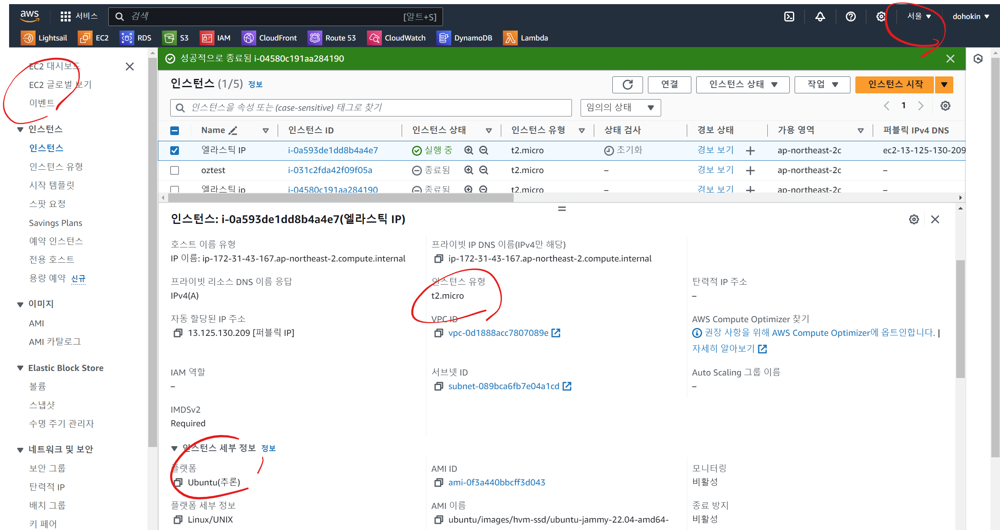
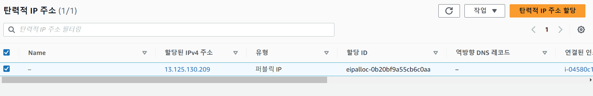
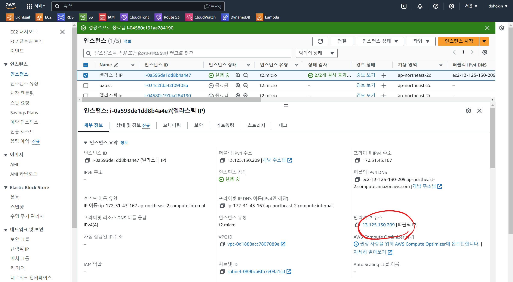
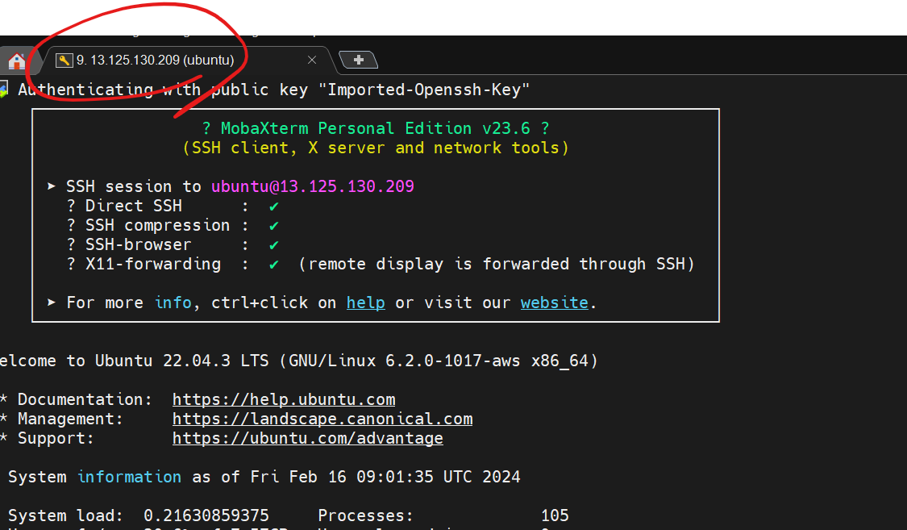
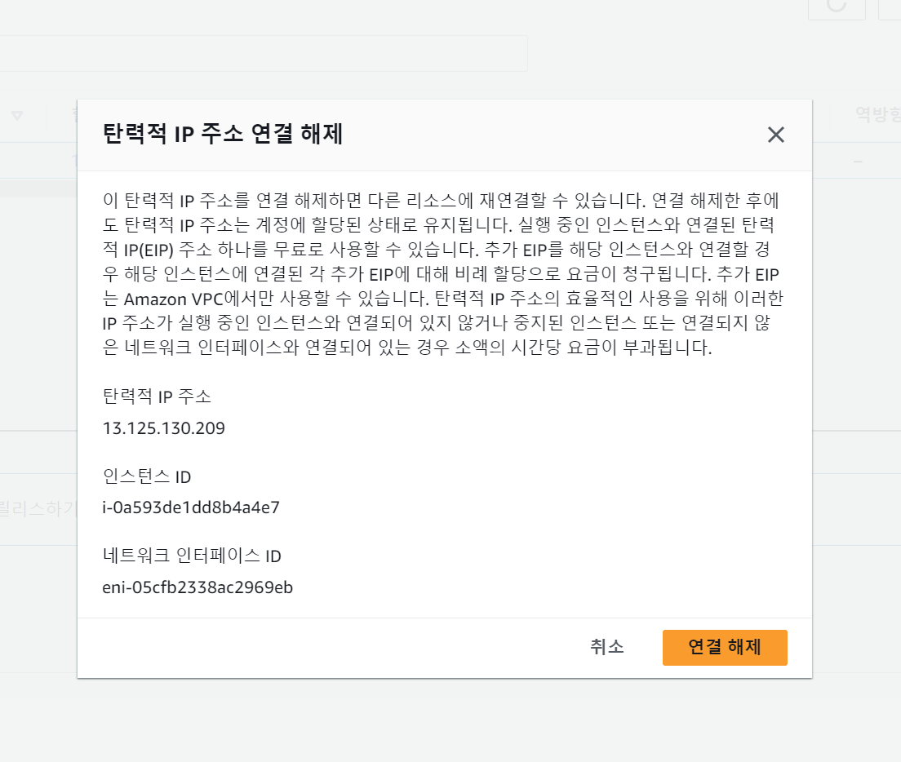
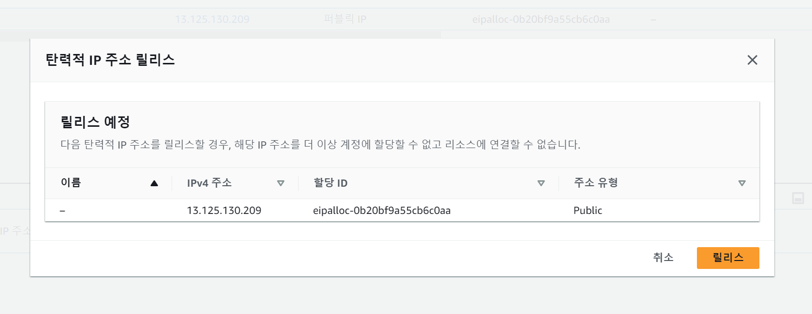
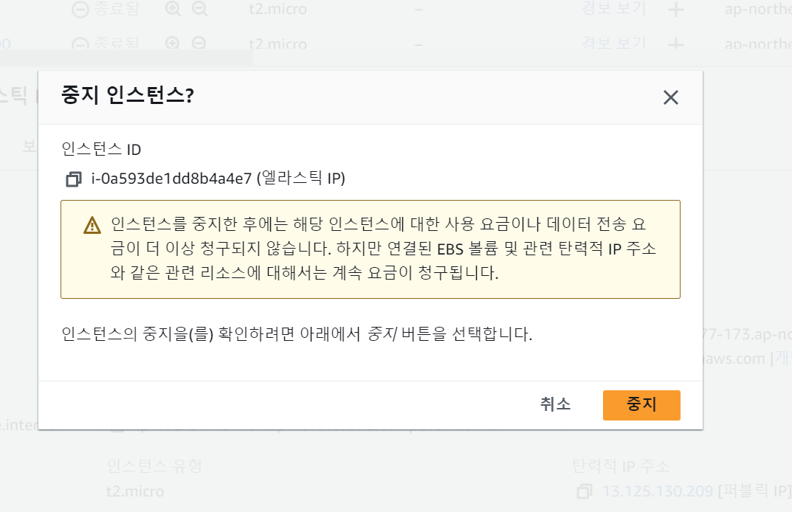

# Elastic IP  

- EC2 인스턴스 생성하기 (서울 리전, Ubuntu, t2.micro)  

- Elastic IP 할당 받기  

- 할당 받은 Elastic IP를 EC2 인스턴스에 연결하기  

- 연결한 이후 Elastic IP를 통해 ssh 접속하기  

- EC2 인스턴스에서 Elastic IP 연결 해제하기  

- 할당 받은 Elastic IP 릴리즈 하기  

- EC2 인스턴스 종료하기  

