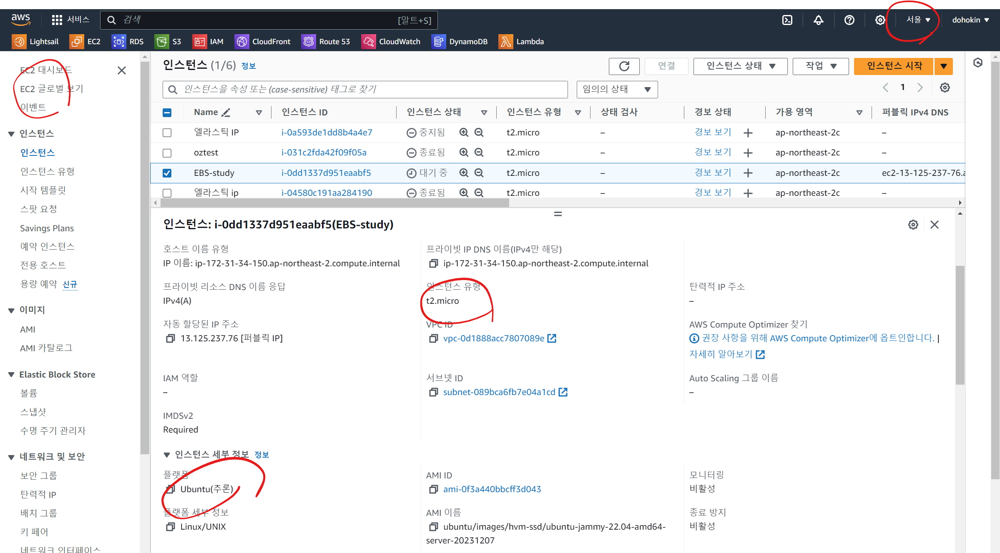
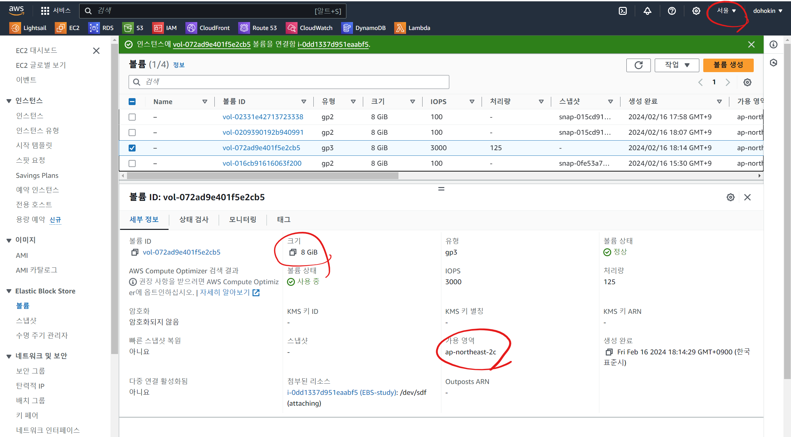
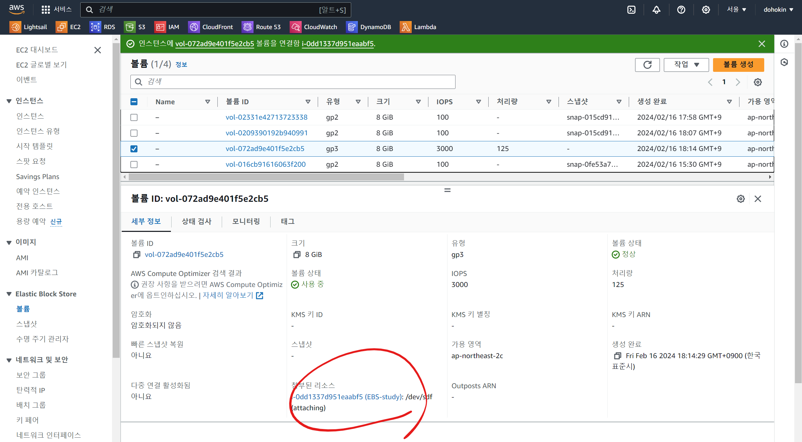
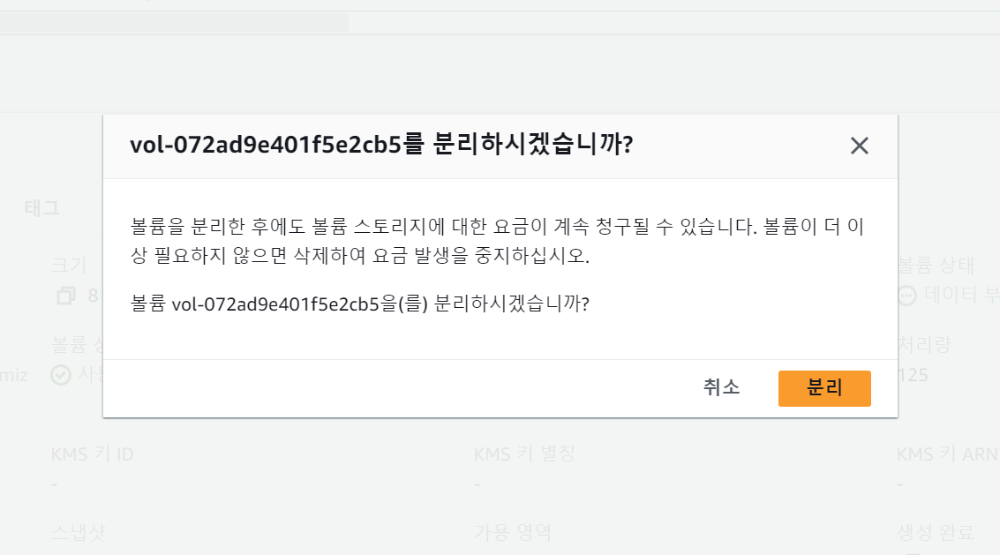
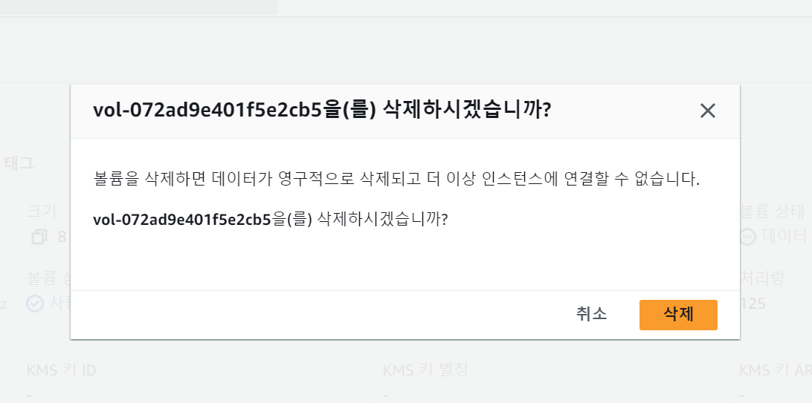
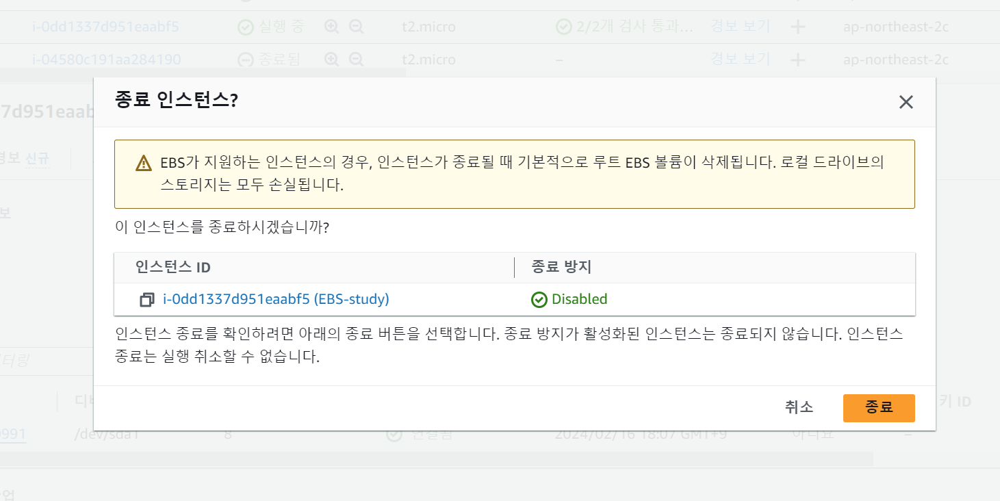

# EBS  

- EC2 인스턴스 생성하기 (서울 리전, Ubuntu, t2.micro)  

- EBS 볼륨 생성 하기 (EC2 인스턴스와 같은 리전+가용영역, 용량은 8GB)  

- EC2 인스턴스에 EBS 볼륨 연결하기  

- EC2 인스턴스에서 EBS 볼륨 제거하기  

- EBS 볼륨 삭제하기  

- EC2 인스턴스 종료하기  

