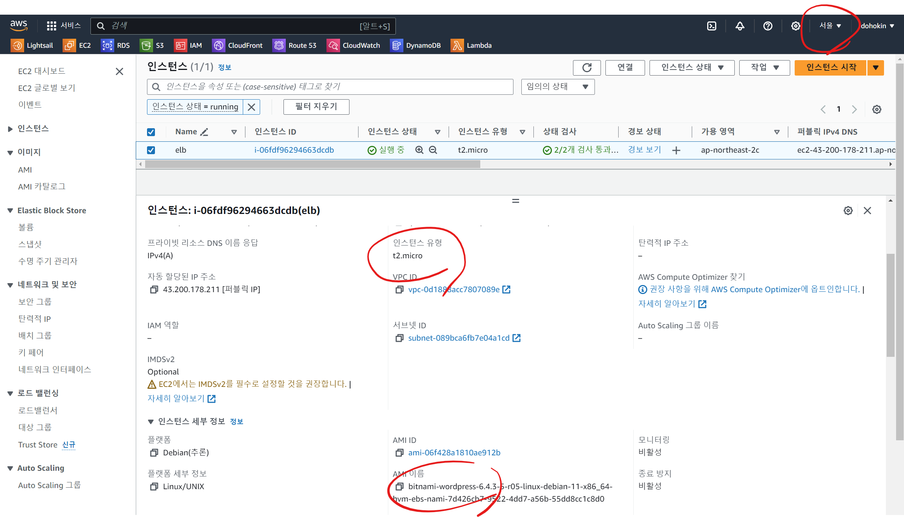
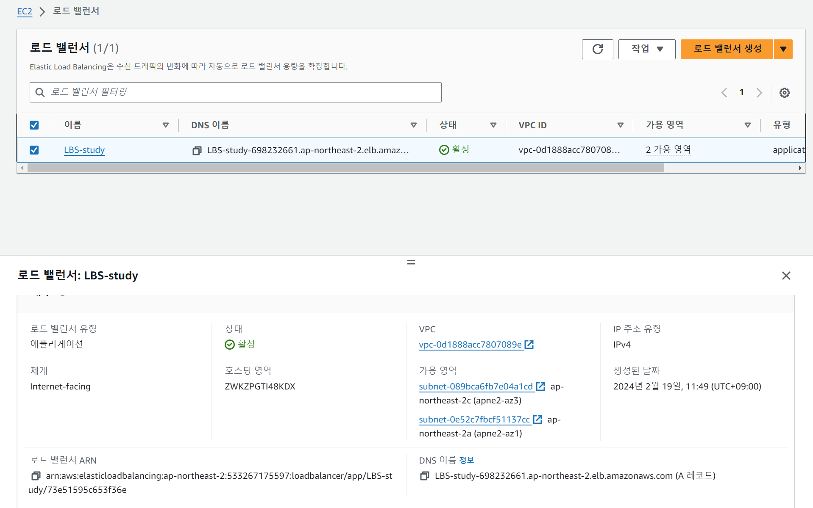
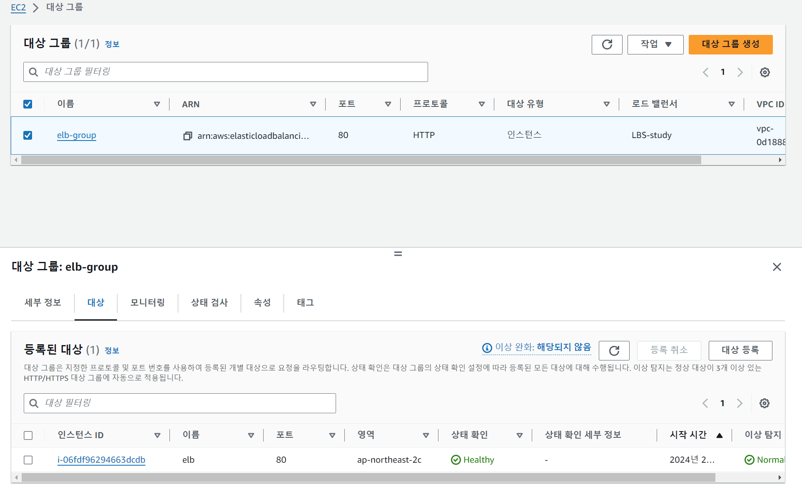

# ELB  
- 로드밸런싱이 필요한 이유와 역할 설명해보기  
  > AWS 로드 밸런싱은 여러 대의 서버에 대한 트래픽을 분산하여 서버 부하를 균형 있게 분산하고, 가용성과 성능을 향상시키는 서비스입니다. 이를 통해 웹 사이트나 애플리케이션의 안정성을 높이고, 사용자 경험을 개선할 수 있습니다. 

  - 부하 분산: 클라이언트들이 웹 애플리케이션에 대한 요청을 보낼 때, 이들 요청을 여러 대의 EC2 인스턴스에 균등하게 분산시킵니다. 예를 들어, 서버 A에 100개의 요청이 오고, 서버 B에 200개의 요청이 오는 대신에 AWS 로드 밸런서를 통해 요청이 균등하게 분산됩니다.  

  - 고가용성: AWS 로드 밸런서는 여러 가용 영역에 걸쳐 배치되므로, 한 가용 영역에서 장애가 발생하더라도 다른 가용 영역의 인스턴스로 트래픽을 자동으로 전환하여 서비스의 가용성을 유지합니다.

  - 자동 확장: 로드 밸런서는 Auto Scaling 그룹과 통합하여 트래픽 양에 따라 자동으로 EC2 인스턴스를 확장 또는 축소시킵니다. 따라서 트래픽이 증가하면 자동으로 추가 인스턴스를 생성하여 대응하고, 트래픽이 감소하면 불필요한 인스턴스를 자동으로 종료하여 비용을 절감할 수 있습니다.  
  
  
- EC2 인스턴스 생성하기 (서울 리전, Bitnami Wordpress, t2.micro)  
  
  
  
- ELB 생성하기 (EC2 인스턴스와 같은 리전)  
  - 대상 그룹도 함께 생성하고 EC2 인스턴스를 대상 그룹에 포함시키기  
  
    

  
  
- ELB의 주소를 통해 EC2 인스턴스에 접속하기  

    
  
- EC2 인스턴스 종료하기  
  
   
  