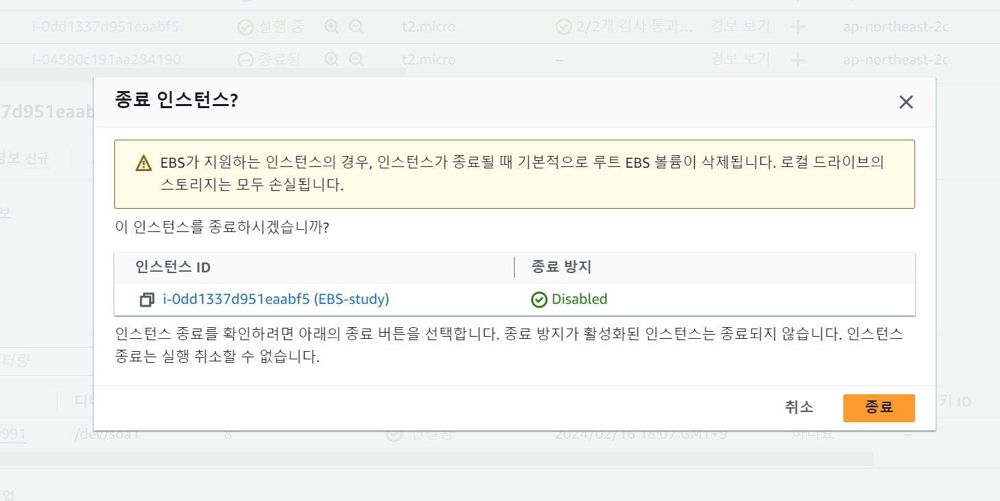

# Auto Scaling  

- Auto Scaling이 필요한 이유와 역할 설명해보기  
  
  
  
- EC2 인스턴스 생성하기 (서울 리전, Bitnami Wordpress, t2.micro)  
  
  
  
- ELB 생성하기 (EC2 인스턴스와 같은 리전)  
  
  
  
- 생성한 EC2 인스턴스를 기반으로 AMI 생성하기  
  
  
  
- Auto Scaling Group(ASG) 만들기  
  - 시작 템플릿도 함께 생성하기  

    

  - ELB와 연결하기  

  
  
  
- EC2 인스턴스에 ssh로 접속하고 stress를 사용하여 Auto Scaling 작동 테스트 하기  
  
  

  -80%이상 올라가서, ec2하나 증가

  

  - 80%아래로 떨어져서, ec2하나 감소

  
  
- 모든 리소스(EC2, AMI, ASG, ELB 등) 정리하기  
  

  
