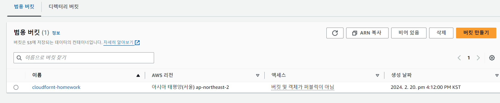
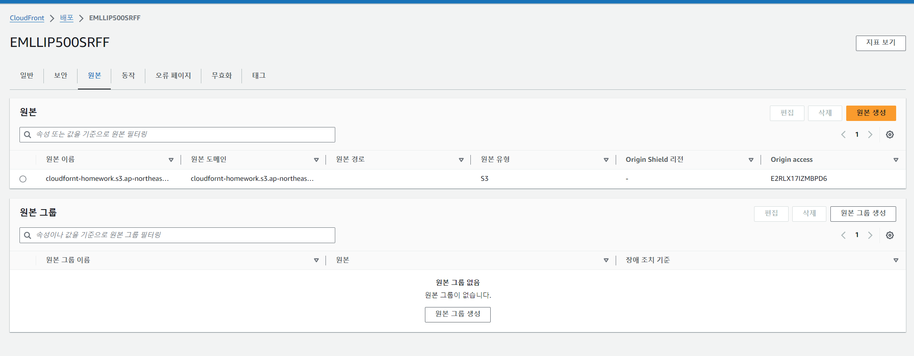
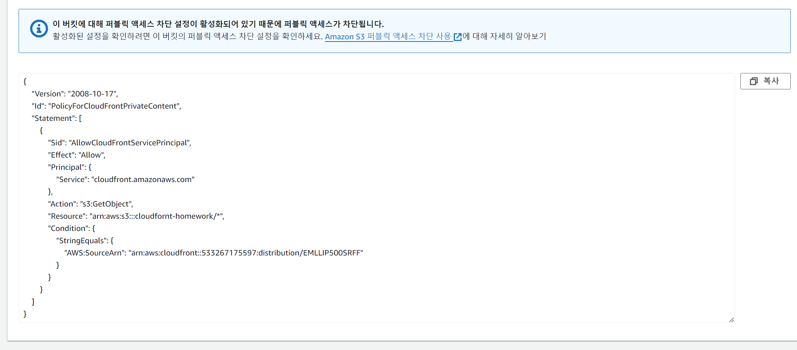
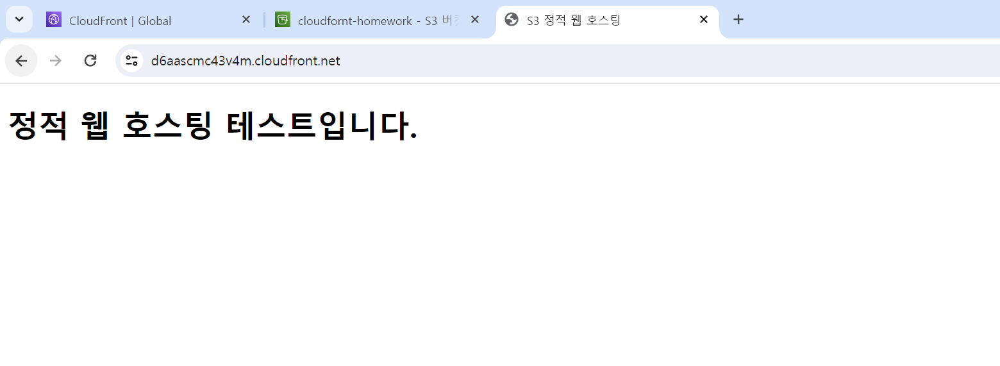
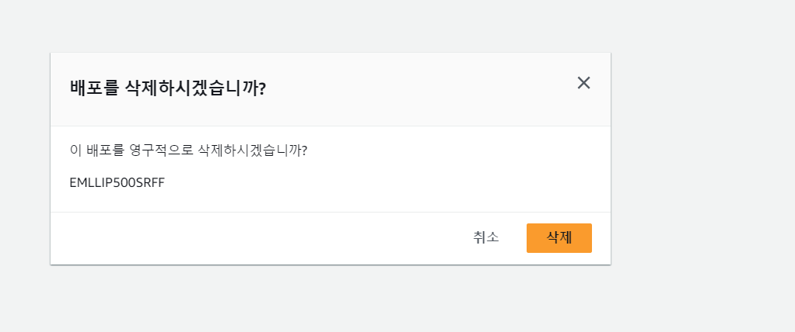

# CloudFront  
- S3 버킷 생성하기 (서울 리전)  
  
  
  
- 생성한 버킷을 origin으로 하는 CloudFront 배포 생성하기 (원본 액세스 제어 설정 포함)  
  
  
  
- 배포 생성 후 S3 버킷 정책 업데이트 하기 (CloudFront가 버킷의 모든 객체에 접근할 수 있도록)  
  
  
  
- CloudFront 배포 도메인 이름으로 접속하여 객체가 잘 나오는지 확인하기  
  
  
  
- CloudFront 배포 및 S3 버킷 삭제하기  
  
  
  
  
  
