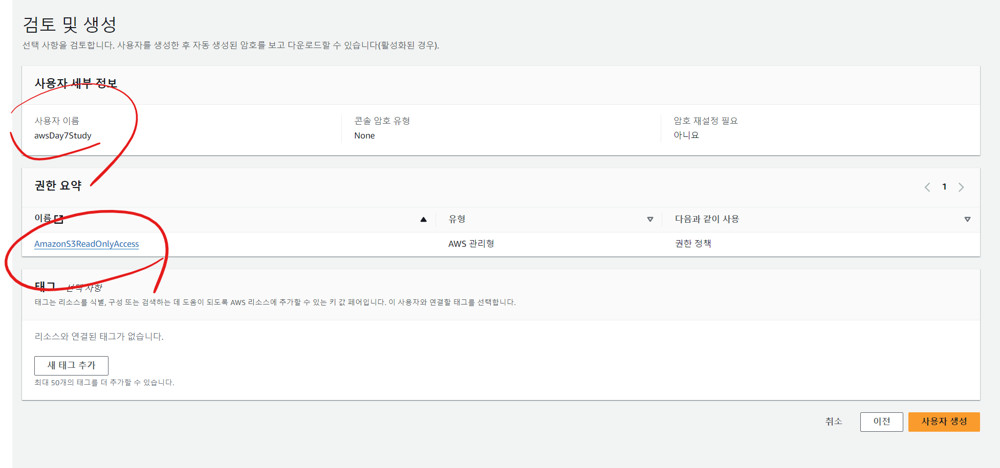
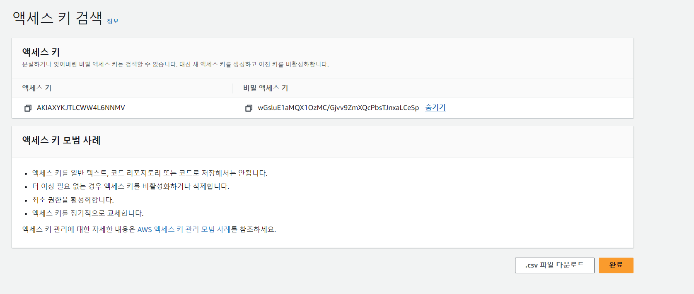
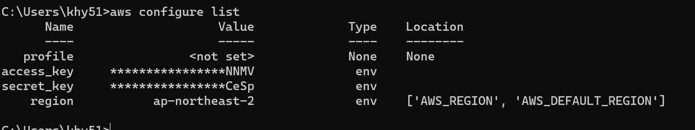
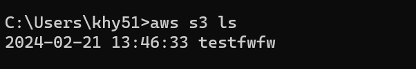
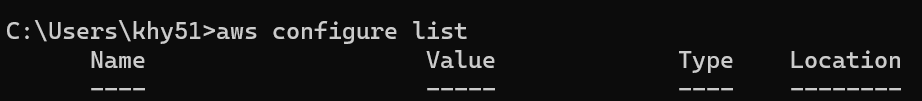
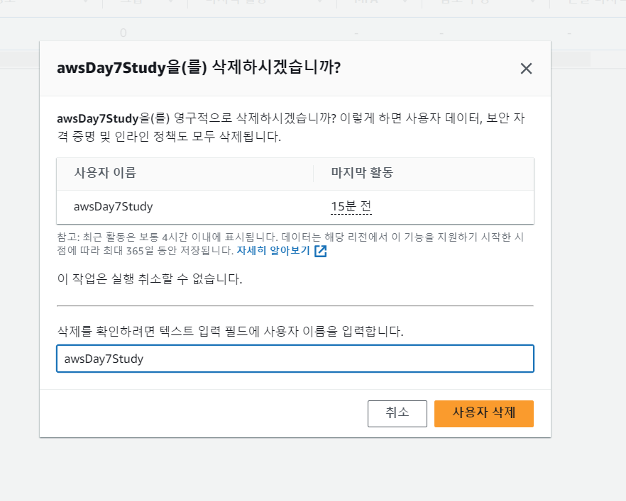

# AWS SDK, CLI (공유 자격 증명 설정)
- IAM 사용자 생성하기 (S3ReadOnlyAccess 권한 포함)  
  
  
  
- 생성한 IAM 사용자에 액세스 키 만들기 (CLI 용도)  
  
  
  
- 생성한 액세스 키를 사용하여 사용 중인 컴퓨터에 공유 자격 증명 설정하기  
  
  
  
- AWS CLI를 설치하여 S3 명령어 테스트 해보기  
  
  
  
- 공유 자격 증명 제거하기  [링크](https://docs.aws.amazon.com/ko_kr/cli/latest/userguide/cli-chap-troubleshooting.html#tshoot-uninstall-1)
  
  
  
- IAM 사용자 삭제하기  
  
  
   
