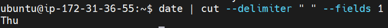

- piping " | " 기호를 씀.  
 

- date 데이터 > tee > 복사데이터

- echo 는 타이핑만 입력 받음.  
  

- xargs 를 입력해서, 데이터 받게 가능.  

- xargs 를 이용해서, 텍스트 파일안에 있는 파일이름의 파일을 삭제가능.  
  
  

- aliases [링크](https://linuxconfig.org/how-to-remove-alias-on-linux)

  

