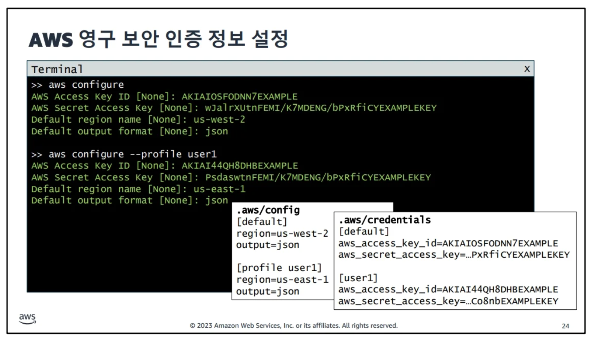

# api gateway.  
[aws현장 교육링크](https://balsam-comfort-a47.notion.site/Developing-on-AWS-240229-c04efc9ccafe4ad78805a664b7f75e14)  

  
- 람다와 연결해서 서비스 제공.  

- iam 코그니토 같이 사용 가능.  
[코그니토 설명링크](https://yoo11052.tistory.com/178)  

  

- user to aws server 요청하는 방법  
  - m/c  
  - cli (comend line interface)  
    - 커맨드로 요청을 날림. 익숙해지면, 복붙가능.  
    - 단점. 한줄씩 명령입력. 요청을 코딩을 못함 로직을 못짬.  
  - sdk  
    - cli는 로직을 못만들지만, sdk는 가능.  
  47PAGE.  
    

-AWS CLI 예제  
  

  


- AWS 사용할때 사용자는 인터넷을 사용해서 API 요청을 보냄.  
  - 호출가능여부 체크.(권한부여, 유저인증)  
    - IAM에서 처리.  
    - 루트 계정으로 사용하지 않을 것을 강력 권장.  
      - EMAIL + 비밀번호 + 카드정보 보호  

  


  
  ㄴ 전체 권한 설정.  


  ㄴ 컴퓨터로 로그인 할때.  

  

  

  

  

# 실습  

  

  - 클라우드 9 - ec2생성해서, 서버위에서 ide 구동.  

[BOTO3 설명사이트](https://boto3.amazonaws.com/v1/documentation/api/latest/index.html)  


# 다니아모 db

- WCU 쓰기성능 설정가능.  
- RCU 읽기성능 설정가능.  
  - 1건만 읽기 할때 최신데이터, 2건씩 읽어오기 가능. 정확성떨어짐.  

Amazon DynamoDB에서는 두 가지 일관성 모델을 제공합니다: **최종 일관성**과 **강력 일관성**.

### 최종 일관성(Eventually Consistent Reads)

- **최종 일관성**은 읽기 작업이 항상 최신 데이터를 반환하지는 않을 수 있음을 의미합니다. 즉, 데이터가 복제되는 동안에는 일부 읽기 작업이 최신 상태의 데이터가 아닌 이전 상태의 데이터를 반환할 수 있습니다. 
- 최종 일관성 읽기는 네트워크 지연 시간을 줄이고 읽기 처리량을 높이는 데 유리합니다. 
- 이 모델은 대부분의 경우에 충분하지만, 항상 최신 데이터를 읽어야 하는 애플리케이션에는 적합하지 않을 수 있습니다.

### 강력 일관성(Strongly Consistent Reads)

- **강력 일관성**은 읽기 작업이 항상 최신의 쓰기 작업 결과를 반영하여 데이터를 반환함을 보장합니다. 즉, 데이터의 복제가 완료되고 모든 복제 위치가 최신 상태로 업데이트될 때까지 읽기 요청이 기다립니다.
- 강력 일관성 읽기는 최신 데이터가 필요한 애플리케이션에 적합하지만, 최종 일관성 읽기에 비해 처리량이 낮아지거나 지연 시간이 증가할 수 있습니다.
- 강력 일관성을 사용하면 애플리케이션의 일관된 데이터 요구 사항을 충족시킬 수 있지만, 성능과 비용 측면에서 트레이드오프가 발생할 수 있습니다.

### 선택 기준

- **데이터 일관성 요구사항**: 애플리케이션이 최신 데이터를 필요로 하는지, 아니면 일정 수준의 지연을 허용할 수 있는지에 따라 강력 일관성과 최종 일관성 중에서 선택할 수 있습니다.
- **읽기 성능**: 강력 일관성은 보장된 데이터 정확성을 제공하지만 성능 저하가 발생할 수 있습니다. 최종 일관성은 더 빠른 읽기 성능을 제공합니다.
- **응용 프로그램의 지리적 분포**: 글로벌 애플리케이션에서는 최종 일관성이 더 나은 성능을 제공할 수 있습니다.

DynamoDB에서는 강력 일관성 읽기를 사용할 때 추가 비용이 발생하지 않습니다. 사용자는 애플리케이션의 요구 사항과 특성에 따라 적절한 일관성 모델을 선택해야 합니다. DynamoDB는 2020년 말부터 모든 작업에 대해 강력 일관성을 기본 옵션으로 제공하고 있으며, 이는 사용자가 명시적으로 최종 일관성 읽기를 선택하지 않는 한 강력 일관성이 적용됨을 의미합니다.

- 다이나모 db 연결방법.  
  - 콘솔에서 접속.(웹화면)  
  
ㄴ쿼리 속도가 더빠름.  

  - cli형식 접속.  
    


# lambda 람다.  

- 런타임(사용할 언어 사용)  


ㄴ클라우드워치에서 람다 실행로그 볼수있음.  


[링크](https://medium.com/@vigneshdayalan/decoding-lambda-handler-architecture-how-aws-lambda-functions-work-f9fd71ee75df)

- 권한 줄때, 역활을 만들고, 역할에 람다 할당.  


ㄴ 생성할때 권한 설정가능.   


ㄴ생성후 권한 설정가능.  


ㄴ역할 설정 가능.  


[수료증 사이트](https://www.aws.training/)


# $$\Huge\color{purple}\fbox{\Huge \color{pink}{learned}}$$
- configparser  
  - yaml과 비슷한 파이썬 표준라이브러리.  

`ConfigParser`는 파이썬 표준 라이브러리의 일부로, INI 파일 형식으로 저장된 구성 파일을 읽고 쓰는 데 사용됩니다. 이 모듈을 사용하여 애플리케이션 설정, 사용자 설정, 프로그램 상태 등을 파일에 저장하고 불러올 수 있습니다. `ConfigParser`는 간단한 구조의 텍스트 파일을 파싱하여 프로그램에서 쉽게 접근할 수 있는 데이터 구조로 만들어 줍니다.

INI 파일은 섹션으로 나뉘어 있으며, 각 섹션은 키와 값의 쌍을 포함합니다. 이러한 형식은 사람이 읽고 쓰기 쉬워서 간단한 구성 데이터를 저장하는 데 자주 사용됩니다. 예를 들어, 다음은 `ConfigParser`로 읽고 쓸 수 있는 INI 파일의 예입니다:

```ini
[settings]
resolution = 1024x768
fullscreen = True

[user]
name = johndoe
email = johndoe@example.com
```

### 기본 사용 방법

`ConfigParser`를 사용하여 INI 파일을 읽고 쓰는 기본적인 방법은 다음과 같습니다:

#### 구성 파일 읽기

```python
import configparser

config = configparser.ConfigParser()
config.read('example.ini')

# 섹션과 키를 사용하여 설정 값에 접근
resolution = config['settings']['resolution']
fullscreen = config.getboolean('settings', 'fullscreen')  # 타입 변환도 지원
```

#### 구성 파일 쓰기

```python
config = configparser.ConfigParser()
config['settings'] = {'resolution': '1920x1080', 'fullscreen': 'yes'}
config['user'] = {'name': 'janedoe', 'email': 'janedoe@example.com'}

with open('example.ini', 'w') as configfile:
    config.write(configfile)
```

`ConfigParser`는 다양한 데이터 타입을 지원하며, 특히 `get` 메서드를 사용하면 문자열 외에도 정수(`getint`), 부울(`getboolean`), 실수(`getfloat`) 등으로 값을 변환할 수 있습니다. 이러한 기능을 통해 애플리케이션의 설정을 쉽게 관리하고 사용할 수 있습니다.