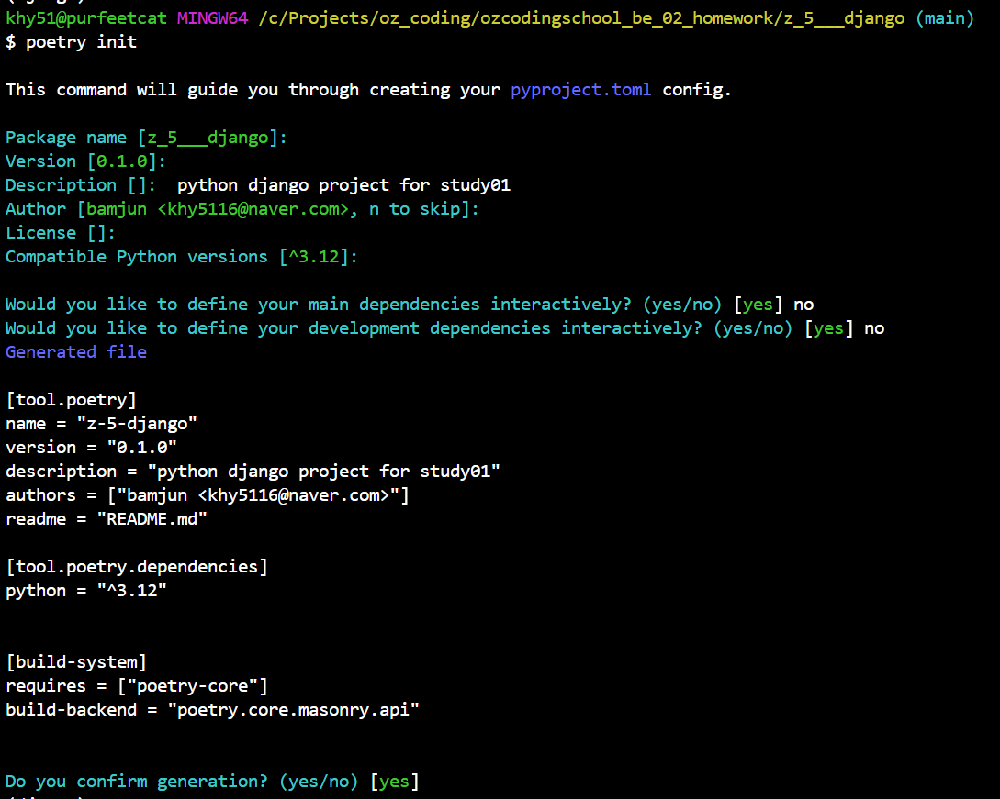
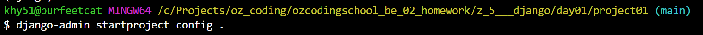
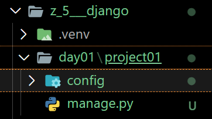
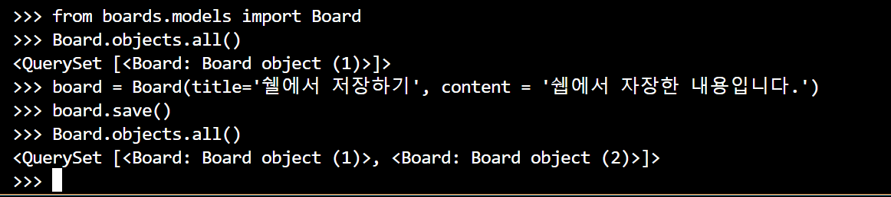
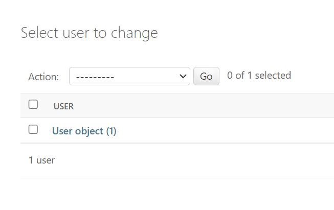
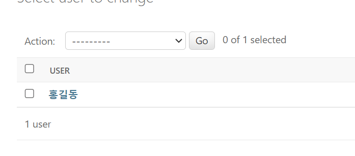

[강의링크](https://visioneer.notion.site/Django-afe96763fd4c40238b947d6f4206e050)  

# poetry [설치링크](https://python-poetry.org/docs/#installing-with-pipx)  
- 의존성 관리 및 패키지 관리 도구  

## 설치순서(윈도우)  
- 가상환경 설치  
  `bash`
  ```bash  
  python -m venv .venv  
  ```  

- 가상환경 진입  
  `bash`
  ```bash  
  cd '\.venv\Scripts\'  
  . activate  
  ```  

- poetry 설치  
  `bash`
  ```bash  
  pip install poetry  
  poetry --version  # 버전확인을 통해 정상적으로 설치 됐는지 확인.  
  ```  

- poetry 초기화  
  - pyproject.toml 파일을 설정하는 과정  
  `bash`
    ```bash  
    poetry init  
    ```  
      
    1. **Package Name**: 프로젝트 또는 패키지의 이름입니다. 일반적으로 프로젝트의 디렉토리 이름을 기본값으로 사용합니다.
    2. **Version**: 패키지의 시작 버전입니다. 일반적으로 **`0.1.0`**으로 시작하며, 개발 진행에 따라 버전을 업데이트합니다.
    3. **Description**: 프로젝트의 간단한 설명입니다. 이 내용은 PyPI 등의 패키지 저장소에 표시됩니다.
    4. **Author Name**: 패키지의 작성자 또는 유지 관리자의 이름입니다. 이 정보는 선택 사항이지만, 공개 패키지의 경우 중요할 수 있습니다.
    5. **License**: 프로젝트에 적용할 라이선스입니다. Open Source 프로젝트의 경우, 일반적으로 MIT, GPL, Apache 등의 라이선스를 사용합니다.
    6. **Python Version Compatibility**: 프로젝트가 호환되는 Python 버전을 지정합니다. 예를 들어, **`^3.7`**은 Python 3.7 이상의 버전과 호환됨을 의미합니다.
    7. **Dependency Specification**: 프로젝트의 의존성을 지정합니다. 필요한 외부 패키지를 여기에 추가할 수 있습니다.
    8. **Development Dependency Specification**: 개발 시에만 필요한 의존성을 지정합니다. 예를 들어, 테스팅 라이브러리나 문서화 도구 등이 여기에 해당됩니다.  

- 장고설치 하기 poetry add django  
  - pip install django 와 똑같은 명령어임.  
  `bash`
    ```bash  
    poetry add django  
    ```  
  - 이 과정에서 .venv 디렉토리와 poetry.lock 파일이 생성되거나 업데이트됩니다.  
  - poetry.lock 파일은 프로젝트의 의존성 트리에 대한 정확한 스냅샷을 제공합니다.  

## poetry shell 가상환경 접속하기  
- 이미 가상환경에서 poetry 설치해서 다시 가상환경에 접속할 필요없음.  
- poetry shell
  - 가상환경 접속 명령어  
- exit  
  - 가상환경에서 나오기  

## 장고에서 사용할수 있는 명력어 확인하기  
- django-admin  

## 장고설치 프로젝트 시작하기  
django-admin startproject [기본 폴더이름] [설치할 폴더]  
  `bash`
```bash  
django-admin startproject config . 
```  
  
  

## 장고에 앱추가.  
  `bash`
```bash  
python manage.py startapp feeds  
```  

## config-urls에 include로 관리  
- 앱단위로 url 관리하기  
  - include('[앱이름.ruls'])  
  `python`
    ```python  
    # config/urls.py
    from django.urls import include  
    urlpatterns = [
      path('feeds/', include('feeds.urls'))
    ]

    #feeds/urls.py
    from django.urls import path
    from . import views
    urlpatterns = [
      path('', views.func1),
      ...
    ]
    ```  

# model  
  `bash`
```bash
python manage.py startapp boards  
```  
`python`
```python  
#boards/models.py  
class Board(models.Model):
    title = models.CharField(max_length=30)
    content = models.TextField()

#모델등록하기  
#config/settings.py  
INSTALLED_APPS = [
    ...
    'boards.apps.BoardsConfig',
    #board.apps.[클래스이름]  
    #boards/apps.py 안에 있는 클래스이름  
]

#admin패널 등록하기  
#boards/admin.py  
from .models import Board

@admin.register(Board)
class BoardAdmin(admin.ModelAdmin):
    pass
  `bash`
```bash  
#db에 테이블 만들기.  
python manage.py makemigrations 
#아직 테이블 생성전.models의 클래스에 따라 sql문 변환  
python manage.py migrate  
#테이블 생성 하기.  
```

  `bash`
```bash  
python manage.py shell  
from boards.models import Board  

#전체 내용 조회  
Board.objects.all()  

#내용 저장  
board = Board(title='쉘에서 저장하기', content = '쉡에서 자장한 내용입니다.')  
board.save()  
```  
  

## users 모델 만들기.  
- users 앱만들기  
- settings.py installapp에 등록  
- models 작성  
- admin 등록  
- makemigrations, migrate  

# Admin pannel  
  
  
- name으로 테이블 보이게 하기  
  `python`
  ```python  
  #users/models.py  
  class User(models.Model):
    ...

    def __str__(self):
        return self.name
        # or 위에꺼 아니면, 아래처럼도 가능,  
        return f"{self.name} / ({self.age} 살)"
  ```  

