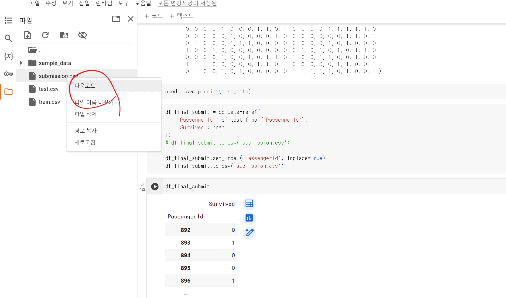
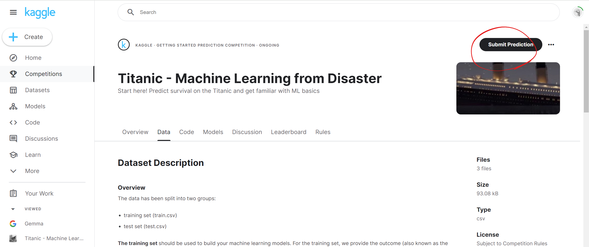
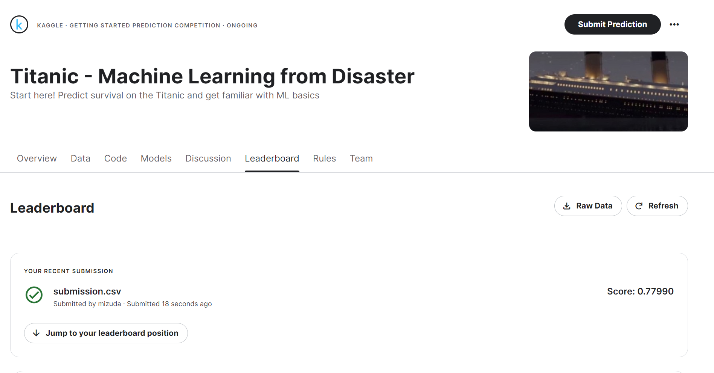
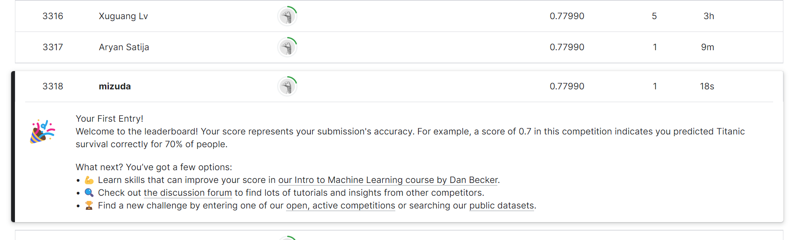

# 케글 사이트에 제출하기 
  
  
  
  


# [실습] 타이타닉 생존자 예측

### Kaggle Link

[Titanic - Machine Learning from Disaster | Kaggle](https://www.kaggle.com/competitions/titanic/data?select=train.csv)

타이타닉 Kaggle 대회는 타이타닉호 승객의 생존 여부를 예측하는 머신러닝 경진대회입니다. 주요 목표는 승객의 나이, 성별, 클래스 등 다양한 특징을 기반으로 **생존자를 예측하는 모델을 만드는 것**입니다.

- **데이터**: 데이터셋은 훈련용(**`train.csv`**)과 테스트용(**`test.csv`**)으로 나뉩니다. 훈련용 데이터에는 승객의 생존 여부가 포함되어 있으며, 모델을 구축하는 데 사용됩니다. 테스트 데이터는 모델이 보지 못한 데이터에 대한 성능을 평가하는 데 사용됩니다.

### **튜토리얼 개요**

1. **데이터 탐색**: 훈련 데이터를 분석하여 특징과 생존 여부 간의 관계를 이해합니다. (EDA)
2. **데이터 전처리**: 결측치 처리, 새로운 특징 생성, 범주형 변수 인코딩 등을 수행합니다.
3. **모델 선택 및 훈련**: 로지스틱 회귀, 결정 트리, 랜덤 포레스트 등과 같은 알고리즘을 사용하여 모델을 훈련합니다.
4. **모델 평가 및 튜닝**: 교차 검증과 하이퍼파라미터 튜닝을 통해 모델 성능을 최적화합니다.
5. **결과 제출**: 테스트 데이터에 대한 예측 결과를 Kaggle에 제출하여 평가받습니다.

### 데이터 셋

| 변수명 | 정의 | 키 |
| --- | --- | --- |
| survival | 생존 여부 | 0 = 죽음, 1 = 생존 |
| pclass | 티켓 클래스 | 1 = 1등석, 2 = 2등석, 3 = 3등석 |
| sex | 성별 |  |
| age | 나이 |  |
| sibsp | 타이타닉호에 탑승한 형제/배우자 수 |  |
| parch | 타이타닉호에 탑승한 부모/자녀 수 |  |
| ticket | 티켓 번호 |  |
| fare | 승객 요금 |  |
| cabin | 객실 번호 |  |
| embarked | 탑승 항구 | C = 쉐르부르, Q = 퀸스타운, S = 사우샘프턴 |

### **추가 설명**

- **pclass**: 사회경제적 지위를 대변합니다 (1등석 = 상위, 2등석 = 중간, 3등석 = 하위).
- **age**: 1세 미만의 경우 소수점 형태로 표시, 나이가 추정된 경우 xx.5 형태로 표기.
- **sibsp**: 형제, 자매, 의붓형제, 의붓자매, 배우자(정식 부부만 해당, 정부나 약혼자는 제외)를 나타냅니다.
- **parch**: 부모 또는 자녀(자연의 자녀 및 의붓자녀 포함)를 나타냅니다. 보모와 함께 여행하는 어린이는 parch=0입니다.

### 데이터 파일

[test.csv](https://s3-us-west-2.amazonaws.com/secure.notion-static.com/38e575c0-56cf-4874-bed4-ec6c375dda2a/test.csv)

[train.csv](https://s3-us-west-2.amazonaws.com/secure.notion-static.com/0ba9885f-be19-462b-bdc4-f65a4c1a6c48/train.csv)

## 타이타닉 실습 코드

```python
# 데이터 로드
import pandas as pd

df_train = pd.read_csv("train.csv")
df_train.head(3)

df_test = pd.read_csv("test.csv")
df_test
```

```python
# EDA (Exploratory Data Analysis) -> 데이터 탐험 (데이터의 유무 확인)
print(df_train.columns) # train
print(df_test.columns) # test

Index(['PassengerId', 'Survived', 'Pclass', 'Name', 'Sex', 'Age', 'SibSp',
       'Parch', 'Ticket', 'Fare', 'Cabin', 'Embarked'],
      dtype='object')
Index(['PassengerId', 'Pclass', 'Name', 'Sex', 'Age', 'SibSp', 'Parch',
       'Ticket', 'Fare', 'Cabin', 'Embarked'],
      dtype='object')
```

```python
print(df_train.shape)
print(df_test.shape)

(891, 12)
(418, 11)
```

```python
print(df_train.info())
print(df_test.info())
```

<class 'pandas.core.frame.DataFrame'>
RangeIndex: 891 entries, 0 to 890
Data columns (total 12 columns):

# Column Non-Null Count Dtype

---

0   PassengerId  891 non-null    int64

1   Survived     891 non-null    int64

2   Pclass       891 non-null    int64

3   Name         891 non-null    object
4   Sex          891 non-null    object
5   Age          714 non-null    float64
6   SibSp        891 non-null    int64

7   Parch        891 non-null    int64

8   Ticket       891 non-null    object
9   Fare         891 non-null    float64
10  Cabin        204 non-null    object
11  Embarked     889 non-null    object
dtypes: float64(2), int64(5), object(5)
memory usage: 83.7+ KB
None
<class 'pandas.core.frame.DataFrame'>
RangeIndex: 418 entries, 0 to 417
Data columns (total 11 columns):

# Column Non-Null Count Dtype

---

0   PassengerId  418 non-null    int64

1   Pclass       418 non-null    int64

2   Name         418 non-null    object
3   Sex          418 non-null    object
4   Age          332 non-null    float64
5   SibSp        418 non-null    int64

6   Parch        418 non-null    int64

7   Ticket       418 non-null    object
8   Fare         417 non-null    float64
9   Cabin        91 non-null     object
10  Embarked     418 non-null    object
dtypes: float64(2), int64(4), object(5)
memory usage: 36.0+ KB
None

```python
# null 갯수 체크
print(df_train.isna().sum())
print(df_test.isna().sum())

PassengerId      0
Survived         0
Pclass           0
Name             0
Sex              0
Age            177
SibSp            0
Parch            0
Ticket           0
Fare             0
Cabin          687
Embarked         2
dtype: int64
PassengerId      0
Pclass           0
Name             0
Sex              0
Age             86
SibSp            0
Parch            0
Ticket           0
Fare             1
Cabin          327
Embarked         0
dtype: int64
```

```python
# 어떤 컬럼을 살리고, 어떤 컬럼을 지울 것인가? => 시각화를 통해 진행
import matplotlib.pyplot as plt
import seaborn as sns

# df_train[df_train["Survived"] == 1]
df_train[df_train["Survived"] == 1]["Pclass"] # Pclass 컬럼의 데이터 출력

survived = df_train[df_train["Survived"] == 1]["Pclass"].value_counts()
dead = df_train[df_train["Survived"] == 0]["Pclass"].value_counts()

df_merged = pd.DataFrame({"Survived":survived, "Dead": dead})
df_merged.plot(kind="bar", stacked=True, figsize=(12,8))
```

```python
# 위와 같은 코드를 함수로 만든 것 == column의 모든 값을 받을 수 있음

def bar_chart(column_name):
  survived = df_train[df_train["Survived"] == 1][column_name].value_counts()
  dead = df_train[df_train["Survived"] == 0][column_name].value_counts()

  df_merged = pd.DataFrame({"Survived":survived, "Dead": dead})
  df_merged.plot(kind="bar", stacked=True, figsize=(12,8))
```


```python
# bar_chart("Sex")
bar_chart("Cabin")
```

---

```python
# 가장 많은 요금을 낸 상위 10명의 생존율은 어떻게 될까요?
# df_train.sort_values(by="Fare", ascending=False).head(10)[["Survived", "Fare"]] # Fare : 요금에 따라서 정렬
# head(5) 상위 5명 || tail(5) 하위 5명
df_train.sort_values(by="Fare", ascending=False).head(10)[["Survived", "Fare"]].value_counts() # 인원 카운트
```

```python
df_train[["Name","Survived"]]
```

```python
# 이름으로 값들 추려서 확인
train_test_data = [df_train, df_test]

for data in train_test_data:
  data["Name"] = data["Name"].str.extract(" ([A-Za-z]+)\. ") # extract 추출하기
```

```python
df_train["Name"]
# df_train["Name"].value_counts()
```

```python
# 문자열 -> 숫자형 데이터로 변경
name_mapping = {
    "Mr": 0, "Miss": 1, "Mrs": 2, "Master": 3, "Dr": 4, "Rev": 5
}

for data in train_test_data:
  data["Name"] = data["Name"].map(name_mapping)
```

```python
df_train["Name"].value_counts()
```

```python
bar_chart("Name")
```


```python
# Sex
df_train["Sex"] = df_train["Sex"].replace({"male":0, "female":1})
df_test["Sex"] = df_test["Sex"].replace({"male":0, "female":1})
```

```python
df_train["Sex"].value_counts()
df_test["Sex"].value_counts()
```

```python
# Age
 df_train["Age"].isna().sum()

177
```

```python
df_train.groupby("Name")["Age"].mean()

Name
0.0    32.368090
1.0    21.773973
2.0    35.898148
3.0     4.574167
4.0    42.000000
5.0    43.166667
Name: Age, dtype: float64
```

```python
df_train["Age"].fillna(df_train.groupby("Name")["Age"].transform("mean"), inplace=True)
df_test["Age"].fillna(df_test.groupby("Name")["Age"].transform("mean"), inplace=True)
```

```python
df_train["Age"].isna().sum()

0
```

```python
df_test["Age"].isna().sum()

1
```

```python
df_test["Age"].fillna(df_test["Age"].mean(), inplace=True) # Nan인 부분을 변경
df_test["Age"].isna().sum() # null 데이터 갯수 확인

0
```

---

- Age, SibSp Parch, Fare, Embarked

```python
# Age

df_train["Age"].value_counts()

df_train["Age"].isna().sum() # null 데이터 갯수 확인
```

```python
import numpy as np

# age_bins = [0, 16, 32, np.inf] #inf: infinite
age_bins = [0, 16, 32, 50, 100] 
age_labels = [0, 1, 2, 3] 

for data in train_test_data:
  data["Age"] = pd.cut(data["Age"], bins=age_bins, labels=age_labels)

df_train["Age"].value_counts()

1    382
2    341
0    104
3     64
Name: Age, dtype: int64
```

```python
# SibSp, Parch
df_train["Family"] = df_train["SibSp"] + df_train["Parch"] + 1
df_test["Family"] = df_train["SibSp"] + df_train["Parch"] + 1

# 위 아래 둘 중 하나 사용 하기

for data in train_test_data:
  data["Family"] = data["SibSp"] + data["Parch"] + 1
```

```python
df_train["Family"].value_counts()

1     537
2     161
3     102
4      29
6      22
5      15
7      12
11      7
8       6
Name: Family, dtype: int64
```

```python
# Fare
df_train["Fare"].isna().sum() # null 데이터 갯수 체크

fare_bins = [0, 20, 100, 1000]
fare_labels = [0, 1, 2]

for data in train_test_data:
  data["Fare"] = pd.cut(data["Fare"], bins=fare_bins, labels=fare_labels)

df_train["Fare"].value_counts()
```

```python
# Embarked
df_train["Embarked"] = df_train["Embarked"].replace({"S":0, "C":1, "Q":2})
df_test["Embarked"] = df_train["Embarked"].replace({"S":0, "C":1, "Q":2})

df_test["Age"].fillna(0, inplace=True)
df_test["Age"].isna().sum()

df_train["Embarked"].value_counts()

df_train["Embarked"].fillna(0, inplace=True)
df_test["Embarked"].fillna(0, inplace=True)

df_train["Embarked"].isna().sum()
df_test["Embarked"].isna().sum()
```

```python
df_train # 데이터 목록 확인용 (생략가능)
```

```python
# drop_train_cols = ["Embarked", "SibSp", "Parch", "Ticket", "Cabin"]
drop_train_cols = ["PassengerId", "SibSp", "Parch", "Ticket", "Cabin"]

df_train_final = df_train.drop(drop_train_cols, axis=1)
df_train_final
```

```python
df_test # 데이터 목록 확인용 (생략가능)
```

```python
drop_test_cols = ["SibSp", "Parch", "Ticket", "Cabin"]

df_test_final = df_test.drop(drop_test_cols, axis=1)
df_test_final
```

---

### 모델링

```python
from sklearn.tree import DecisionTreeClassifier
from sklearn.neighbors import KNeighborsClassifier
from sklearn.ensemble import RandomForestClassifier
from sklearn.naive_bayes import GaussianNB
from sklearn.svm import SVC
```

```python
from sklearn.model_selection import KFold
from sklearn.model_selection import cross_val_score
from sklearn.model_selection import cross_val_predict
```

```python
features = df_train_final.drop("Survived", axis=1)
labels = df_train_final["Survived"]

df_train_final.fillna(0, inplace=True)
df_train_final.isna().sum()
```

```python
df_train_final.fillna(0, inplace=True)
df_train_final.isna().sum()
```

```python
df_test_final.fillna(0, inplace=True)
df_test_final.isna().sum()
```

```python
# kfold
kfold = KFold(n_splits=10, shuffle=True, random_state=123)
dt_clf = DecisionTreeClassifier()
scores = cross_val_score(dt_clf, features, labels, cv=kfold, scoring="accuracy")

print(np.mean(scores)*100)

-> 81.3670411985019
```

```python
# KNeighborsClassifier
knn = KNeighborsClassifier(n_neighbors=5)
scores = cross_val_score(knn, features, labels, cv=kfold, scoring="accuracy")

print(np.mean(scores)*100)

-> 78.55805243445693
```

```python
# RandomForestClassifier
rf = RandomForestClassifier(n_estimators=5)
scores = cross_val_score(rf, features, labels, cv=kfold, scoring="accuracy")

# scores
print(np.mean(scores)*100)# RandomForestClassifier
rf = RandomForestClassifier(n_estimators=5)
scores = cross_val_score(rf, features, labels, cv=kfold, scoring="accuracy")

# scores
print(np.mean(scores)*100)

-> array([0.77777778, 0.80898876, 0.80898876, 0.7752809 , 0.76404494,
       0.78651685, 0.7752809 , 0.82022472, 0.82022472, 0.74157303])
```

```python
# GaussianNB
gb = GaussianNB()
scores = cross_val_score(gb, features, labels, cv=kfold, scoring="accuracy")

print(np.mean(scores)*100)

-> 80.80399500624219
```

```python
# SVC
svc = SVC()
scores = cross_val_score(svc, features, labels, cv=kfold, scoring="accuracy")

print(np.mean(scores)*100)

-> 68.00124843945069
```

- 현재는 svc 가 가장 낮게 나옵니다 ..

```python
df_train_final
```

```python
df_test_final
```

```python
# SVC 알고리즘을 사용해서 최종 결과 값 도출
svc = SVC()
svc.fit(features, labels) 
scores = cross_val_score(svc, features, labels, cv=kfold, scoring="accuracy")
```

```python
# 수능 문제는?
test_data = df_test_final.drop("PassengerId", axis=1)
test_data
```

```python
pred = svc.predict(test_data)
pred

-> array([0, 0, 0, 0, 0, 0, 0, 0, 0, 0, 0, 0, 0, 0, 0, 0, 0, 0, 0, 0, 0, 0,
       0, 0, 0, 0, 0, 0, 0, 0, 0, 0, 0, 0, 0, 0, 0, 0, 0, 0, 0, 0, 0, 0,
       0, 0, 0, 0, 0, 0, 0, 0, 0, 0, 0, 0, 0, 0, 0, 0, 0, 0, 0, 0, 0, 0,
       0, 0, 0, 0, 0, 0, 0, 0, 0, 0, 0, 0, 0, 0, 0, 0, 0, 0, 0, 0, 0, 0,
       0, 0, 0, 0, 0, 0, 0, 0, 0, 0, 0, 0, 0, 0, 0, 0, 0, 0, 0, 0, 0, 0,
       0, 0, 0, 0, 0, 0, 0, 0, 0, 0, 0, 0, 0, 0, 0, 0, 0, 0, 0, 0, 0, 0,
       0, 0, 0, 0, 0, 0, 0, 0, 0, 0, 0, 0, 0, 0, 0, 0, 0, 0, 0, 0, 0, 0,
       0, 0, 0, 0, 0, 0, 0, 0, 0, 0, 0, 0, 0, 0, 0, 0, 0, 0, 0, 0, 0, 0,
       0, 0, 0, 0, 0, 0, 0, 0, 0, 0, 0, 0, 0, 0, 0, 0, 0, 0, 0, 0, 0, 0,
       0, 0, 0, 0, 0, 0, 0, 0, 0, 0, 0, 0, 0, 0, 0, 0, 0, 0, 0, 0, 0, 0,
       0, 0, 0, 0, 0, 0, 0, 0, 0, 0, 0, 0, 0, 0, 0, 0, 0, 0, 0, 0, 0, 0,
       0, 0, 0, 0, 0, 0, 0, 0, 0, 0, 0, 0, 0, 0, 0, 0, 0, 0, 0, 0, 0, 0,
       0, 0, 0, 0, 0, 0, 0, 0, 0, 0, 0, 0, 0, 0, 0, 0, 0, 0, 0, 0, 0, 0,
       0, 0, 0, 0, 0, 0, 0, 0, 0, 0, 0, 0, 0, 0, 0, 0, 0, 0, 0, 0, 0, 0,
       0, 0, 0, 0, 0, 0, 0, 0, 0, 0, 0, 0, 0, 0, 0, 0, 0, 0, 0, 0, 0, 0,
       0, 0, 0, 0, 0, 0, 0, 0, 0, 0, 0, 0, 0, 0, 0, 0, 0, 0, 0, 0, 0, 0,
       0, 0, 0, 0, 0, 0, 0, 0, 0, 0, 0, 0, 0, 0, 0, 0, 0, 0, 0, 0, 0, 0,
       0, 0, 0, 0, 0, 0, 0, 0, 0, 0, 0, 0, 0, 0, 0, 0, 0, 0, 0, 0, 0, 0,
       0, 0, 0, 0, 0, 0, 0, 0, 0, 0, 0, 0, 0, 0, 0, 0, 0, 0, 0, 0, 0, 0])
```

```python
df_final_submit = pd.DataFrame({
    "PassengerId": df_test_final["PassengerId"],
    "Survived": pred
    })

df_final_submit.set_index("PassengerId", inplace=True)
```

```python
df_final_submit.to_csv("submission.csv")
```

`submission.csv`파일을 다운 받은 후,

[Titanic - Machine Learning from Disaster](https://www.kaggle.com/competitions/titanic/overview)

위의 링크에 업로드 


다른 사람들과 비교해보기