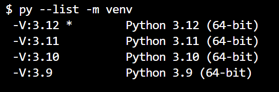
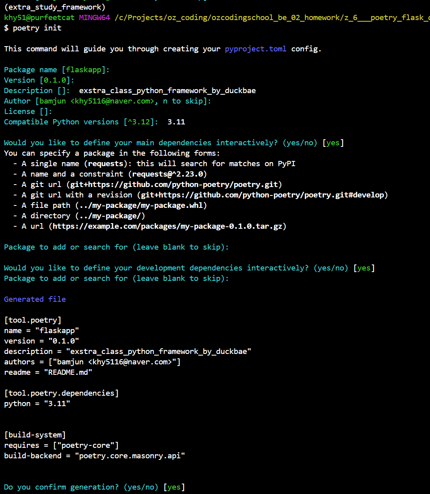
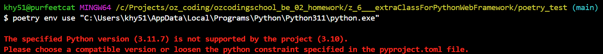
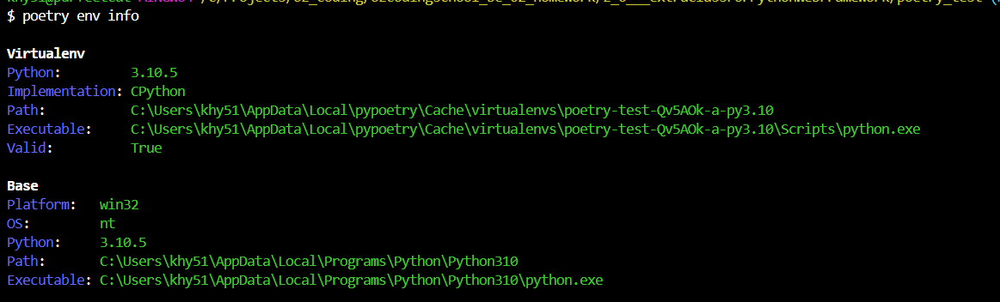

[자료링크](https://brass-alder-325.notion.site/Flask-72f6d347e574400b9c516e9583b68165)  

# flask 심화학습  
- poetry  

  - black  
    - 포메터  
    - poetry run black .  

  - isort  
    - isort 는 import 순서를 정렬시켜줍니다.  

  - mypy  
    - 정적(프로그램 실행하지 않고 검색) 타입 검색.  


- orm 없이 pymysql 사용  


- poetry add pytest  

<br>  
<br>  

---
---
---

<br>  
<br>  

# 파이참 사용하기 싫어서, 파이참 사용안하고 프로젝트 진행하기.  
- 파이참에서 포이트리 사용시, 프로젝트 생성할때 파이썬 버전을 없으면 자동다운로드 설정 진행해줌.  
- vscode 환경에서 하려면 ?  
  - 버전이 없다면, 파이썬 홈페이지에서 버전 다운로드, 설치하고 py --list -m venv 로 버전 있는지 확인한다.  
    
  - 명령어 python -m venv 와 py -m venv 틀린점, python 현재 사용중인 버전만 사용가능하고, py는 현재 컴퓨터에 설치된 전체 버전 사용가능.  
- py -[설치할 버전] -m venv .venv 로 가상환경에서 사용하는게 좋을듯..
- 사용할 프로젝트에서 가상환경 

## vscode로 프로젝트 진행(윈도우)  
- 파이썬버전 확인하기  
  `bash shell`
  ```bash  
  py --list -m venv  
  ```  
- 사용할 파이썬 버전 없으면 공식홈페이지에서 다운로드 후 설치  

- 가상환경 설치  
  - py -[설치 원하는 버전] -m venv [설치경로/폴더이름]  
    `bash shell`
    ```bash  
    py -3.11 -m venv .venv  
    ```

- 가상환경 활성화 이후 이미 가상환경 활성화 이므로 poetry shell 명령어 없이 진행.  
- 포이트리 초기화 하기  
  - poetry init  
  
  `bash shell`
  ```bash  
  poetry init  
  ```  
    
  
- 모듈 설치하기  
  - poetry add [설치할 모듈]  
  `bash shell`
  ```bash  
  poetry add flask  
  ```


## venv에서 말고, poetry 사용하기  

### 처음 시작할때  
- poetry init  
  -  여기에서 원하는 파이썬 버전 선택하기  
     `bash shell`
     ```bash  
     Compatible Python versions [^3.12]:  3.10  
     ```  
- poetry env use [파이썬 버전경로]  
    `bash shell`
    ```bash  
    poetry env use "C:\Users\khy51\AppData\Local\Programs\Python\Python311\python.exe"
  ```

- 만약에 아래와 같은 경고문이 나온다면, toml 파일에서 파이썬 버전 설정해주기  
  
  - '^' 기호는 설정한 버전보다 위에 버전이면 가능하게 설정하는 표시임.  

    `.toml`
    ```bash  
    [tool.poetry.dependencies]
    python = "3.11.7"
    # or
    python = "^3.11.7"
    ```

- poetry shell 입력해서 poetry 가상환경 진입하기.  
    `bash shell`
    ```bash  
    poetry shell  
    ```

- poetry env info 로 현재 가상환경과 기본 경로 확인가능  
  