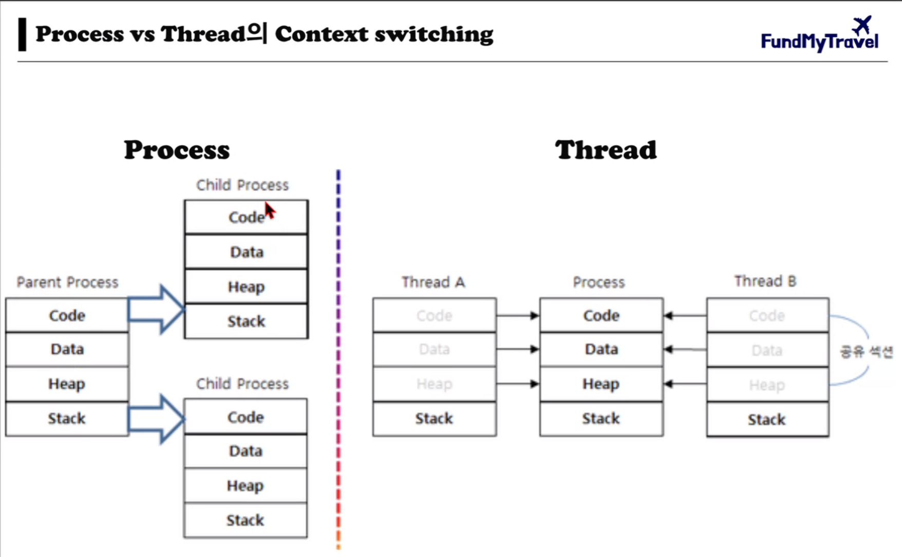

[교제 링크](https://visioneer.notion.site/Fast-API-5d29c06e54bf46f4a5f7103b28faa345)  
[깃허브](https://github.com/Seopftware/fastapi-backend-class2)  

# fastapi-backend-class [노션](https://visioneer.notion.site/02-FastAPI-2a8992e398204e00a86dae0774ebd4f4)  
- install fast api  

  &darr; `fastapi-backend-class\` &darr; `bash shell`
  ```bash
  pip install fastapi
  ```

<br>

- install uvicorn

  &darr; `fastapi-backend-class\` &darr; `bash shell`
  ```bash
  pip install 'uvicorn[standard]'
  ```

<br>

- fastapi 파일 `main.py` 생성

  &darr; `fastapi-backend-class\` &darr; `bash shell`
  ```bash
  touch main.py
  ```

<br>  

- `main.py` 파일작성  

  &darr; `fastapi-backend-class\` &darr; `main.py`
  ```python
  from fastapi import FastAPI

  app = FastAPI()


  @app.get("/")
  def read_root():
      return {"Hello": "World"}

  @app.get("/items/{item_id}")
  def read_item(item_id: int, q: str = None):
      return {"item_id": item_id, "q": q}


  if __name__ == "__main__":
      import uvicorn
      uvicorn.run("main:app", host="127.0.0.1", port=8000, log_level='DEBUG', reload=True)
  ```
<br>

- 서버 실행 하기  

  &darr; `fastapi-backend-class\` &darr; `bash shell`
  ```bash
  uvicorn main:app --reload
  ```

<br>

- 결과 확인  

> 브라우저를 열고 **`http://127.0.0.1:8000`**로 이동합니다. "Hello: World"라는 JSON 응답을 볼 수 있습니다. 또한 FastAPI는 자동으로 API 문서를 생성합니다. **`http://127.0.0.1:8000/docs`** 또는 **`http://127.0.0.1:8000/redoc`**으로 이동하여 API 문서를 볼 수 있습니다.

  

  

  

<br>

- ## Swagger UI vs ReDoc 차이점

### **Swagger UI (`/docs`)**

- **Swagger UI**는 FastAPI와 함께 가장 일반적으로 사용되는 자동 생성 문서입니다.
- 사용자 친화적인 인터페이스를 제공하며, API의 각 경로와 가능한 요청 및 응답을 시각적으로 표시합니다.
- 실시간으로 API를 테스트하고 상호 작용할 수 있는 기능을 제공합니다. 예를 들어, API 엔드포인트에 대한 요청을 직접 보내고 응답을 받아볼 수 있습니다.
- 각 API 엔드포인트에 대한 파라미터, 요청 본문, 응답 스키마 등의 세부 사항을 볼 수 있습니다.

### **ReDoc (`/redoc`)**

- **ReDoc**은 좀 더 간결하고 정돈된 인터페이스를 제공하는 다른 형태의 문서화 도구입니다.
- Swagger UI보다 더 간단하고 읽기 쉬운 레이아웃을 제공합니다.
- 대규모 API에 적합하며, 복잡한 스키마를 가진 API를 좀 더 쉽게 탐색하고 이해할 수 있도록 도와줍니다.
- 실시간 API 테스트 기능은 제공하지 않습니다. 대신, 문서화에 더 초점을 맞추고 있습니다.

### **언제 어떻게 활용하나요?**

- **개발 및 테스트**: Swagger UI (**`/docs`**)는 API 개발 및 테스트 과정에서 매우 유용합니다. 개발자는 API의 각 부분을 실시간으로 테스트하고 결과를 즉시 확인할 수 있습니다.
- **문서화 및 프레젠테이션**: ReDoc (**`/redoc`**)은 API의 최종 사용자나 스테이크홀더들에게 API를 소개하거나 문서화하는 데 더 적합합니다. 그것은 깔끔하고 직관적인 인터페이스로 API의 구조와 기능을 명확하게 전달합니다.

결론적으로, Swagger UI와 ReDoc은 각기 다른 목적과 상황에 맞게 활용될 수 있으며, FastAPI에서 두 문서화 도구를 모두 제공하는 것은 개발자가 다양한 요구 사항과 선호도에 맞게 선택할 수 있게 합니다.

<br>

- 다양한 서버 실행 방법

1. **프로그래밍 방식으로 직접 실행하기:**
FastAPI 애플리케이션을 프로그램 내부에서 직접 실행하는 가장 일반적인 방법입니다.
    
    ```python
    import uvicorn
    
    if __name__ == "__main__":
        uvicorn.run("main:app", port=8000, log_level="info")
    ```
    
    - python main.py
    
    만약, 위 내용이 없다면
    
    ```bash
    > uvicorn main:app --port 8000 --log-level info
    ```
    
2. **Config와 Server 인스턴스 사용하기:**
더 많은 구성 옵션과 서버 수명 주기 제어가 필요할 때 사용합니다.
    
    ```python
    import uvicorn
    
    if __name__ == "__main__":
        config = uvicorn.Config("main:app", port=8000, log_level="info")
        server = uvicorn.Server(config)
        server.run()
    ```
    
3. **Gunicorn과 함께 사용하기:**
프로덕션 환경에서는 Gunicorn을 사용하는 것이 권장됩니다. Gunicorn은 프로세스 관리 및 부하 분산 기능을 제공합니다.
    
    ```
    gunicorn example:app -w 4 -k uvicorn.workers.UvicornWorker
    ```

# FastAPI APIRouter  

- `items.py` 파일생성.  

    &darr; `fastapi-backend-class\` &darr; `bash shell`
    ```bash
    touch items.py
    ```

- `items.py` 코드 작성.  

  &darr; `fastapi-backend-class\` &darr; `items.py`
  ```python
  from fastapi import APIRouter

  router = APIRouter()

  @router.get("/api/v1/items/{item_id}/", 
              status_code=200, 
              tags=["items", "payment"], 
              summary="특정 아이템 가져오기", 
              description="Item 모델에서 item_id 값을 가지고 특정 아이템 조회")
  def get_item(item_id: int):
      return {'items': item_id}
  ```

- `main.py` 에 items 라우터 추가하기  
- 

# Pydantic [교제](https://visioneer.notion.site/04-FastAPI-Pydantic-c24aeb89038245019d97da2fec8a9eb7)

- `models.py` 파일 만들기  

# Async&Sync [교제](https://visioneer.notion.site/05-FastAPI-Async-Sync-40801ec50fc4494f943da883d79ee614)  

  

### `cpu_hard_task` 함수

- 이 함수는 `async`로 선언되어 있으며, `await`를 사용하여 `cpu_intensive_task()` 함수를 비동기적으로 실행합니다. 
- `cpu_intensive_task()` 함수가 CPU 집약적 작업을 수행한다면, 이 함수를 기다리는 동안 이벤트 루프는 다른 작업을 처리할 수 없게 됩니다. 이는 CPU 집약적 작업이 이벤트 루프 자체를 차지하기 때문에, 다른 비동기 I/O 작업들의 처리가 지연될 수 있습니다. 
- 이 접근 방식의 문제는 CPU에 부하가 많은 작업이 이벤트 루프를 막아서 전체 시스템의 반응성이 떨어질 수 있다는 것입니다. 비동기 함수 내에서 CPU 집약적 작업을 수행할 때 이러한 문제가 발생하기 쉽습니다.

### `cpu_bound_task` 함수

- 이 함수는 `concurrent.futures.ThreadPoolExecutor`를 사용하여 CPU 집약적 작업을 이벤트 루프에서 분리시키고 별도의 스레드 풀에서 실행합니다.
- `asyncio.get_event_loop().run_in_executor()` 메소드를 사용함으로써, `cpu_intensive_task` 함수가 별도의 스레드에서 동기적으로 실행되게 합니다. 이로 인해 이벤트 루프는 CPU 집약적 작업의 완료를 기다리는 동안에도 다른 비동기 작업을 계속 처리할 수 있습니다.
- 이 접근 방식의 핵심 이점은 CPU에 부하가 많은 작업이 이벤트 루프와는 별도로 실행되기 때문에, 전체 시스템의 반응성이 유지된다는 것입니다. 이는 특히 I/O 바운드 및 CPU 바운드 작업이 혼합된 어플리케이션에서 매우 중요합니다.

### 결론적인 차이

- `cpu_hard_task` 함수는 CPU 집약적 작업을 비동기 방식으로 처리하려고 시도하지만, 이벤트 루프 내에서 해당 작업을 실행하기 때문에 시스템의 전반적인 반응성에 부정적인 영향을 줄 수 있습니다.
- 반면, `cpu_bound_task` 함수는 `ThreadPoolExecutor`를 사용하여 이벤트 루프에서 CPU 집약적 작업을 분리하고, 별도의 스레드에서 실행함으로써, 이벤트 루프의 블로킹을 방지하고 시스템의 반응성을 유지합니다.

`cpu_bound_task` 함수의 접근 방식은 CPU에 부하가 많은 작업을 처리할 때 선호되는 방식입니다, 특히 비동기 프로그래밍 컨텍스트에서 이벤트 루프의 효율성과 반응성을 유지하는 것이 중요할 때 매우 유용합니다.

# FastAPI ORM

- pip install sqlalchemy  

### pymysql & aiomysql

**pymysql**

```markdown
> pip install pymysql
```

- **`pymysql`**은 순수 파이썬으로 작성된 라이브러리이며, **`mysqlclient`**와 API 호환성을 유지합니다.**`mysqlclient`**에 비해 설치가 간단하고, 특정 시스템에 대한 이진 의존성이 없습니다.성능은 **`mysqlclient`**보다 약간 떨어질 수 있지만, 대부분의 일반적인 사용 사례에서 충분히 좋은 성능을 제공합니다.

**aiomysql**

```markdown
> pip install aiomysql
```

- **`aiomysql`**은 **`pymysql`**을 기반으로 하는 비동기 프로그래밍(특히 **`asyncio`**를 사용하는 경우)을 위한 라이브러리입니다.**`aiomysql`**을 사용하면 비동기 I/O를 통해 데이터베이스 연산을 수행할 수 있어 애플리케이션의 동시성을 향상시킬 수 있습니다.

- pymysql & aiomysql  
- pip install pymysql  
- pip install aiomysql    

- [fastapi문서](https://fastapi.tiangolo.com/tutorial/sql-databases/#__tabbed_1_1)  

> 파이썬 백엔드
> fask
> django
> fastapi
> aws lambda (serverless)

- 비밀번호 해쉬화를 위한 bcrypt 설치  


<br>  

<br>  

<br>  

<br>  

--- 
--- 
--- 

# 노트 

비동기와 데이터 검증. ?
페스트 아이피..

데이터검증..

파이덴틱..

직렬화. 자동화...

# 트렌트 체크..
앵귤러는 안쓰는추세...
[추세](https://trends.google.co.kr/trends/explore?date=today%205-y&geo=KR&q=fastapi,%20flask&hl=en)  
fast api vs fLask 지난 5년간...  
 FASTAPI  올라가는 추세..  


개발자들이 중요한거.. 깃.  스타수..  


MSA 구조 ?