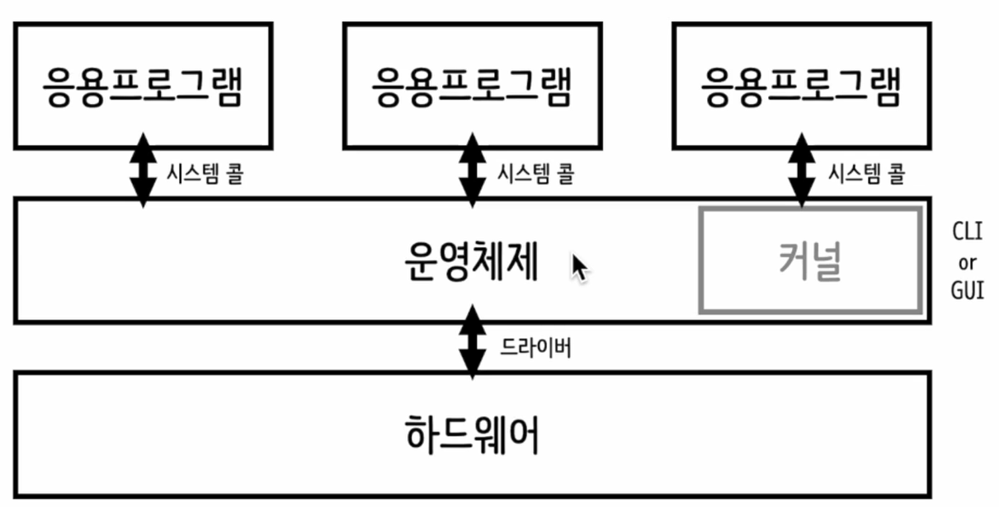
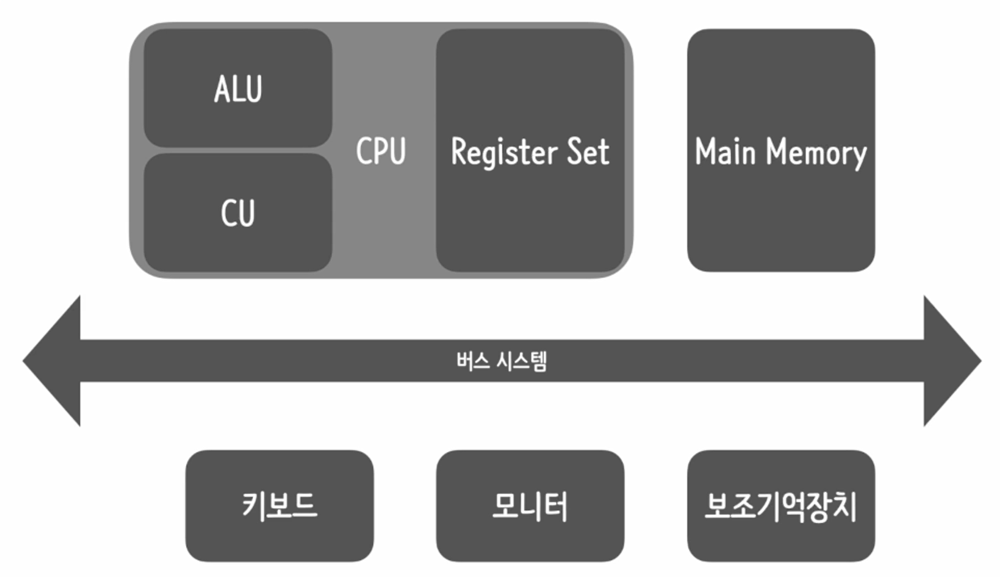
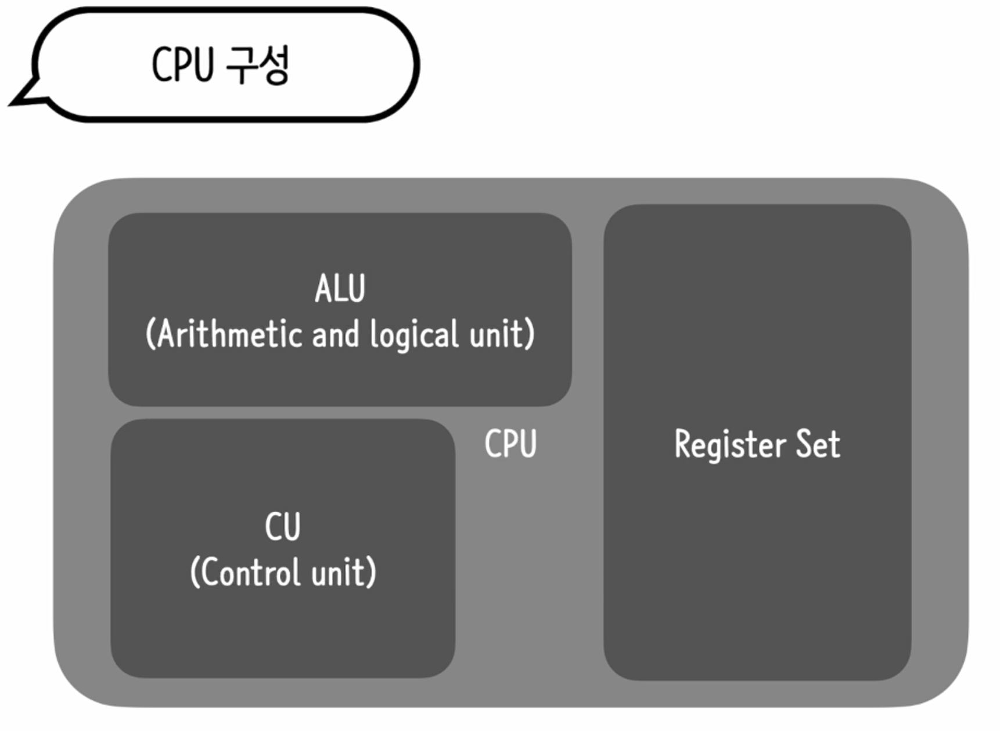
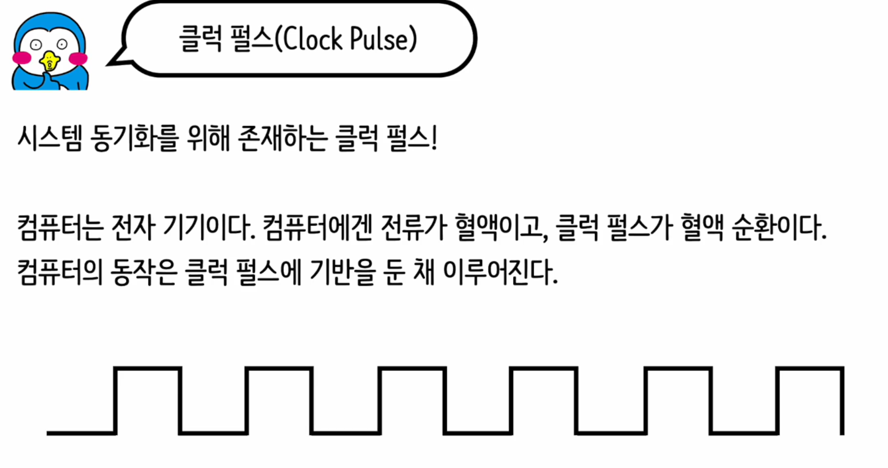
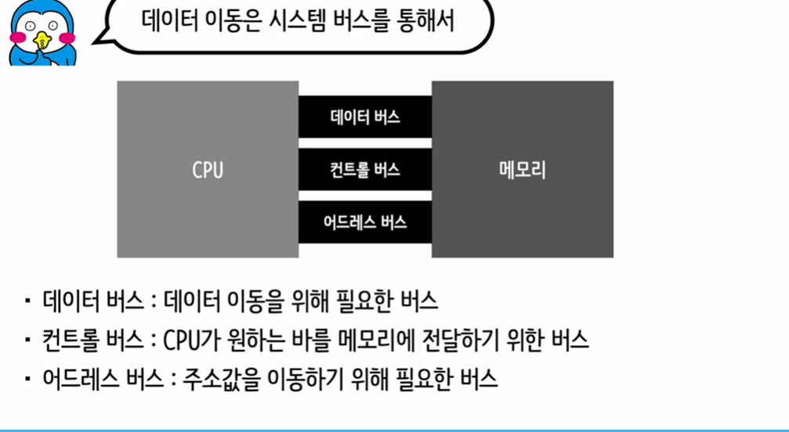

# 운영체제란  

운영체제(Operating System, OS)는 컴퓨터 하드웨어와 사용자 간의 인터페이스 역할을 하며, 컴퓨터의 기본적인 소프트웨어 시스템입니다. 운영체제의 주요 목적은 컴퓨터 시스템의 하드웨어와 소프트웨어 자원을 효율적으로 관리하고, 사용자에게 편리한 인터페이스를 제공하는 것입니다. 운영체제는 컴퓨터를 사용하기 위한 필수적인 소프트웨어로, 다음과 같은 주요 기능을 수행합니다:

1. **프로세스 관리:** 운영체제는 컴퓨터에서 실행되는 모든 프로세스(실행 중인 프로그램)를 관리합니다. 프로세스에 CPU 시간을 할당하고, 실행 순서를 결정하며, 필요에 따라 프로세스 간의 통신 및 동기화를 지원합니다.

2. **메모리 관리:** 운영체제는 메모리의 할당 및 회수를 관리합니다. 프로그램이 실행될 때 적절한 메모리 공간을 할당받고, 프로그램 종료 시 메모리를 회수하여 다른 프로그램이 사용할 수 있도록 합니다.

3. **파일 시스템 관리:** 운영체제는 파일과 데이터를 저장, 검색 및 관리하는 파일 시스템을 제공합니다. 사용자 및 프로그램이 파일을 쉽게 생성, 삭제, 읽기, 쓰기 및 조직할 수 있도록 지원합니다.

4. **자원 관리:** 운영체제는 CPU 시간, 메모리 공간, 저장 공간 및 입출력 장치와 같은 컴퓨터 자원을 관리합니다. 이는 여러 프로그램과 사용자가 효율적으로 공유하도록 하여 자원의 낭비를 최소화하고, 각 작업에 필요한 자원을 할당합니다.

5. **입출력 시스템 관리:** 운영체제는 키보드, 마우스, 디스플레이, 프린터 등 다양한 입출력 장치의 관리를 담당합니다. 이를 통해 사용자 및 프로그램이 하드웨어 장치와 효과적으로 상호작용할 수 있습니다.

6. **사용자 인터페이스 제공:** 운영체제는 사용자가 컴퓨터와 상호작용할 수 있는 인터페이스를 제공합니다. 이는 명령어 기반 인터페이스(Command-Line Interface, CLI) 또는 그래픽 사용자 인터페이스(Graphical User Interface, GUI) 형태일 수 있습니다.

대표적인 운영체제로는 Microsoft의 Windows, Apple의 macOS 및 iOS, Linux 배포판(예: Ubuntu, Fedora) 등이 있으며, 이들은 각각 다른 특성과 기능을 가지고 있습니다.

# 운영체제 구조

운영체제의 구조는 크게 간단하고 단일 구조부터 복잡하고 계층화된 구조까지 다양합니다. 다음은 운영체제 구조의 주요 형태들입니다:

### 1. 단순 구조(모놀리식 구조)
- 초기의 운영 체제들은 대부분 단순 구조 또는 모놀리식(Monolithic) 구조를 가졌습니다.
- 이 구조에서는 모든 운영 체제 기능이 하나의 큰 프로그램 또는 몇 개의 타이트하게 연결된 컴포넌트로 구성됩니다.
- 모놀리식 구조는 구현이 비교적 단순하지만, 크기가 커지고 복잡해질수록 유지보수와 오류 수정이 어려워질 수 있습니다.

### 2. 계층화 구조
- 계층화된 구조는 운영 체제를 여러 계층으로 나누어 각 계층이 특정 기능을 담당하도록 설계됩니다.
- 하위 계층은 하드웨어와 가까우며, 상위 계층으로 갈수록 사용자 인터페이스와 가까워집니다.
- 각 계층은 오직 바로 아래 계층의 기능만을 사용할 수 있어, 시스템의 구조를 명확하게 하고, 오류 발생 시 문제를 좀 더 쉽게 분리할 수 있게 합니다.

### 3. 마이크로커널 구조
- 마이크로커널 구조는 최소한의 기능만을 커널에 포함시키고, 나머지 기능들은 사용자 공간의 서버 프로세스로 구현합니다.
- 기본적인 메모리 관리, 프로세스 스케줄링, 기본적인 통신 기능만을 커널이 처리하고, 파일 시스템, 장치 드라이버, 네트워크 프로토콜 등은 별도의 프로세스로 실행됩니다.
- 이 구조는 시스템의 유연성을 높이고, 신뢰성 및 보안을 향상시킬 수 있지만, 성능 오버헤드가 발생할 수 있습니다.

### 4. 클라이언트-서버 모델
- 클라이언트-서버 모델은 마이크로커널의 개념을 확장하여, 운영 체제의 다양한 기능을 서로 독립된 서버 프로세스로 구현합니다.
- 클라이언트 프로세스는 서비스가 필요할 때 서버 프로세스에 요청(request)을 보내고, 서버 프로세스는 해당 서비스를 제공한 후 결과를 반환합니다.
- 이 구조는 시스템의 모듈성을 높이며, 분산 시스템 환경에서 효과적인 운영을 가능하게 합니다.

### 5. 가상머신
- 가상머신은 하드웨어 위에 하나 이상의 운영 체제를 동시에 실행할 수 있게 해주는 구조입니다.
- 하이퍼바이저 또는 VMM(Virtual Machine Monitor)이라 불리는 소프트웨어가 각 가상 머신의 실행을 관리합니다.
- 이 구조는 다양한 운영 체제를 동시에 사용할 수 있게 하며, 시스템 개발,

 테스트, 보안 환경 구축 등에 유용하게 사용됩니다.

각 운영체제 구조는 특정 목적과 요구사항에 맞게 설계되며, 장단점이 있습니다. 시스템의 요구사항, 성능, 보안, 유지보수의 용이성 등을 고려하여 적절한 구조를 선택하는 것이 중요합니다.

  

응용프로그램, 시스템콜, 운영체제(커널), 하드웨어 간의 상호작용은 컴퓨터 시스템에서 매우 중요한 과정입니다. 이 구조는 소프트웨어와 하드웨어 사이의 인터페이스 역할을 하며, 사용자의 요청을 하드웨어가 이해하고 처리할 수 있도록 전달하는 데 필수적인 단계를 포함합니다. 다음은 이 구조에 대한 간략한 설명입니다:

### 응용프로그램 (Application)
- 사용자가 직접적으로 상호작용하는 소프트웨어입니다. 워드 프로세서, 웹 브라우저, 게임 등이 여기에 해당합니다.
- 응용프로그램은 사용자로부터 입력을 받아 처리한 결과를 사용자에게 제공합니다.
- 처리 과정 중에 운영체제의 서비스가 필요할 때 시스템콜을 사용하여 요청합니다.

### 시스템콜 (System Call)
- 응용프로그램이 운영체제의 서비스를 요청할 때 사용하는 인터페이스입니다.
- 파일 생성, 읽기, 쓰기, 네트워크 통신, 프로세스 관리 등의 기능을 운영체제로부터 요청할 수 있습니다.
- 시스템콜은 사용자 모드에서 커널 모드로의 전환을 필요로 합니다. 이는 운영체제가 자원을 관리하고, 보안 및 안정성을 유지하기 위해 필요한 과정입니다.

### 운영체제 (커널) (Operating System - Kernel)
- 컴퓨터 하드웨어를 관리하고, 응용프로그램에게 시스템 서비스를 제공하는 소프트웨어의 핵심 부분입니다.
- 운영체제는 시스템콜을 통해 받은 요청을 처리하고, 필요한 작업을 하드웨어에 지시합니다.
- 메모리 관리, 프로세스 스케줄링, 입출력 관리, 파일 시스템 관리 등 다양한 기능을 수행합니다.

### 하드웨어 (Hardware)
- 컴퓨터의 물리적 구성 요소로, CPU, 메모리(RAM), 저장 장치(HDD, SSD), 네트워크 카드 등이 포함됩니다.
- 운영체제(커널)는 하드웨어 위에서 실행되며, 하드웨어의 자원을 효율적으로 사용하고 관리합니다.
- 커널의 지시에 따라 하드웨어는 데이터 처리, 저장, 전송 등의 작업을 수행합니다.

이 구조를 통해, 사용자 및 응용프로그램은 복잡한 하드웨어의 세부사항을 몰라도 시스템의 자원을 사용하고, 필요한 작업을 수행할 수 있습니다. 운영체제는 이러한 요청을 적절히 처리하고 조정하여, 사용자에게 투명하게 하드웨어 자원을 제공하는 역할을 합니다.

GUI(Graphical User Interface)와 CLI(Command Line Interface)는 사용자가 컴퓨터와 상호작용하는 두 가지 주요 방법입니다. 이 두 인터페이스는 사용자 경험과 상호작용 방식에서 상당한 차이를 보입니다. 각각의 특징과 차이점을 아래와 같이 정리할 수 있습니다:

### GUI (Graphical User Interface)
- **시각적 요소:** GUI는 창, 아이콘, 버튼, 메뉴 등 시각적 요소를 사용하여 사용자와 컴퓨터 간의 상호작용을 제공합니다.
- **사용 용이성:** 직관적인 디자인 덕분에 비전문가도 쉽게 사용할 수 있으며, 학습 곡선이 상대적으로 낮습니다.
- **멀티태스킹:** 여러 작업을 동시에 시각적으로 관리하기 쉬워, 사용자는 여러 창을 열어 놓고 작업을 전환할 수 있습니다.
- **리소스 사용:** GUI는 그래픽과 시각적 효과를 처리하기 위해 더 많은 시스템 리소스(예: CPU, 메모리)를 사용합니다.
- **응용 프로그램:** 대부분의 데스크톱 응용 프로그램, 웹 브라우저, 멀티미디어 소프트웨어 등은 GUI를 기반으로 합니다.

### CLI (Command Line Interface)
- **텍스트 기반:** CLI는 텍스트 명령어를 통해 사용자와 컴퓨터 간의 상호작용을 제공합니다. 사용자는 키보드를 사용하여 명령어를 입력하고, 컴퓨터는 텍스트로 결과를 출력합니다.
- **자동화와 스크립팅:** 반복적인 작업을 스크립트로 작성하여 자동화하기 쉽습니다. 고급 사용자와 관리자에게 유용합니다.
- **리소스 사용:** GUI에 비해 적은 시스템 리소스를 사용합니다. 이는 서버 관리 및 리소스가 제한된 환경에서 유리합니다.
- **학습 곡선:** 새로운 사용자에게는 CLI의 명령어와 구문을 배우는 데 시간이 걸릴 수 있으며, 학습 곡선이 높습니다.
- **응용 프로그램:** 시스템 관리, 서버 운영, 개발 작업 등에 주로 사용됩니다.

### 결론
GUI와 CLI는 각각의 장단점을 가지고 있으며, 사용 상황에 따라 적합한 인터페이스를 선택하는 것이 중요합니다. GUI는 직관적이고 사용하기 쉬운 반면, CLI는 강력한 자동화와 효율적인 리소스 사용을 제공합니다.

  

1. **CPU의 구성 요소:**
   - **산술 논리 장치(ALU):** ALU는 컴퓨터에서 수학적 연산(덧셈, 뺄셈 등)과 논리 연산(AND, OR 등)을 담당합니다. 이는 프로그램의 명령에 따라 데이터를 처리하는 핵심적인 부분입니다.
   - **제어 유닛(CU):** 제어 유닛은 컴퓨터의 다른 부분에 명령을 전달하고 실행을 조정하는 역할을 합니다. 즉, 메모리에서 명령어를 가져오고, 그 명령어를 해석하여 ALU나 기타 장치에 지시를 내리는 중추적인 역할을 수행합니다.
   - **레지스터:** 레지스터는 CPU 내부에 있는 매우 빠른 메모리로, 현재 실행 중인 작업에 필요한 데이터나 중간 계산 결과를 일시적으로 저장합니다. 레지스터는 CPU가 즉시 접근할 수 있는 소량의 데이터를 보관하여 처리 속도를 높여줍니다.

2. **메인 메모리와 보조기억장치의 차이:**
   - **메인 메모리(RAM):** 메인 메모리는 컴퓨터가 현재 실행 중인 프로그램과 프로그램이 사용하는 데이터를 저장하는 장소입니다. 빠른 접근 속도를 가지며, 전원이 꺼지면 정보가 사라지는 휘발성을 가집니다.
   - **보조기억장치:** 보조기억장치(하드 드라이브, SSD 등)는 컴퓨터의 전원이 꺼져도 정보를 유지하는 비휘발성 저장소입니다. 프로그램, 문서, 미디어 파일 등을 장기간 저장하는 데 사용됩니다. 메인 메모리에 비해 접근 속도는 느리지만, 저장 용량이 훨씬 크고 비용이 적게 듭니다.

3. **버스 시스템의 세 가지 종류:**
   - **데이터 버스:** 데이터 버스는 CPU와 메모리 또는 다른 하드웨어 장치 간에 데이터를 전송하는 데 사용됩니다. 즉, 데이터의 이동 경로 역할을 합니다.
   - **주소 버스:** 주소 버스는 CPU가 메모리의 특정 위치에 접근하려고 할 때 해당 메모리 주소를 전달하는 데 사용됩니다. 메모리의 어느 부분에 데이터를 읽거나 쓸지를 결정하는 역할을 합니다.
   - **제어 버스:** 제어 버스는 CPU와 메모리 및 기타 장치들 사이의 제어 신호(읽기, 쓰기 요청 등)를 전달하는 데 사용됩니다. 장치들 간의 동기화 및 명령 실행에 필요한 신호를 제공합니다.

이 세 가지 주요 구성 요소와 시스템을 통해 컴퓨터는 다양한 작업을 빠르고 효율적으로 처리할 수 있습니다.

# CPU 구성  

  

Arithmetic Logic Unit (ALU)는 컴퓨터의 중앙 처리 장치(CPU) 내부에 있는 핵심 구성 요소 중 하나로, 다양한 산술(예: 더하기, 빼기) 및 논리(예: AND, OR, NOT) 연산을 담당합니다. ALU는 컴퓨터가 프로그램을 실행하며 수행해야 하는 계산 작업의 실제 연산 부분을 처리합니다. 

### ALU의 기능:

1. **산술 연산**: 기본적인 산술 연산인 덧셈, 뺄셈은 물론, 곱셈과 나눗셈 같은 보다 복잡한 연산을 수행할 수 있습니다. 이러한 연산은 정수 및 부동소수점 숫자에 대해 수행될 수 있습니다.

2. **논리 연산**: 논리 연산자인 AND, OR, NOT을 사용하여 논리 연산을 수행합니다. 이러한 연산은 조건문 평가, 비트 연산 등에 사용됩니다.

3. **비교 연산**: 두 값의 비교를 통해 어느 것이 큰지, 작은지, 또는 같은지를 판단합니다. 이는 분기, 반복 등의 제어 구조에서 중요한 역할을 합니다.

4. **비트 단위 연산**: 비트 단위 AND, OR, XOR 연산 및 시프트 연산(비트를 왼쪽 또는 오른쪽으로 이동)을 수행하여, 데이터의 비트 패턴을 조작합니다.

ALU의 설계와 기능은 컴퓨터 아키텍처에 따라 다르며, 특정 ALU는 복잡한 연산을 더 효율적으로 처리하기 위해 설계될 수 있습니다. 예를 들어, 일부 ALU는 고성능 부동소수점 연산을 지원하기 위해 특별히 최적화됩니다. 

ALU는 CPU의 다른 부분, 특히 레지스터 세트와 밀접하게 연동하여 작동합니다. 레지스터는 ALU로 전달되는 연산의 입력 데이터를 저장하거나, ALU에서 계산된 결과를 임시로 보관하는 데 사용됩니다. 이러한 상호 작용을 통해 ALU는 컴퓨터가 다양한 작업을 효율적으로 수행할 수 있도록 지원합니다.

# 주요레지스터  

1. **프로그램 카운터(Program Counter, PC)**: 현재 실행중인 명령어의 메모리 주소를 저장하는 레지스터입니다. 프로세서는 PC 값을 참조하여 다음에 실행할 명령어를 가져옵니다.

2. **인스트럭션 레지스터(Instruction Register, IR)**: 현재 실행중인 명령어를 일시적으로 저장하는 레지스터입니다. 프로세서는 메모리에서 가져온 명령어를 IR에 저장한 후 해석하고 실행합니다.

3. **어드레스 레지스터(Address Register, AR)**: 메모리 주소를 저장하는 레지스터입니다. 데이터를 읽거나 쓸 메모리 주소를 가리키는 역할을 합니다.

4. **버퍼 레지스터(Buffer Register, BR)**: 메모리와 CPU 간의 데이터 전송을 위한 임시 저장소 역할을 합니다. 데이터 읽기/쓰기 작업 시 BR을 거쳐 데이터가 이동합니다.

5. **플래그 레지스터(Flag Register, FR)**: 프로세서의 상태를 나타내는 플래그들을 저장하는 레지스터입니다. 예를 들어, 오버플로, 제로, 캐리 등의 플래그가 있습니다.

6. **스택 포인터(Stack Pointer, SP)**: 스택의 최상위 주소를 가리키는 레지스터입니다. 함수 호출, 중간 연산 결과 저장 등 스택 작업 시 SP를 사용합니다.

이러한 레지스터들은 CPU 내부에 존재하며, 프로그램 실행 중 데이터와 주소 처리, 상태 관리 등의 역할을 수행합니다. 레지스터의 크기와 종류는 CPU 아키텍처에 따라 다를 수 있습니다.

# 클럭 퍼스 (Clock Purse)  
  

클럭 펄스(clock pulse) 또는 클럭 신호는 컴퓨터나 다른 디지털 시스템에서 동작의 타이밍을 조정하기 위해 사용되는 신호입니다. 이 신호는 일정한 간격으로 발생하는 전기적 펄스 형태로, 시스템의 모든 부품이 동기화된 방식으로 데이터를 처리하고 전송할 수 있도록 합니다. 클럭 펄스는 디지털 시스템의 "하트비트"와 유사하며, 각 펄스는 특정 작업이 시작되거나 완료되어야 하는 정확한 순간을 나타냅니다.

### 클럭 펄스의 주요 기능:

1. **동기화**: 클럭 펄스는 시스템의 모든 구성 요소가 동시에 동작할 수 있도록 합니다. 이는 데이터의 일관된 처리와 전송을 보장합니다.

2. **속도 제어**: 클럭 펄스의 빈도(클럭 속도)는 시스템의 성능을 결정합니다. 클럭 속도가 높을수록 더 많은 연산을 빠르게 수행할 수 있지만, 열 발생이나 전력 소모도 증가할 수 있습니다.

3. **타이밍 제어**: 클럭 신호는 명령어 실행, 데이터 전송 등의 타이밍을 정확하게 제어합니다. 이는 특히 병렬 처리나 고속 데이터 전송에서 중요합니다.

### 클럭 속도:
클럭 속도는 보통 헤르츠(Hz) 단위로 측정되며, 1초 동안에 발생하는 클럭 펄스의 수를 나타냅니다. 예를 들어, 3GHz(기가헤르츠) 클럭 속도는 1초에 30억 개의 클럭 펄스가 발생한다는 것을 의미합니다. 클럭 속도는 CPU의 성능을 평가하는 중요한 지표 중 하나입니다.

### 클럭 신호의 중요성:
클럭 신호 없이는 현대의 디지털 시스템이 제대로 동작할 수 없습니다. 이 신호는 데이터 처리의 정확성과 신뢰성을 보장하며, 복잡한 시스템 내에서 여러 구성 요소들이 서로 올바르게 통신하도록 합니다. 또한, 시스템 설계자는 클럭 속도를 조정함으로써 성능과 전력 소모 사이의 최적의 균형을 찾을 수 있습니다.

  

컴퓨터 시스템 내에서 CPU, 메모리, 그리고 기타 주변 장치 간의 데이터 이동은 주로 시스템 버스를 통해 이루어집니다. 시스템 버스는 여러 하위 버스로 나누어질 수 있으며, 각각은 특정 종류의 정보 전달을 담당합니다. 여기서 언급된 데이터 버스, 컨트롤 버스, 그리고 어드레스 버스는 이러한 시스템 버스의 핵심 구성 요소입니다.

### 데이터 버스
- **목적**: 데이터 버스는 CPU와 메모리 또는 기타 입출력 장치들 사이에서 데이터를 전달하기 위한 수단입니다.
- **기능**: 이 버스를 통해 실제 데이터 값(예: 명령어, 계산 결과, 파일 정보 등)이 이동합니다.
- **양방향성**: 데이터 버스는 양방향으로 데이터를 전송할 수 있어, CPU가 데이터를 읽거나 쓸 때 사용됩니다.

### 컨트롤 버스
- **목적**: 컨트롤 버스는 CPU가 메모리나 주변 장치들에 제어 신호를 전송하기 위한 경로를 제공합니다.
- **기능**: 이 버스를 통해 CPU는 장치에 명령을 내리고(예: 데이터 읽기/쓰기 요청), 장치로부터 상태 정보(예: 준비 완료, 오류 발생)를 수신합니다.
- **단방향성 또는 양방향성**: 컨트롤 버스는 주로 단방향이거나 양방향으로 작동할 수 있으며, 이는 구현에 따라 다릅니다.

### 어드레스 버스
- **목적**: 어드레스 버스는 CPU가 메모리에 데이터를 저장하거나 메모리로부터 데이터를 읽어올 특정 주소를 지정하기 위해 사용됩니다.
- **기능**: CPU가 처리할 데이터의 위치를 메모리에 알려줍니다.
- **단방향성**: 어드레스 버스는 주로 CPU에서 다른 장치로 주소 정보를 전달하는 단방향 통신 경로입니다.

이 세 가지 주요 버스는 CPU와 시스템 내 다른 구성 요소들 사이의 통신을 가능하게 함으로써, 컴퓨터가 효율적으로 데이터를 처리하고 관리할 수 있도록 합니다. 버스의 폭(즉, 전송할 수 있는 데이터의 양)과 속도는 시스템의 전반적인 성능에 중요한 영향을 미칩니다.

# 프로그래 실행 중 돌발상황.  

인터럽트(interrupt)는 CPU가 현재 수행 중인 작업을 일시 중지하고, 긴급하게 처리해야 할 다른 작업(인터럽트 요청에 의해 지정된 작업)을 먼저 처리하도록 하는 메커니즘입니다. 인터럽트는 CPU 작업을 '방해'하는 것처럼 보일 수 있지만, 실제로는 시스템의 효율성과 반응성을 높이기 위해 필수적인 기능을 제공합니다.

### 인터럽트의 유형
인터럽트는 크게 두 가지 유형으로 나눌 수 있습니다:

1. **하드웨어 인터럽트**: 외부 장치(예: 키보드, 마우스, 네트워크 인터페이스)로부터 발생하는 인터럽트입니다. 이러한 인터럽트는 장치가 데이터를 준비했거나 서비스가 필요할 때 CPU에 신호를 보냅니다.

2. **소프트웨어 인터럽트**: 프로그램 코드 내부에서 발생하는 인터럽트로, 특정 명령(예: 시스템 호출) 실행에 의해 발생합니다. 이는 프로그램이 운영 체제의 특정 기능을 요청할 때 사용됩니다.

### 인터럽트 처리 과정
1. **인터럽트 요청(IRQ)**: 장치 또는 프로그램이 CPU에 인터럽트를 요청합니다.
2. **인터럽트 인식**: CPU는 현재 실행 중인 명령어를 완료한 후 인터럽트 요청을 인식합니다.
3. **인터럽트 서비스 루틴(ISR) 실행**: CPU는 현재 상태를 저장(컨텍스트 스위치)하고, 인터럽트에 해당하는 인터럽트 서비스 루틴으로 제어를 이동합니다.
4. **인터럽트 처리**: ISR에서 인터럽트를 처리한 후, CPU는 이전 작업으로 돌아가 그 시점부터 실행을 재개합니다.

### 인터럽트의 중요성
- **멀티태스킹**: 인터럽트는 운영 체제가 여러 프로세스나 스레드를 효율적으로 관리하고, 시스템 자원을 공정하게 분배하는 데 도움을 줍니다.
- **실시간 반응**: 시스템이 외부 이벤트에 신속하게 반응할 수 있도록 합니다. 예를 들어, 사용자 입력이나 네트워크 패킷 수신과 같은 이벤트에 즉각적으로 대응할 수 있습니다.
- **자원 효율성**: 인터럽트는 CPU가 불필요한 폴링(polling)을 줄이고, 대신 필요한 작업에만 집중할 수 있도록 함으로써 자원 사용을 최적화합니다.

인터럽트는 현대 컴퓨팅 시스템에서 중요한 역할을 하며, 효율적인 시스템 운영과 빠른 이벤트 처리를 가능하게 합니다.

# 인터럽트 예제 
01_interrupt.py