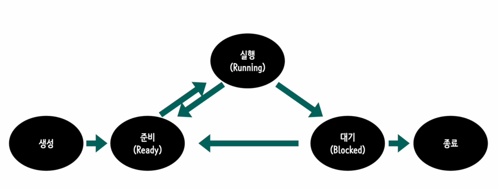
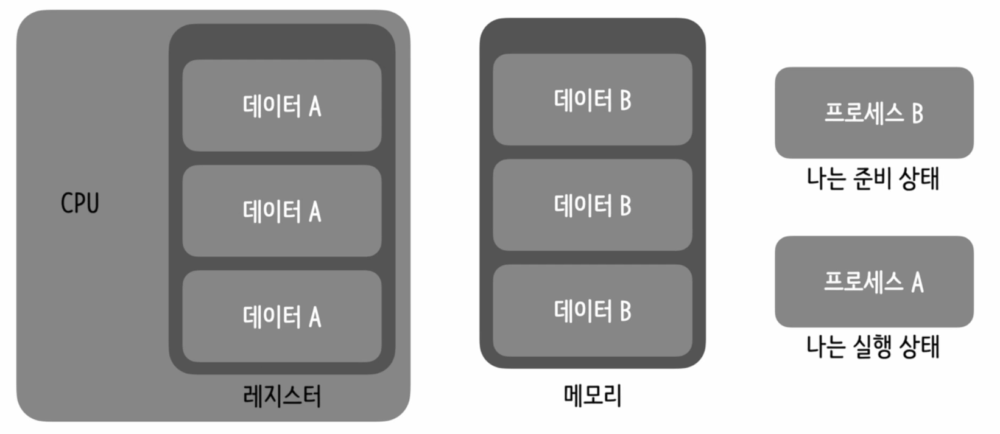
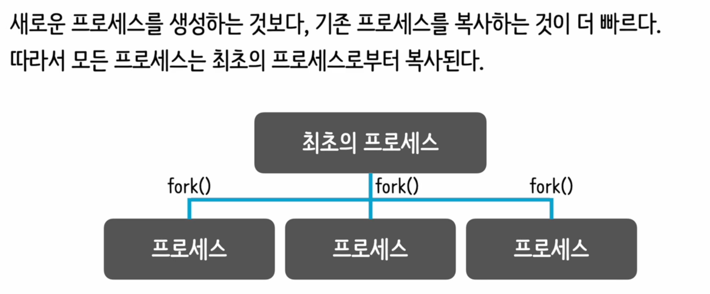
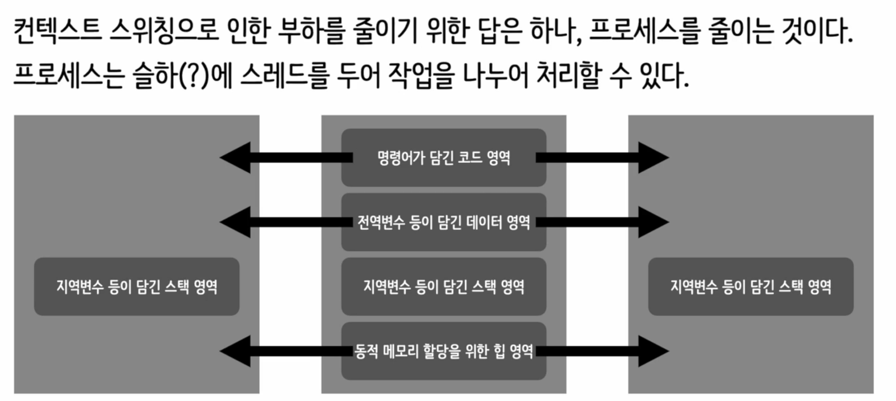
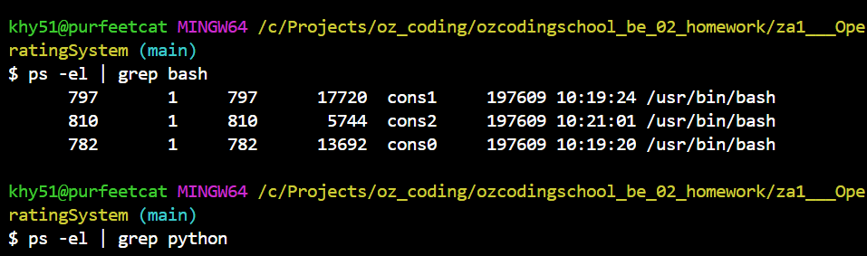
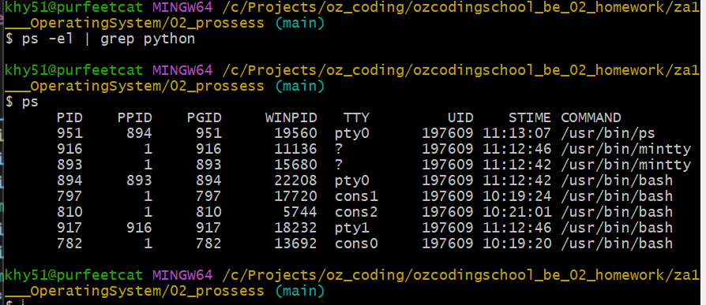
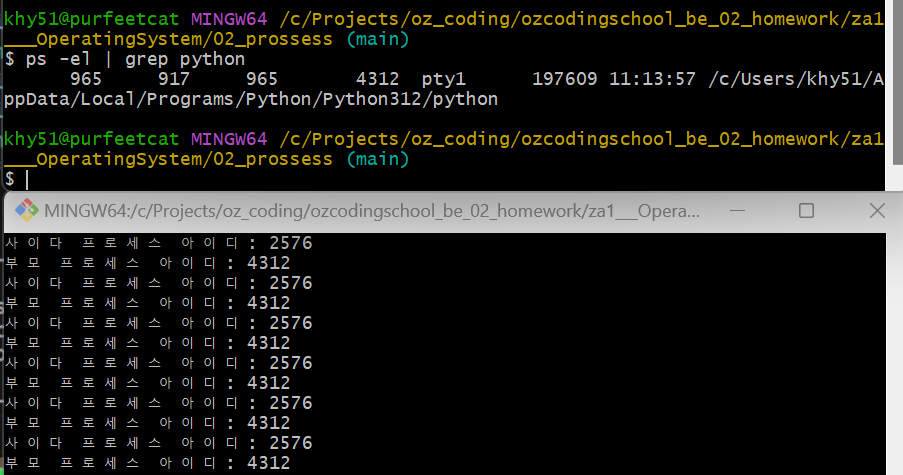

# 프로세서는 id는 랜덤하게 생성.

# pip install psutil

# 프로세스 상태 변화  
  

프로세스 컨트롤 블록(Process Control Block, PCB)은 운영 체제가 각 프로세스를 효율적으로 관리하기 위해 사용하는 중요한 데이터 구조입니다. PCB는 운영 체제의 스케줄링 시스템과 프로세스 관리 시스템의 핵심 요소 중 하나로, 프로세스가 CPU에서 실행될 때 필요한 모든 정보를 담고 있습니다. 이 정보에는 프로세스의 현재 상태, 프로그램 카운터, CPU 레지스터 값, 스케줄링 정보, 메모리 관리 정보 등이 포함됩니다. PCB의 주요 구성 요소를 좀 더 자세히 살펴보겠습니다:

1. **프로세스 식별자(Process Identifier, PID):** 시스템 내에서 각 프로세스를 유일하게 식별하는 번호입니다. 이 식별자는 프로세스를 생성할 때 운영 체제에 의해 할당됩니다.

2. **프로세스 상태(Process State):** 프로세스의 현재 상태를 나타냅니다. 이 상태에는 준비(Ready), 실행(Running), 대기(Waiting), 중단(Suspended) 등이 포함될 수 있습니다.

3. **프로그램 카운터(Program Counter, PC):** 프로세스가 다음에 실행할 명령어의 주소를 가리킵니다. CPU가 프로세스를 실행할 때, 이 주소에서 시작하여 명령어를 순차적으로 실행합니다.

4. **CPU 레지스터 정보(CPU Registers):** 프로세스 실행에 필요한 레지스터의 값들입니다. 이 정보는 프로세스가 중단되었다가 다시 시작될 때, 마지막 실행 상태로 복원하는 데 필요합니다.

5. **CPU 스케줄링 정보(CPU Scheduling Information):** 프로세스에 대한 우선 순위, 스케줄링 큐에 대한 포인터 등 스케줄링에 필요한 정보가 포함됩니다.

6. **메모리 관리 정보(Memory Management Information):** 프로세스가 사용하는 메모리 영역에 대한 정보입니다. 이는 프로세스의 주소 공간, 페이지 테이블 등을 포함할 수 있습니다.

7. **입출력 상태 정보(I/O Status Information):** 프로세스에 할당된 입출력 장치와 열린 파일 목록 등, 입출력에 관련된 정보입니다.

PCB는 운영 체제가 프로세스를 효과적으로 관리하고, 프로세스 간의 문맥 교환(Context Switching)을 수행할 때 필요한 정보를 제공합니다. 문맥 교환이란, CPU가 현재 실행 중인 프로세스에서 다른 프로세스로 전환할 때 발생하는 작업으로, 실행 중인 프로세스의 상태를 저장하고 새로운 프로세스의 상태를 복원하는 과정을 말합니다. PCB를 통해 이러한 과정이 원활하게 이루어질 수 있습니다.

# 프로세스 계층이 존제한다  
- 예제 04.py

# 멀티 프로세스  
- 프로세스는 동시에 실행가능 하다..  

# 컨텍스트 스위칭  
  
컨텍스트 스위칭(Context Switching)은 운영 체제가 CPU를 효율적으로 사용하기 위해 실행 중인 프로세스(혹은 스레드)에서 다른 프로세스(혹은 스레드)로 CPU의 제어를 이전하는 과정입니다. 이 과정은 멀티태스킹 환경에서 매우 중요한 역할을 하며, 컴퓨터 시스템의 성능과 반응성에 직접적인 영향을 미칩니다.

### 컨텍스트 스위칭의 과정
컨텍스트 스위칭은 크게 다음 단계로 이루어집니다:

1. **현재 실행 중인 프로세스의 상태 저장**: 현재 CPU에서 실행 중인 프로세스의 상태(레지스터 정보, 프로그램 카운터, 스택 정보 등)를 해당 프로세스의 프로세스 컨트롤 블록(PCB)에 저장합니다. 이 과정을 통해 프로세스가 나중에 다시 실행될 때 이전에 중단된 지점부터 실행을 재개할 수 있게 됩니다.

2. **다음 실행할 프로세스의 상태 복원**: CPU에서 실행할 다음 프로세스의 PCB에서 상태 정보를 불러와 CPU 레지스터에 복원합니다. 이 단계에서는 프로그램 카운터, 레지스터 값 등이 복원되어, 이 프로세스가 실행될 준비가 완료됩니다.

3. **실행 교체**: 복원된 다음 프로세스가 CPU에서 실행을 시작합니다.

### 컨텍스트 스위칭의 비용
컨텍스트 스위칭은 CPU 사용의 효율성을 높이고 시스템의 반응성을 유지하는 데 필수적이지만, 무료가 아닌 과정입니다. 컨텍스트 스위칭은 다음과 같은 비용을 수반합니다:

- **시간 지연**: 상태를 저장하고 복원하는 데 시간이 소요되어, 실제로 작업을 처리하는 데 사용할 수 있는 CPU 시간이 줄어듭니다.
- **캐시 초기화**: 새로운 프로세스로 교체될 때, CPU 캐시에 있던 이전 프로세스의 데이터가 무효화되고, 새로운 프로세스의 데이터로 캐시를 다시 채워야 합니다. 이로 인해 캐시 미스가 증가하고 성능이 저하될 수 있습니다.

### 컨텍스트 스위칭 최적화
운영 체제는 컨텍스트 스위칭의 비용을 최소화하기 위해 다양한 전략을 사용합니다. 예를 들어, 스케줄링 알고리즘을 통해 자주 사용되는 프로세스들이 CPU를 더 오랫동안 보유하도록 하거나, 유사한 작업을 하는 프로세스들을 연속적으로 실행하여 캐시 효율성을 높이는 방법 등이 있습니다.

  

# 멀티프로세스 예제  
-05.py
-06.py
-07.py
이 Python 스크립트는 `multiprocessing` 모듈을 사용하여 별도의 프로세스를 생성하고, 각각에서 간단한 함수를 실행하는 예제입니다. `multiprocessing` 모듈을 사용하면, Python 코드를 동시에 실행하는 병렬 처리가 가능해집니다. 아래는 스크립트의 주요 부분과 프로세스가 생성 및 실행되는 원리에 대한 설명입니다:

1. **모듈 및 함수 정의**:
   - `multiprocessing` 모듈에서 `Process` 클래스를 임포트합니다. 이 클래스를 사용하여 별도의 프로세스를 생성할 수 있습니다.
   - `func` 함수는 각 자식 프로세스에서 실행될 함수로, 실행 중인 프로세스의 ID와 부모 프로세스의 ID를 출력합니다.

2. **메인 프로세스 정보 출력**:
   - 스크립트가 실행되면, 메인 프로세스(부모 프로세스)의 프로세스 ID를 출력합니다.

3. **자식 프로세스 생성 및 실행**:
   - `Process` 객체를 생성하여 `func` 함수를 대상(target)으로 지정합니다. 이렇게 하면, 각 `Process` 객체는 별도의 프로세스에서 `func` 함수를 실행할 준비를 합니다.
   - `start()` 메소드를 호출하여 각 `Process` 객체(자식 프로세스)를 실행합니다. 이때, 실제로 운영 체제에 새 프로세스를 생성하라는 요청이 이루어지며, 지정된 함수(`func`)가 새 프로세스에서 실행됩니다.
   - `time.sleep(1)`은 각 자식 프로세스의 시작 사이에 1초의 지연을 추가합니다. 이는 프로세스가 순차적으로 생성되고 실행되도록 하기 위함입니다.

4. **자식 프로세스에서 함수 실행**:
   - 각 자식 프로세스는 `func` 함수를 실행하여, 현재 프로세스의 ID와 부모 프로세스의 ID를 출력합니다. 여기서, 부모 프로세스의 ID는 메인 스크립트가 실행되는 프로세스의 ID와 같습니다.

5. **프로세스 종료**:
   - 자식 프로세스가 `func` 함수의 실행을 완료하면, 해당 프로세스는 종료됩니다. 프로세스의 실행 순서 및 종료는 `time.sleep`에 의해 제어되며, 각각 독립적으로 실행되기 때문에 서로에게 영향을 주지 않습니다.

이 스크립트는 멀티프로세싱을 통해 동시에 여러 작업을 처리할 수 있는 간단한 예를 보여줍니다. 멀티프로세싱은 CPU 집약적인 작업이나 병렬 처리를 필요로 하는 애플리케이션에서 유용하게 사용될 수 있습니다.

# 스레드  


스레드(Thread)는 프로세스 내에서 실행되는 실행 단위입니다. 기본적으로 프로세스는 애플리케이션의 실행 인스턴스를 의미하며, 자체적인 코드, 데이터, 힙, 스택 등을 가지고 있습니다. 반면, 스레드는 프로세스 내에서 실제 작업을 수행하는 경량의 실행 단위로, 프로세스의 자원과 메모리를 공유합니다. 이런 특성 때문에 스레드들은 같은 프로세스 내에서 데이터를 쉽게 공유할 수 있으며, 컨텍스트 스위칭의 비용이 프로세스 간 전환보다 상대적으로 낮습니다.

### 스레드의 특징

- **경량성(Lightweight)**: 스레드는 프로세스에 비해 생성, 종료, 전환의 비용이 적습니다. 이는 스레드가 프로세스의 자원을 공유하기 때문입니다.
- **자원 공유(Resource Sharing)**: 스레드들은 같은 프로세스 내에서 코드, 데이터 세그먼트 및 개방된 파일과 같은 자원을 공유합니다. 이는 통신을 용이하게 하지만 동기화 문제를 야기할 수 있습니다.
- **독립적인 실행(Independent Execution)**: 각 스레드는 독립적인 실행 경로를 가지며, 자신만의 스택과 프로그램 카운터를 가집니다.
- **효율적인 통신(Efficient Communication)**: 같은 프로세스 내의 스레드들은 공유 메모리를 통해 데이터를 효율적으로 교환할 수 있습니다.

### 스레드의 사용

스레드는 다양한 용도로 사용됩니다:

- **멀티태스킹**: 하나의 애플리케이션 내에서 여러 작업을 동시에 처리할 수 있게 합니다. 예를 들어, 웹 브라우저는 한 스레드에서 사용자 인터페이스를 관리하고, 다른 스레드에서는 네트워크 요청을 처리할 수 있습니다.
- **병렬 처리**: 멀티코어 프로세서의 이점을 최대화하기 위해, 병렬로 작업을 수행하여 애플리케이션의 성능을 향상시킬 수 있습니다.
- **반응성 향상**: 사용자 인터페이스 애플리케이션에서 긴 작업을 백그라운드 스레드에서 실행함으로써, 사용자 인터페이스가 멈추지 않고 반응적으로 유지될 수 있습니다.

### 멀티스레딩의 도전 과제

- **동기화(Synchronization)**: 여러 스레드가 같은 메모리에 동시에 접근할 때 발생하는 문제를 관리해야 합니다. 이를 위해 뮤텍스, 세마포어 등의 동기화 기법이 사용됩니다.
- **데드락(Deadlock)**: 두 개 이상의 스레드가 서로의 자원을 기다리면서 영원히 대기하는 상태에 빠질 수 있습니다.
- **스타베이션(Starvation)**: 일부 스레드가 자원에 접근하지 못하고 무한히 대기하는 현상입니다.
- **컨텍스트 스위칭 비용**: 스레드 간의 전환에도 비용이 들기는 하지만, 프로

세스 간 전환보다는 훨씬 경제적입니다. 그럼에도 불구하고 스레드가 많아지면 이 비용이 증가할 수 있습니다.

스레드는 프로그램의 성능을 향상시키고 사용자 경험을 개선할 수 있는 강력한 수단을 제공하지만, 올바르게 관리되지 않으면 성능 저하, 예측 불가능한 동작, 어려운 버그 등의 문제를 일으킬 수 있습니다.


bash
ps -el | grep python  

  

  




# 프로세서 동작 예제  

이 작업을 위해 Python의 `os` 모듈과 `psutil` 모듈을 사용할 것입니다. `os.getpid()` 함수를 사용하여 현재 실행 중인 파이썬 프로그램의 프로세스 ID(pid)를 얻고, `psutil` 모듈을 사용하여 실행 중인 모든 프로세스를 순회하며 해당 pid를 찾습니다. 찾은 경우, 프로세스의 이름을 출력합니다.

먼저, `psutil` 모듈을 설치해야 합니다. 이는 일반적으로 `pip install psutil` 명령을 사용하여 설치할 수 있습니다.

다음은 요구사항을 충족하는 간단한 코드 예제입니다:

```python
import os
import psutil

# 현재 파이썬 프로그램의 pid를 얻습니다.
current_pid = os.getpid()

# 실행 중인 모든 프로세스에 대해 반복합니다.
for proc in psutil.process_iter():
    try:
        # 프로세스 정보를 가져오는데 성공하면,
        if proc.pid == current_pid:
            # 현재 프로세스의 이름을 출력합니다.
            print(f"Process Name: {proc.name()}")
            break
    except (psutil.NoSuchProcess, psutil.AccessDenied, psutil.ZombieProcess):
        pass
```

이 코드는 다음과 같이 작동합니다:

1. `os.getpid()` 함수를 사용하여 현재 Python 프로그램의 프로세스 ID를 얻습니다.
2. `psutil.process_iter()` 함수를 사용하여 실행 중인 모든 프로세스를 순회합니다.
3. 각 프로세스에 대해, 현재 프로그램의 PID와 프로세스의 PID를 비교합니다.
4. 만약 PID가 일치한다면, 해당 프로세스의 이름을 `proc.name()` 함수를 통해 얻어내고 출력합니다.
5. `try-except` 블록은 프로세스 정보를 얻는 도중 발생할 수 있는 예외를 처리합니다.

이 코드는 `psutil`을 사용하여 프로세스 정보를 안전하게 얻어내는 방법을 보여줍니다. 프로세스 정보를 얻는 과정에서 `NoSuchProcess`, `AccessDenied`, `ZombieProcess`와 같은 예외가 발생할 수 있는데, 이러한 예외들은 각각 프로세스가 존재하지 않는 경우, 접근 권한이 없는 경우, 좀비 프로세스인 경우에 발생합니다. 이 예외들을 적절히 처리함으로써 코드의 안정성을 높일 수 있습니다.