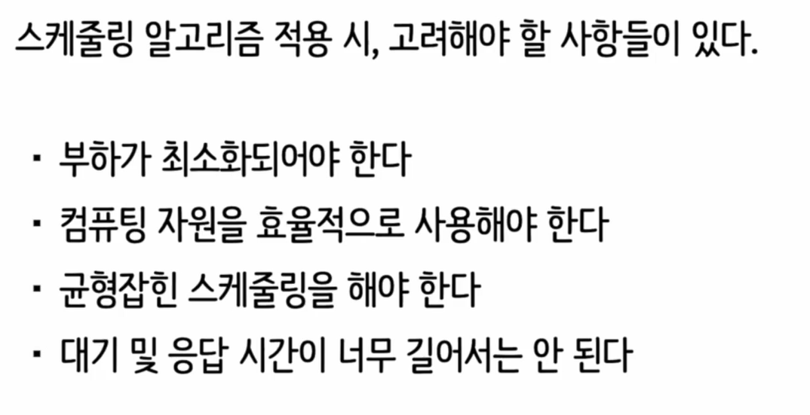
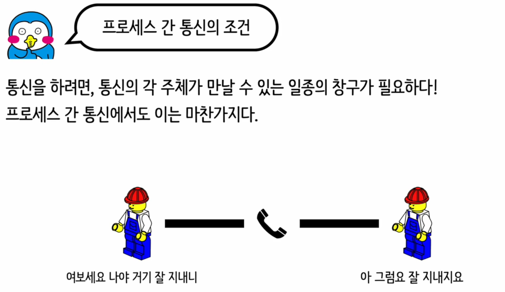
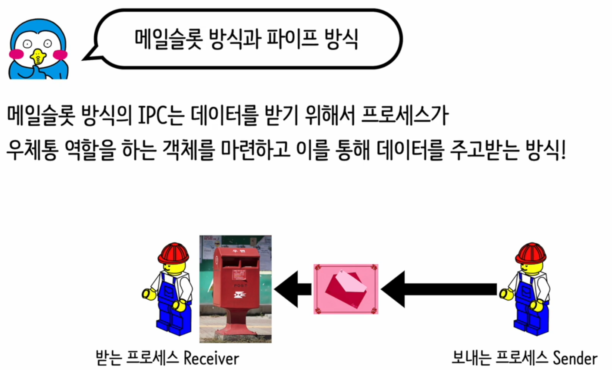
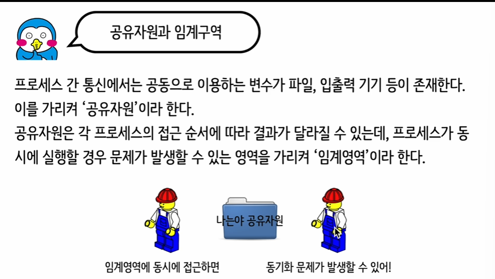
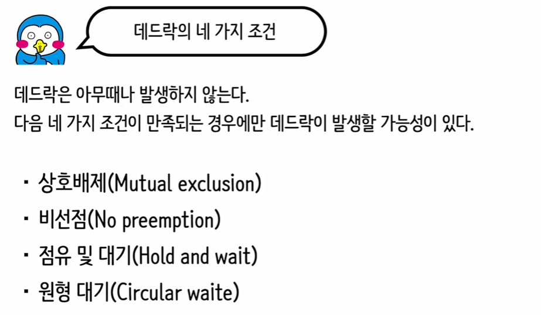

# 스케줄링
    

### 선입선출 (First In, First Out - FIFO)
- FIFO는 가장 단순한 형태의 스케줄링 알고리즘입니다.
- 프로세스는 그들이 준비 큐에 도착한 순서대로 CPU에 할당됩니다.
- 첫 번째로 도착한 프로세스가 첫 번째로 서비스를 받고, 그 다음에 도착한 프로세스가 그 다음으로 서비스를 받습니다.
- 이 방법은 공평하지만, 짧은 작업이 긴 작업 뒤에 있을 경우 평균 대기 시간이 길어질 수 있는 "호위 효과(convoy effect)"를 일으킬 수 있습니다.

### 최단 작업 우선 (Shortest Job First - SJF)
- SJF는 각 프로세스의 다음 CPU 버스트 시간을 기준으로 스케줄링합니다.
- 실행 시간이 가장 짧은 프로세스가 먼저 CPU를 할당받습니다.
- 이 방법은 평균 대기 시간을 최소화하는 데 효과적이지만, 실행 시간이 긴 프로세스가 계속해서 대기 상태로 남아 있는 "기아 상태(starvation)" 문제를 일으킬 수 있습니다.

### 라운드 로빈 (Round Robin - RR)
- RR은 각 프로세스가 작은 시간 단위(타임 슬라이스 또는 타임 퀀텀) 동안 CPU를 차례로 사용하는 방식입니다.
- 모든 프로세스는 동일한 크기의 시간 할당을 받으며, 할당된 시간이 끝나면 다음 프로세스로 전환합니다.
- 이 방법은 응답 시간을 단축시키고, 다중 사용자 환경에서 각 사용자에게 공정한 CPU 시간을 제공하는 데 유리합니다.

### 우선순위 스케줄링 (Priority Scheduling)
- 우선순위 스케줄링에서는 각 프로세스에 우선순위가 할당됩니다.
- 높은 우선순위를 가진 프로세스가 먼저 CPU를 할당받습니다.
- 우선순위는 정적(미리 할당)이거나 동적(실행 중에 변경)일 수 있습니다.
- 이 방법은 긴급한 작업을 빠르게 처리해야 할 때 유용하지만, 낮은 우선순위의 작업이 기아 상태에 빠질 위험이 있습니다.

각 스케줄링 알고리즘은 특정 시나리오에서 장점을 가지지만, 한 가지 방법이 모든 상황에 완벽하게 적합한 것은 아닙니다. 따라서 운영 체제는 주어진 요구 사항과 환경에 가장 적합한 스케줄링 알고리즘을 선택해야 합니다.

# 프로세스간에 통신  
  

  

메일슬롯 방식과 파이프 방식은 프로세스 간 통신(IPC)을 위한 두 가지 다른 메커니즘입니다. 이러한 방법들은 운영 체제에서 프로세스들이 데이터를 교환할 수 있게 해주며, 각기 다른 특성과 사용 사례를 가지고 있습니다.

### 메일슬롯 방식 (Mailslot)
- 메일슬롯은 주로 윈도우 운영 체제에서 사용되는 메커니즘으로, 네트워크를 통한 메시지 기반의 비동기 통신을 가능하게 합니다.
- 메일슬롯을 사용하면 한 프로세스가 메시지를 메일슬롯에 "발송"할 수 있고, 다른 프로세스가 해당 메일슬롯에서 메시지를 "수신"할 수 있습니다.
- 메일슬롯은 일반적으로 단방향 통신에 사용되며, 브로드캐스팅(하나의 메일슬롯으로 여러 수신자에게 메시지를 보내는 것)을 지원합니다.
- 메일슬롯은 설정이 간단하고 사용하기 쉽지만, 대용량 데이터 전송이나 고급 통신 기능을 필요로 하는 상황에는 적합하지 않을 수 있습니다.

### 파이프 방식 (Pipe)
- 파이프는 UNIX 및 유닉스 계열 운영 체제(리눅스 포함)에서 널리 사용되는 IPC 메커니즘입니다. 윈도우 운영 체제에서도 이름이 있는 파이프(Named Pipes)를 통해 비슷한 기능을 제공합니다.
- 파이프는 두 프로세스 간의 단방향 통신 채널을 생성합니다. 한 프로세스가 파이프의 한쪽 끝으로 데이터를 쓰면, 다른 프로세스가 다른 쪽 끝에서 데이터를 읽을 수 있습니다.
- "익명 파이프(Anonymous Pipes)"는 부모-자식 프로세스 간의 통신에 주로 사용되며, "이름이 있는 파이프(Named Pipes)"는 다른 컴퓨터의 프로세스를 포함한 어떠한 프로세스 간에도 통신을 가능하게 합니다.
- 파이프는 신뢰성 있는 순차적 데이터 전송을 제공하며, 복잡한 데이터 통신이나 프로세스 간 동기화가 필요한 경우 유용합니다.

두 방식은 특정 환경과 요구 사항에 따라 선택되며, 각각의 장단점을 고려하여 가장 적합한 통신 방법을 결정해야 합니다. 메일슬롯은 간단한 메시지 전달에 적합한 반면, 파이프는 보다 복잡한 데이터 전송과 프로세스 간의 긴밀한 협업에 더 적합할 수 있습니다.

# 동기화  
동기화는 컴퓨터 과학과 정보 기술 분야에서 광범위하게 사용되는 개념입니다. 특히, 멀티프로세싱, 멀티스레딩, 분산 시스템, 데이터베이스 관리 등에서 중요한 역할을 합니다. 동기화는 데이터의 일관성을 유지하고, 프로세스나 스레드 간의 조정을 위해 필요한 메커니즘입니다. 다양한 컨텍스트에서의 동기화를 살펴보겠습니다:

### 멀티스레딩 및 멀티프로세싱
- 멀티스레딩 및 멀티프로세싱 환경에서 동기화는 공유 자원에 대한 접근을 조정하여 데이터의 일관성을 보장하고, 경쟁 상태(race conditions)를 방지하는 데 사용됩니다.
- 동기화 메커니즘으로는 뮤텍스(mutexes), 세마포어(semaphores), 모니터(monitor), 조건 변수(condition variables) 등이 있습니다.
- 예를 들어, 뮤텍스는 특정 자원 또는 코드 섹션에 대한 독점적 접근을 보장하는 반면, 세마포어는 한 번에 여러 프로세스나 스레드가 자원에 접근할 수 있도록 제한적인 동시 접근을 허용할 수 있습니다.

### 분산 시스템
- 분산 시스템에서 동기화는 네트워크 상의 다양한 컴퓨터나 시스템 간의 작업을 조율하여 일관된 상태를 유지하고, 트랜잭션의 원자성(atomicity)과 일관성(consistency)을 보장하는 데 사용됩니다.
- 클록 동기화(예: NTP, Network Time Protocol), 트랜잭션 관리, 일관성 프로토콜(예: Paxos, Raft) 등이 동기화를 달성하기 위해 사용되는 기술입니다.

### 데이터베이스 관리
- 데이터베이스 시스템에서 동기화는 동시에 발생하는 트랜잭션들이 데이터베이스의 일관성과 무결성을 유지하도록 보장하는 데 필요합니다.
- 동기화는 락(locking) 메커니즘, 트랜잭션 일관성 수준(isolation levels), 로그 기반 복구(mechanisms) 등을 통해 구현됩니다.
- 이를 통해 데이터베이스 시스템은 동시에 실행되는 여러 트랜잭션이 서로 간섭 없이 데이터에 안전하게 접근하고 수정할 수 있도록 합니다.

동기화는 시스템의 성능, 확장성, 안정성에 직접적인 영향을 미치기 때문에, 효과적인 동기화 전략과 메커니즘의 선택은 매우 중요합니다. 동기화의 목표는 시스템의 동시성을 최대화하면서도, 데이터의 일관성과 무결성을 유지하는 것입니다.

뮤텍스 락과 세마포어는 멀티스레딩 환경에서 동기화를 위해 사용되는 두 가지 주요 기술입니다. 각각의 사용 사례를 화장실의 메타포를 사용해 쉽게 이해할 수 있습니다.

### 뮤텍스 락 (Mutex Lock)
- **활용 예시:** 화장실에 누가 있는지 확인하는 것과 같습니다. 화장실이 한 칸만 있는 경우를 상상해 보세요. 한 사람이 화장실을 사용 중이면, 다른 누구도 들어갈 수 없습니다. 사용자가 나올 때까지 기다려야 합니다.
- **기능:** 뮤텍스는 "Mutual Exclusion"의 약자로, 상호 배제를 의미합니다. 한 번에 하나의 스레드만이 공유 자원(이 경우 화장실)에 접근할 수 있게 합니다.
- **동작 방식:** 스레드가 화장실(리소스)을 사용하려고 할 때, 뮤텍스 락을 획득(잠금) `acquire()`합니다. 이 락이 이미 다른 스레드에 의해 획득되어 있다면, 해당 스레드는 락이 해제될 때까지 대기합니다. 리소스 사용이 끝나면, 락을 해제(잠금 해제) `release()`하여 다른 스레드가 사용할 수 있게 합니다.

### 세마포어 (Semaphore)
- **활용 예시:** 여러 개의 화장실이 있는 경우를 생각해 볼 수 있습니다. 여러 사람이 동시에 다른 화장실을 사용할 수 있습니다. 화장실 중 하나가 비어 있으면, 대기 중인 다음 사람이 들어갈 수 있습니다.
- **기능:** 세마포어는 동시에 리소스에 접근할 수 있는 스레드의 수를 제한합니다. 세마포어의 값은 동시에 접근할 수 있는 최대 스레드의 수를 나타냅니다.
- **동작 방식:** 스레드가 리소스를 사용하려고 할 때, `wait()` 함수(또는 `P` 연산)를 호출하여 세마포어를 감소시킵니다. 이 값이 0보다 크면, 스레드는 리소스를 사용할 수 있습니다. 값이 0이면, 리소스가 모두 사용 중이므로 스레드는 대기해야 합니다. 리소스 사용이 끝나면, `signal()` 함수(또는 `V` 연산)를 호출하여 세마포어를 증가시키고, 대기 중인 다른 스레드가 리소스에 접근할 수 있도록 합니다.

이 두 메커니즘은 동기화 문제를 해결하기 위해 널리 사용되며, 각각의 특성과 사용 사례에 따라 적절히 선택하여 사용됩니다. 뮤텍스는 주로 상호 배제를 요구하는 단일 자원에 대한 접근 제어에 사용되고, 세마포어는 동시에 여러 자원에 접근해야 하는 상황에서 유용합니다.

# 데드락
  

데드락(Deadlock)은 멀티 프로세싱 시스템에서 발생할 수 있는 문제로, 두 개 이상의 프로세스 또는 스레드가 서로 상대방의 작업이 끝나기를 무한히 기다리는 상태를 의미합니다. 이로 인해 모든 관련 프로세스나 스레드가 영원히 대기 상태에 빠져, 시스템의 일부 자원이 사용되지 못하고 방치되는 상황이 발생합니다. 데드락이 발생하면, 아무런 진행도 이루어질 수 없으므로 시스템의 성능 저하나 정지를 초래할 수 있습니다.

데드락이 발생하기 위한 네 가지 필수 조건이 있습니다:

1. **상호 배제(Mutual Exclusion):** 한 번에 한 프로세스(또는 스레드)만이 특정 자원을 사용할 수 있습니다.
2. **점유 대기(Hold and Wait):** 최소한 하나의 자원을 점유하면서, 추가적인 자원을 기다리는 프로세스가 적어도 하나 이상 존재합니다.
3. **비선점(No Preemption):** 프로세스가 자원을 스스로 방출하기 전까지, 다른 프로세스가 그 자원을 강제로 빼앗을 수 없습니다.
4. **순환 대기(Circular Wait):** 프로세스의 집합 {P1, P2, ..., Pn}에서 P1은 P2가 점유한 자원을 기다리고, P2는 P3가 점유한 자원을 기다리며, ..., Pn은 P1이 점유한 자원을 기다리는 순환 형태의 대기가 존재합니다.

### 데드락 해결 방법
데드락을 해결하는 주요 전략은 예방, 회피, 감지 및 복구로 구분됩니다:

- **데드락 예방(Deadlock Prevention):** 네 가지 필수 조건 중 적어도 하나가 절대로 발생하지 않도록 시스템을 설계함으로써 데드락이 일어나지 않도록 합니다. 예를 들어, 점유 대기 조건을 제거하기 위해 프로세스가 실행되기 전에 필요한 모든 자원을 한 번에 할당받도록 할 수 있습니다.
- **데드락 회피(Deadlock Avoidance):** 자원 요청에 대해 안전성 검사를 수행하여, 시스템이 데드락으로 이어질 수 있는 위험한 상태로 진입하지 않도록 합니다. 가장 유명한 회피 알고리즘으로는 은행원 알고리즘(Banker's Algorithm)이 있습니다.
- **데드락 감지 및 복구(Deadlock Detection and Recovery):** 시스템이 데드락을 감지하고, 이를 해결하기 위해 프로세스를 종료하거나 할당된 자원을 강제로 회수하는 방법입니다. 이 방법은 시스템의 성능에 부정적인 영향을 미칠 수 있습니다.
- **데드락 무시(Deadlock Ignorance):** 실제로 많은 운영 체제는 데드락을 예방하거나 회피하는 복잡한 메커니즘을 구현하는 대신, 데드락을 감지하고 해결하는 비용이 그 발생 빈도에 비해 상대적으로

 높다고 판단하여 데드락을 무시하기로 선택합니다.

데드락 관리 전략은 시스템의 요구 사항, 자원의 종류, 그리고 프로세스 특성에 따라 달라질 수 있습니다.

---  
---  

"식사하는 철학자 문제(Dining Philosophers Problem)"는 동시성(concurrency) 제어와 데드락(교착 상태) 예방, 회피, 탐지, 복구 전략을 이해하기 위해 자주 사용되는 고전적인 컴퓨터 과학 문제입니다. 이 문제는 1965년 에츠거르 다익스트라에 의해 처음 제시되었으며, 복잡한 시스템에서 발생할 수 있는 동기화와 데드락 문제를 개념적으로 설명하기 위한 모델로 사용됩니다.

### 문제 설명
다섯 명의 철학자가 원형 테이블에 앉아 있습니다. 각 철학자의 왼쪽에는 젓가락이 하나씩 놓여 있어, 테이블에는 총 다섯 개의 젓가락이 있습니다. 철학자들은 생각하는 활동과 식사하는 활동을 번갈아 가며 하는데, 식사를 하기 위해서는 양쪽에 있는 두 개의 젓가락을 모두 사용해야 합니다. 하지만, 각 젓가락은 인접한 두 철학자가 공유하므로, 모든 철학자가 동시에 식사를 시작하려고 하면 젓가락이 부족해지고, 결국 아무도 식사를 할 수 없게 됩니다.

### 문제의 핵심
이 문제는 다음과 같은 복잡한 동기화 이슈를 담고 있습니다:

- **상호 배제(Mutual Exclusion):** 젓가락은 한 번에 한 철학자만 사용할 수 있습니다.
- **점유 대기(Hold and Wait):** 철학자는 이미 하나의 젓가락을 들고 있으면서 다른 하나를 기다립니다.
- **비선점(No Preemption):** 철학자가 젓가락을 사용 중일 때, 다른 철학자가 강제로 빼앗을 수 없습니다.
- **순환 대기(Circular Wait):** 각 철학자는 왼쪽 또는 오른쪽 젓가락을 기다리는 순환 체인을 형성합니다.

### 문제 해결
"식사하는 철학자 문제"를 해결하는 방법은 여러 가지가 있으며, 각각 데드락을 예방하고, 해결하는 전략을 보여줍니다:

1. **자원의 계층화(Resource Hierarchical Ordering):** 젓가락에 번호를 부여하고, 낮은 번호부터 높은 번호 순으로 젓가락을 집도록 함으로써 순환 대기 조건을 제거합니다.
2. **자원 요구의 일괄 처리(Bulk Resource Request):** 철학자가 식사를 하기 전에 두 개의 젓가락을 모두 사용할 수 있을 때만 젓가락을 집도록 합니다.
3. **사용자 제한(Arbitrator Solution):** 식사를 하려는 철학자 수를 제한하여, 동시에 식사할 수 있는 철학자의 수가 젓가락 수보다 하나 적게 하여 데드락을 방지합니다.

### 결론
"식사하는 철학자 문제"는 동시성 제어와 데드락 문제를 이해하고 해결하기 위한 전략을 공부하는 데 매우 유용한 모델입니다. 이 문제는 복잡한 시스템에서 자원을 공유하고 접근하는 방법을 설계할 때 고려해야 할 중요한 원칙과 이슈를 명확하게 보여줍니다.