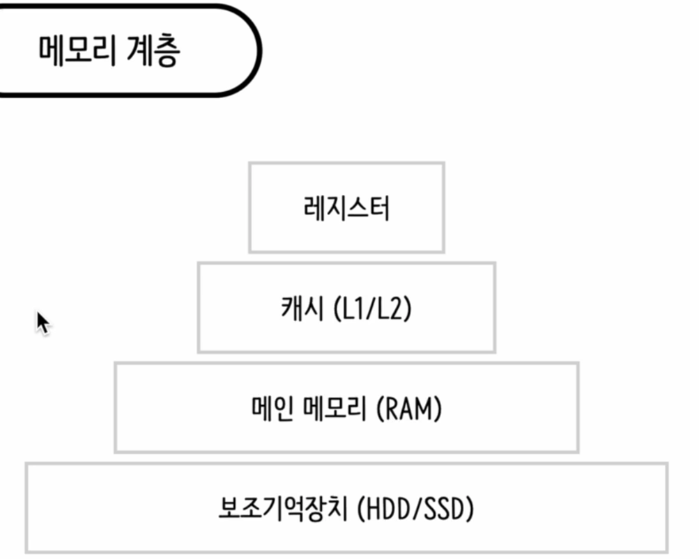
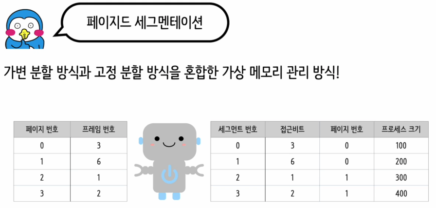

# 메모리 계층
  

컴퓨터 메모리 계층은 데이터를 저장하고 액세스하는 데 사용되는 다양한 유형의 메모리 리소스를 계층적으로 배열한 것입니다. 이 계층 구조는 속도, 용량, 비용 간의 균형을 맞추기 위해 설계되었습니다. 메모리 계층 구조는 가장 빠르고 비싼 메모리부터 느리고 저렴한 메모리까지 다양한 메모리 유형을 포함합니다. 일반적으로, 계층이 높을수록 속도는 빠르고 용량은 작으며, 계층이 낮을수록 속도는 느리고 용량은 큽니다.

컴퓨터 메모리 계층은 다음과 같이 구성됩니다:

1. **레지스터 (Register)**: CPU 내부에 위치하며, 가장 빠른 액세스 속도를 제공합니다. 매우 제한된 용량을 가지고 있습니다.
2. **캐시 메모리 (Cache Memory)**: CPU와 주 메모리 사이에 위치하며, 자주 사용되는 데이터를 빠르게 액세스하기 위해 사용됩니다. 캐시 메모리는 여러 레벨(L1, L2, L3)로 나뉩니다.
   - L1 캐시: 가장 빠르지만 용량이 가장 작습니다.
   - L2 캐시: L1보다 느리고 용량이 큽니다.
   - L3 캐시: L2보다 느리지만 용량이 더 큽니다.
3. **주 메모리 (Main Memory or RAM)**: 프로그램과 현재 사용 중인 데이터를 저장합니다. 캐시보다 느리지만, 레지스터나 캐시보다 훨씬 큰 용량을 제공합니다.
4. **보조 메모리 (Secondary Memory)**: 하드 드라이브(HDD)나 솔리드 스테이트 드라이브(SSD)와 같은 비휘발성 저장소입니다. 주 메모리보다 훨씬 느리지만, 데이터를 영구적으로 저장할 수 있으며 용량도 훨씬 큽니다.

각 계층은 특정 목적을 가지고 있으며, 시스템의 전체 성능과 효율성을 높이기 위해 함께 작동합니다. 예를 들어, 프로세서는 매우 빠른 속도로 작동하기 때문에, 데이터를 빠르게 제공할 수 있는 캐시 메모리가 필수적입니다. 반면, 대용량 데이터를 저장하기 위해서는 보조 메모리가 필요합니다.

# 가상메모리 개요  

가상 메모리(Virtual Memory)는 운영 체제에서 사용되는 메모리 관리 기법 중 하나로, 물리적인 메인 메모리를 가상의 메모리 공간으로 확장하는 기술입니다. 가상 메모리의 주요 특징은 다음과 같습니다:

1. **물리적 메모리 확장**:
   - 프로세스가 사용할 수 있는 메모리 공간을 물리적인 메인 메모리 용량을 넘어 확장할 수 있습니다.
   - 프로세스가 요구하는 메모리 공간은 가상 메모리 공간에 매핑됩니다.

2. **페이징 기법**:
   - 가상 메모리 공간을 고정 크기의 페이지 단위로 관리합니다.
   - 필요한 페이지만 메인 메모리에 로드하고, 나머지는 보조 기억장치(하드디스크 등)에 저장합니다.

3. **페이지 교체 알고리즘**:
   - 메인 메모리에 페이지를 적재할 때 어떤 페이지를 교체할지 결정하는 알고리즘입니다.
   - LRU, FIFO, 최적 알고리즘 등이 사용됩니다.

4. **페이지 fault 처리**:
   - 프로세스가 참조하는 페이지가 메인 메모리에 없는 경우 페이지 fault가 발생합니다.
   - 이때 운영 체제는 해당 페이지를 보조 기억장치에서 로드하여 메인 메모리에 적재합니다.

가상 메모리를 사용함으로써 프로세스는 물리적인 메인 메모리 크기를 넘어 더 큰 메모리 공간을 사용할 수 있게 됩니다. 이를 통해 메모리 활용도와 시스템 성능을 높일 수 있습니다.  

  

페이지드 세그멘테이션(Paged Segmentation)은 가상 메모리 관리 기법 중 하나로, 가상 메모리 공간을 페이징과 세그멘테이션을 결합한 방식입니다. 이 기법의 주요 특징은 다음과 같습니다:

1. **페이징과 세그멘테이션의 결합**:
   - 가상 메모리 공간을 고정 크기의 페이지로 나누는 페이징 기법과,
   - 메모리 공간을 논리적인 세그먼트로 나누는 세그멘테이션 기법을 결합한 방식입니다.

2. **세그먼트 테이블과 페이지 테이블**:
   - 각 프로세스는 세그먼트 테이블과 페이지 테이블을 가지고 있습니다.
   - 세그먼트 테이블은 각 세그먼트의 크기와 시작 주소를 관리하고,
   - 페이지 테이블은 각 페이지의 물리적 주소를 관리합니다.

3. **주소 변환 과정**:
   - 프로세스가 가상 주소를 참조하면, 먼저 세그먼트 테이블을 통해 해당 세그먼트를 찾고,
   - 다음으로 페이지 테이블을 통해 물리적 주소를 계산합니다.

4. **장점**:
   - 메모리 단편화 문제를 세그멘테이션을 통해 완화할 수 있습니다.
   - 프로세스 간 메모리 공간 격리를 통해 보안성을 높일 수 있습니다.

페이지드 세그멘테이션은 메모리 관리의 유연성과 효율성을 높여주는 기법입니다. 현대 운영 체제에서 널리 사용되고 있으며, 가상 메모리 관리의 핵심 기술 중 하나입니다.  

# 워킹 셋 

스래싱(Thrashing)은 다중 프로그래밍 환경에서 너무 많은 프로세스가 메모리에 동시에 적재되어 있을 때 발생하는 현상으로, 페이지 부재율(Page Fault Rate)이 증가하여 CPU 이용률이 급격하게 떨어지는 것을 말합니다. 이는 프로세스 처리에 필요한 페이지 교체 시간이 프로세스 실행 시간보다 많아져 발생하며, 운영 체제는 이를 해결하기 위해 다중 프로그래밍의 정도(Multi-Programming Degree, MPD)를 높여 프로세스 수를 증가시키지만, 이는 오히려 스래싱을 더욱 악화시키는 원인이 됩니다【13†source】.

스래싱 문제에 대한 소프트웨어적 해결책 중 하나로 '워킹 셋(Working Set)'이라는 개념이 있습니다. 워킹 셋은 프로세스가 일정 시간 동안 주로 참조하는 페이지들의 집합으로, 프로세스의 메모리 요구 사항을 충족하기 위해 물리적 메모리에 유지되어야 하는 페이지들을 의미합니다. 이 방법은 지역성의 원리를 기반으로 하며, 프로세스 작업에 필수적인 페이지들만을 메모리에 유지함으로써 페이지 부재율을 감소시키고, 따라서 스래싱을 예방하거나 완화하는 데 도움을 줍니다【13†source】【14†source】.

워킹 셋 방식은 운영 체제가 각 프로세스에 대한 페이지 부재 빈도를 주기적으로 조사하고, 이를 통해 각 프로세스에 할당할 메모리 양을 동적으로 예측하고 조절하게 합니다. 프로세스의 현재 페이지 부재율과 이전 페이지 부재 사이의 시간을 관찰하여, 이 값이 설정된 상한값이나 하한값을 초과하거나 미만이 될 경우 운영 체제는 메모리에 적재된 프로세스의 수를 조절합니다. 이러한 조절을 통해 워킹 셋은 메모리 사용 효율성을 높이고 스래싱 현상을 최소화하는 데 기여합니다【13†source】.

워킹 셋을 활용하는 방법은 스래싱을 예방하는 가장 효과적인 소프트웨어적 접근법 중 하나로 간주되며, 운영 체제의 메모리 관리 전략에 있어 중요한 역할을 합니다.

