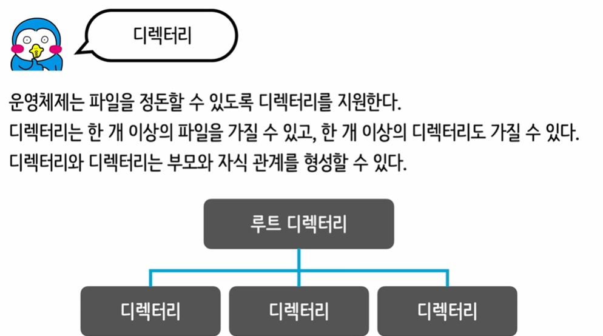

# 파일및 디렉토리  

  

디렉터리는 운영체제가 파일을 체계적으로 관리하도록 돕는 핵심적인 개념입니다. 기본적으로 파일 시스템의 "폴더"와 같은 역할을 합니다. 디렉터리는 다음과 같은 특징을 가집니다:

- **계층 구조**: 디렉터리는 계층적인 구조를 가질 수 있습니다. 이는 파일과 다른 디렉터리를 포함하는 디렉터리를 만들 수 있다는 의미입니다. 이런 방식으로, 운영 체제는 파일 시스템 내에서 파일과 디렉터리를 체계적으로 정리할 수 있습니다.

- **부모와 자식 관계**: 한 디렉터리 안에 다른 디렉터리가 위치할 때, 상위 디렉터리를 "부모 디렉터리"라 하고, 내부의 디렉터리를 "자식 디렉터리"라 합니다. 이 관계는 파일 시스템 내의 위치를 명확하게 표현합니다.

- **파일 저장**: 디렉터리의 주요 기능 중 하나는 파일을 저장하는 것입니다. 사용자는 디렉터리를 사용하여 문서, 이미지, 프로그램 등 다양한 유형의 파일을 저장하고 관리할 수 있습니다.

- **경로**: 디렉터리 구조 내에서 파일이나 디렉터리의 위치를 나타내기 위해 "경로"라는 개념을 사용합니다. 경로는 특정 파일이나 디렉터리에 접근하기 위한 지침으로, 최상위 디렉터리부터 시작하여 해당 파일이나 디렉터리에 도달할 때까지의 모든 디렉터리 이름을 포함합니다.

- **접근 권한**: 대부분의 운영체제는 디렉터리에 대한 접근 권한을 설정할 수 있게 합니다. 이를 통해 사용자는 특정 파일이나 디렉터리에 대한 읽기, 쓰기, 실행 권한을 제어할 수 있습니다.

디렉터리는 운영체제의 효율적인 파일 관리를 가능하게 하며, 사용자가 파일과 디렉터리를 쉽게 찾고, 접근하며, 조직할 수 있도록 돕습니다.

연결 리스트(Linked List)는 데이터 요소의 선형 집합으로, 데이터 요소가 메모리 내에서 연속적으로 저장되지 않고 각 요소가 다음 요소의 주소를 포함하는 방식으로 연결되어 있는 자료 구조입니다. 연결 리스트는 데이터의 동적 추가 및 삭제가 빈번히 발생하는 경우 유용하며, 배열과 달리 미리 메모리 크기를 할당하지 않아도 되는 장점이 있습니다.

### 연결 리스트의 기본 구성 요소
- **노드(Node)**: 데이터와 하나 이상의 '다음 노드'에 대한 참조(주소)를 포함하는 단위입니다.
- **헤드(Head)**: 리스트의 첫 번째 노드를 가리키는 참조입니다.
- **테일(Tail)**: 리스트의 마지막 노드를 가리키는 참조입니다. (양방향 연결 리스트에서 사용)

### 연결 리스트의 종류
- **단일 연결 리스트(Singly Linked List)**: 각 노드가 다음 노드만을 가리키는 가장 간단한 형태입니다.
- **이중 연결 리스트(Doubly Linked List)**: 각 노드가 이전 노드와 다음 노드 양쪽을 가리키는 형태로, 양방향 탐색이 가능합니다.
- **원형 연결 리스트(Circular Linked List)**: 마지막 노드가 다시 첫 번째 노드를 가리키는 형태로, 리스트의 시작과 끝이 연결되어 있습니다.

### C언어로 단일 연결 리스트 구현 예제
아래 예제는 C언어를 사용하여 단일 연결 리스트를 구현한 기본적인 형태를 보여줍니다. 이 예제에서는 노드를 추가하는 함수와 전체 리스트를 출력하는 함수를 포함합니다.

```c
#include <stdio.h>
#include <stdlib.h>

// 노드 구조체 정의
struct Node {
    int data;
    struct Node* next;
};

// 새 노드를 생성하는 함수
struct Node* createNode(int data) {
    struct Node* newNode = (struct Node*) malloc(sizeof(struct Node));
    newNode->data = data;
    newNode->next = NULL;
    return newNode;
}

// 리스트의 끝에 노드를 추가하는 함수
void appendNode(struct Node** head, int data) {
    struct Node* newNode = createNode(data);
    if (*head == NULL) {
        *head = newNode;
    } else {
        struct Node* temp = *head;
        while (temp->next != NULL) {
            temp = temp->next;
        }
        temp->next = newNode;
    }
}

// 리스트를 출력하는 함수
void printList(struct Node* node) {
    while (node != NULL) {
        printf("%d -> ", node->data);
        node = node->next;
    }
    printf("NULL\n");
}

int main() {
    struct Node* head = NULL;

    appendNode(&head, 1);
    appendNode(&head, 2);
    appendNode(&head, 3);

    printList(head);

    return 0;
}
```

이 코드는 간단한 단일 연결 리스트를 생성하고, 몇 개의 노드를 추가한 다음, 리스트의 내용을 출력합니다. 각 노드는 정수 데이터와 다음 노드를 가리키는 포인터를 가집니다. 연결 리스트는 데이터 구조와 알고리즘을 학습하는 데 있어 기본적이면서도 중요한 개념입니다.


불연속 할당(discontinuous allocation)은 컴퓨터 메모리 관리에서 데이터나 프로그램을 연속적인 물리적 메모리 위치에 저장하지 않고 여러 조각으로 나누어 저장하는 방법입니다. 이 방식은 메모리를 더 효율적으로 관리할 수 있게 해주며, 특히 파일 시스템이나 운영 체제의 메모리 관리에서 중요한 역할을 합니다. 불연속 할당은 크게 세 가지 주요 방법으로 구현됩니다: 페이징(paging), 세그먼테이션(segmentation), 그리고 가변 할당(variable allocation)을 사용한 방법입니다.

### 1. 페이징(Paging)
페이징은 물리적 메모리를 고정된 크기의 블록, 즉 '페이지'로 나누고, 프로세스를 같은 크기의 '페이지'로 분할하여 메모리에 할당하는 방식입니다. 각 페이지는 메모리의 연속적이지 않은 위치에 저장될 수 있으며, 페이지 테이블을 사용하여 가상 주소와 물리적 주소를 매핑합니다. 이 방법은 메모리의 낭비를 줄이고, 외부 단편화 문제를 해결할 수 있습니다.

### 2. 세그먼테이션(Segmentation)
세그먼테이션은 프로세스를 다양한 크기의 논리적 단위인 '세그먼트'로 분할합니다. 각 세그먼트는 프로그램의 논리적 구조에 따라 코드, 데이터, 스택 등으로 구분될 수 있으며, 메모리 내의 연속적인 주소 공간에 할당됩니다. 세그먼테이션은 프로그램의 논리적 구조를 반영하여 메모리를 관리하지만, 내부 단편화 문제를 야기할 수 있습니다.

### 3. 가변 할당(Variable Allocation)
가변 할당 방법에서는 파일이나 프로세스를 메모리 내 여러 조각으로 나누어 저장합니다. 가장 일반적인 형태는 연결 리스트를 사용한 링크드 할당(linked allocation)이며, 파일이나 데이터를 여러 '블록'으로 나누고, 각 블록이 다음 블록의 위치를 가리키는 구조를 가집니다. 이 방법은 파일 시스템에서 자주 사용되며, 불연속적으로 분산된 메모리 공간을 효율적으로 사용할 수 있게 합니다.

불연속 할당의 이점은 메모리 공간을 보다 유연하게 사용할 수 있으며, 메모리 단편화 문제를 줄일 수 있다는 점입니다. 다만, 추가적인 관리 비용이 발생하며, 메모리에 접근하는 시간이 늘어날 수 있는 단점도 있습니다. 불연속 할당 기법은 현대 컴퓨팅 시스템의 메모리 관리에서 중요한 역할을 하며, 효율적인 시스템 성능을 위해 계속 발전하고 있습니다.