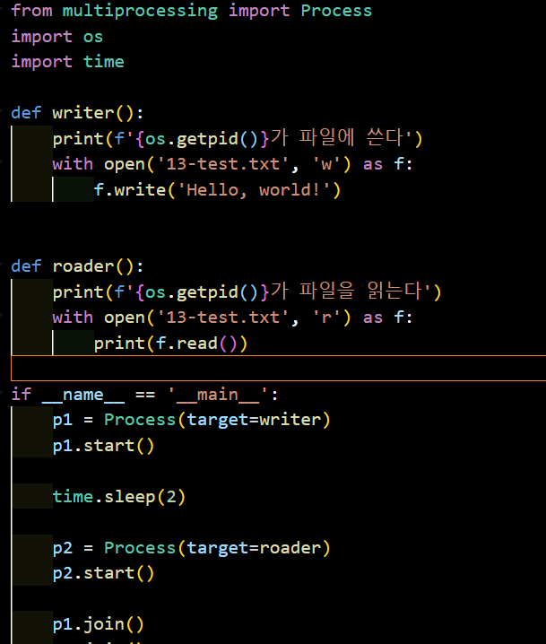
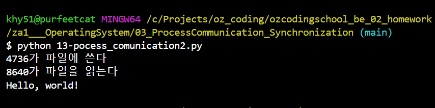

# Q&A
### 함수마다 프로세스가 틀리면, 프로그램을 종료하기 전까지 프로세스가 살아있는 상태인가 ??
C:\Projects\oz_coding\ozcodingschool_be_02_homework\za1___OperatingSystem\03_ProcessCommunication_Synchronization\13-pocess_comunication2.py

